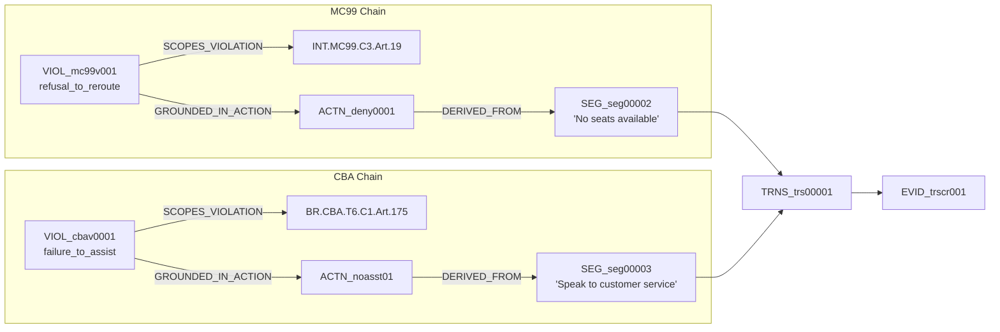
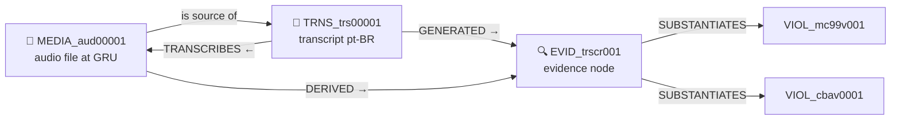
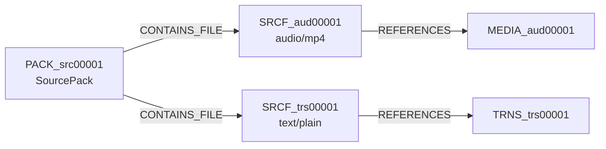
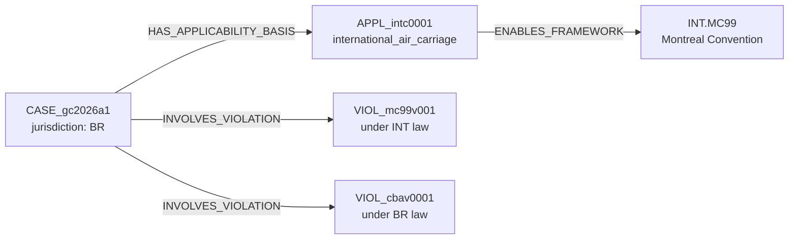

# Golden Case — Ontology Graph

**Case:** `CASE_gc2026a1` — Denied Rerouting After Delay
**Ontology Version:** v2.4
**Generated from:** `04_synthesized_outputs/golden_case_canonical_output.json`

---

## Full Ontology Graph

```mermaid
graph TD
    %% ---- CORE ENTITIES ----
    CASE["🗂️ CASE_gc2026a1\nCase\njurisdiction: BR"]
    APPL["⚖️ APPL_intc0001\nApplicabilityBasis\nbasis_type: international_air_carriage"]

    %% ---- MC99 CHAIN ----
    VIOL1["🚨 VIOL_mc99v001\nViolation\nrefusal_to_reroute\nMC99 · HIGH · 0.91"]
    ACTN1["⚡ ACTN_deny0001\nAction\nrefusal_to_reroute\ncarrier_agent"]
    ART1["📜 INT.MC99.C3.Art.19\nLegalArticle\nMC99 Delay Liability"]
    ART1B["📋 INT.MC99.C3.Art.21\nLegalArticle\n(loaded, not cited)"]

    %% ---- CBA CHAIN ----
    VIOL2["🚨 VIOL_cbav0001\nViolation\nfailure_to_provide_assistance\nCBA · HIGH · 0.88"]
    ACTN2["⚡ ACTN_noasst01\nAction\nfailure_to_provide_assistance\ncarrier_staff"]
    ART2["📜 BR.CBA.T6.C1.Art.175\nLegalArticle\nCBA Service Obligation"]
    ART2B["📋 BR.CBA.T8.C3.Art.260\nLegalArticle\n(loaded, not cited)"]

    %% ---- ACTORS ----
    CARR["👤 ROLE_carr0001\nActorRole\nairline_staff"]
    PASS["👤 ROLE_pass0001\nActorRole\npassenger"]

    %% ---- EVIDENCE CHAIN ----
    PACK["📦 PACK_src00001\nSourcePack"]
    SRCF1["📁 SRCF_aud00001\nSourceFile\naudio/mp4"]
    SRCF2["📁 SRCF_trs00001\nSourceFile\ntext/plain"]
    MEDIA["🎵 MEDIA_aud00001\nMediaAsset\naudio/mp4\nGRU Airport"]
    TRNS["📝 TRNS_trs00001\nTranscript\npt-BR"]
    EVID["🔍 EVID_trscr001\nEvidence\ntranscript"]

    %% ---- SEGMENTS ----
    SEG1["💬 SEG_seg00001\nSegment\npassenger complaint"]
    SEG2["💬 SEG_seg00002\nSegment\ncarrier denial\n← grounds MC99"]
    SEG3["💬 SEG_seg00003\nSegment\nno assistance offered\n← grounds CBA"]

    %% ---- LLM RUN ----
    RUN["🤖 RUN_llmr0001\nLLMRun\ndeepseek-chat\nv2.4"]

    %% ---- FRAMEWORKS ----
    FW1["🌍 INT.MC99\nLegalFramework\nMontreal Convention"]
    FW2["🇧🇷 BR.CBA\nLegalFramework\nCód. Bras. Aeronáutica"]

    %% ================================================================
    %% RELATIONSHIPS
    %% ================================================================

    %% Case → violations
    CASE -->|"INVOLVES_VIOLATION"| VIOL1
    CASE -->|"INVOLVES_VIOLATION"| VIOL2
    CASE -->|"HAS_APPLICABILITY_BASIS"| APPL

    %% Violation → article (SCOPES_VIOLATION)
    VIOL1 -->|"SCOPES_VIOLATION"| ART1
    VIOL2 -->|"SCOPES_VIOLATION"| ART2

    %% Violation → action (GROUNDED_IN_ACTION)
    VIOL1 -->|"GROUNDED_IN_ACTION"| ACTN1
    VIOL2 -->|"GROUNDED_IN_ACTION"| ACTN2

    %% Violation → actor (INVOLVES_ACTOR)
    VIOL1 -->|"INVOLVES_ACTOR"| CARR
    VIOL2 -->|"INVOLVES_ACTOR"| CARR

    %% Action → segment (DERIVED_FROM)
    ACTN1 -->|"DERIVED_FROM"| SEG2
    ACTN2 -->|"DERIVED_FROM"| SEG3

    %% Evidence → violation (SUBSTANTIATES)
    EVID -->|"SUBSTANTIATES"| VIOL1
    EVID -->|"SUBSTANTIATES"| VIOL2

    %% Transcript → segments (CONTAINS)
    TRNS -->|"CONTAINS"| SEG1
    TRNS -->|"CONTAINS"| SEG2
    TRNS -->|"CONTAINS"| SEG3

    %% Forensics chain
    EVID -->|"GENERATED_FROM"| TRNS
    TRNS -->|"TRANSCRIBES"| MEDIA
    EVID -->|"DERIVED_FROM"| MEDIA

    %% Source provenance
    PACK -->|"CONTAINS_FILE"| SRCF1
    PACK -->|"CONTAINS_FILE"| SRCF2
    SRCF1 -->|"REFERENCES"| MEDIA
    SRCF2 -->|"REFERENCES"| TRNS

    %% Article → framework (PART_OF)
    ART1 -->|"PART_OF"| FW1
    ART1B -->|"PART_OF"| FW1
    ART2 -->|"PART_OF"| FW2
    ART2B -->|"PART_OF"| FW2

    %% LLM run (PRODUCED_BY)
    VIOL1 -->|"PRODUCED_BY"| RUN
    VIOL2 -->|"PRODUCED_BY"| RUN

    %% Applicability basis links both frameworks
    APPL -->|"ENABLES_FRAMEWORK"| FW1

    %% Styling
    classDef violation fill:#ff6b6b,color:#fff,stroke:#cc0000
    classDef action fill:#ffa94d,color:#fff,stroke:#cc6600
    classDef article fill:#74c0fc,color:#000,stroke:#1971c2
    classDef evidence fill:#69db7c,color:#000,stroke:#2f9e44
    classDef segment fill:#c0eb75,color:#000,stroke:#5c940d
    classDef actor fill:#e5dbff,color:#000,stroke:#7048e8
    classDef framework fill:#dee2e6,color:#000,stroke:#495057
    classDef system fill:#f8f9fa,color:#000,stroke:#adb5bd

    class VIOL1,VIOL2 violation
    class ACTN1,ACTN2 action
    class ART1,ART2 article
    class ART1B,ART2B framework
    class EVID evidence
    class SEG1,SEG2,SEG3 segment
    class CARR,PASS actor
    class FW1,FW2,PACK,SRCF1,SRCF2,MEDIA,TRNS system
    class CASE,APPL,RUN system
```

---

## Violation Traceability Chains

Two independent traceability chains converge on the same evidence source:

---

## Evidence Forensics Chain

---

## Source Provenance Chain

---

## Cross-Jurisdiction Bridge

> **Why this matters:** The case `jurisdiction = "BR"` but MC99 is `jurisdiction = "INT"`. The `APPL_intc0001` node with `basis_type = "international_air_carriage"` formally bridges this gap. Without this node, Invariant VIII-3 would FAIL. Every case using MC99 in a non-INT jurisdiction MUST have an ApplicabilityBasis node.
