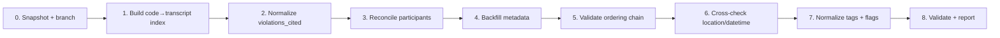

# Next Task: Review & Update Transcript Headers (I-002)

**Target:** `transcription/data/transcripts/*.json` — **27 canonical transcripts, header sections only**
**Driving inputs:** 4 `_intelligence` artifacts + `speaker_index.json` (paths below)
**Status:** Documented — reconnaissance complete, **no edits applied yet**
**Date:** 2026-09-13
**Classification:** Attorney Work Product — Privileged and Confidential

---

## 1. Objective

Use the discovery intelligence layer (events, timeline, event graph, law-dossier registry) and the
speaker index to **review, reconcile and update the header block of each canonical transcript** so
that all 27 files share one consistent, source-backed, machine-readable schema — without touching
`segments[]`.

The header is currently the most inconsistent part of the corpus: metadata is populated in only
3–10 of 27 files, `violations_cited[]` is ~78% free-text, and 18 transcripts lack any top-level
review status. This task closes those gaps.

---

## 2. Scope

### In scope — "the header" = every top-level key except `segments[]`

`transcript_id`, `source_file`, `language`, `timestamp`, `provider`, `original_transcript_id`,
`metadata` (`timestamps`, `audio_properties`, `file_info`, `ontology_node_id`,
`ontology_schema_version`, `processed_audio_file`, `saved_audio_file`), `title`, `subtitle`,
`recording_datetime`, `location`, `audio_id`, `case_id`, `narrative_id`, `chronological_order`,
`prior_stage`, `next_stage`, `classification`, `participants[]`, `violations_cited[]`, `tags[]`,
`forensic_clusters{}`, `key_evidentiary_findings[]`, `corrections_applied[]`.

### Out of scope
- `segments[]` content (text, timing, speaker assignment, `reviewed` per segment).
- The `*.json.bak` files and `transcription/data/transcripts-named/`,
  `transcripts_by_audio/`, `originals/` directories.
- Re-running the discovery pipeline.

---

## 3. Input inventory (schemas verified against the real files)

### 3.1 `law_dossier_registry.json` — 148 KB — code → legal dossier
`discovery/documents_scanned/sessions/f889c1cd-3efb-4f2f-b39a-1a5d708f041d/workspace/_intelligence/`

```
{ entries[], total:81, by_case{}, by_jurisdiction{}, by_tier{} }
entry = { code, title, jurisdiction, case_ids[], severity, category, is_seed,
          has_broken_refs, trust_tier: "A|B|C", confidence{value, components},
          legal_basis[{article_id, article_name, status, applicability, has_verbatim_text}],
          element_grid_keys[], related_violations[] }
```
Verified: **81 entries** — Tier A **32**, Tier B **21**, Tier C **28**.
`title` sometimes embeds `[[SPK-…]]` wikilinks (e.g. `CL-001` →
`False Accusation of Aggression (Calumnia) by LATAM [[SPK-stewardess-accuser]]`).
**Contains no transcript filenames** (`grep NAR-` → 0 matches) — so the code→transcript link must
be resolved from the transcript side.

**Contributes:** canonical `violations_cited[]` codes, `jurisdiction`, `severity`, article-level
`legal_basis`, trust tier, and `related_violations[]` for cross-file linkage.

### 3.2 `events.json` — 220 KB — merged event layer
```
{ events[], stats }
event = { id: "EVT_…", type, action_type, description, date, date_precision, datetime,
          local_datetime, location, actor_function, sequence_index, source_documents[],
          evidence_node_id: "EVID_…", source_segments[{document, index}], jurisdiction,
          violations[], confidence, corroboration{source_count, merge_count} }
```
Verified stats: `raw_events 186 → merged 181`, `corroborated 5`, `files_with_events 56`,
`by_type {documentation 105, incident 42, communication 30, institutional_action 4}`.
⚠️ `violations[]` is **empty across all 181 events** — this layer cannot currently supply
violation content.

**Contributes:** per-transcript `location`, `datetime`/`local_datetime` (recording vs processing),
`jurisdiction`, `evidence_node_id`, `confidence`, `corroboration`.

### 3.3 `timeline.json` — 132 KB — ordered action spine
```
{ case_id, event_count:186, generated_at, events[] }
entry = { index, action_id: "ACTN_…", action_type, description, timestamp, local_datetime,
          location, actor_role, violations[], findings[], evidence_id, source_segments[] }
```
⚠️ `findings[]` is **empty across all 186 entries**.

**Contributes:** authoritative ordering (`index`) to validate `chronological_order` and the
`prior_stage`/`next_stage` chain; per-transcript action/evidence IDs.

### 3.4 `event_graph.json` — 80 KB — topology
```
{ _meta{generated_at, pipeline_layer, analysis_profile, total_events:181, total_edges:488},
  events[], edges[{from: "EVT_…", to: "EVT_…", type, label}] }
```
Verified edge types: `RELATED_TO 192`, `PRECEDED_BY 180`, `CAUSED 116` (`causal_edges 116`).

**Contributes:** independent validation of stage ordering (`PRECEDED_BY`) and of causal claims
asserted in `forensic_clusters[].summary` (`CAUSED`).

### 3.5 `transcription/data/speaker_index.json` — 80 KB — speaker resolution
```
{ summary{generated_utc:"2026-09-13T06:44:24Z", source:"data/transcripts/",
           total_transcripts_scanned:27, total_segments_scanned:3207,
           total_mapped_speaker_ids:47, total_unmapped_segment_instances:210},
  mapped_speakers{ "SPK-…": { display_name, organization, identification_confidence,
                              md_file: "data/speakers/SPK-….md",
                              appearances[{transcript_id, segment_labels[], segment_indices[]}] } },
  unmapped_segment_labels{ label: [transcript_id, …] } }
```
Verified: index keys **fully cover** all `participants[].speaker_id` values found in the
transcripts (0 index-only keys). Unmapped labels include `background_audio` (6 files),
`multi_party_audio` (4), `other_passenger` (I-002_16), `airline_supervisor` (I-002_16),
`airline_staff_antonella` (I-002_17, I-002_19).

**Contributes:** `participants[]` enrichment (`display_name`, `organization`,
`identification_confidence`, `md_file`), `segment_labels` reconciliation, unmapped-label triage.

### 3.6 Adjacent (not in your list, but directly relevant)
| File | Why it matters |
|---|---|
| `_intelligence/violations.json` (160 KB, 101 entries) | **The article cache.** Each entry: `violation_id`, `category`, `description: "Cited in transcript: <raw>"`, `severity`, `confidence: null`, `articles[]` with `eli_id`, `raw_text`, `framework_code/name`, `jurisdiction`, `article_hint`, **verbatim `article_text`**. This is where article-level detail should live — so transcript headers should carry only codes, not article prose. |
| `_intelligence/case_graph.json` (1.3 MB) | Violation/evidence nodes with source segments; possible source of `evidence_ids[]`. |
| `transcription/data/speakers/*.md` | Human-readable speaker dossiers referenced by `speaker_index.mapped_speakers[].md_file`. |

### 3.7 ⚠️ Provenance warning — the intelligence is *older* than the target

The intelligence was generated **2026-09-09T16:59Z** from the discovery session workspace copies
(`…/workspace/I-002_*.json`, mtime **Sep 8 23:06**). The canonical set you are updating
(`transcription/data/transcripts/`) was written **Sep 13 00:13**.

**All 27 files differ.** Sampled diff (`I-002_03`):
- canonical **adds** `segment_labels[]` inside each `participants[]` entry;
- canonical **removes** per-segment `backchannel_events` / `correction_note` (empty strings);
- canonical normalizes numerics (`1` → `1.0`).

Implication: the intelligence is **structurally** compatible but was derived from a slightly older
header shape, and `source_segments[].index` offsets must be re-validated against the current files
before being written into headers. Treat the intelligence as *advisory*, the canonical transcript as
*authoritative*.

---

## 4. Current header state — measured baseline (27 files)

| Section | Coverage | Detail |
|---|---|---|
| Core identity (`transcript_id`, `case_id`, `narrative_id`, `title`, `subtitle`, `language`, `timestamp`, `original_transcript_id`, `provider`, `source_file`, `audio_id`, `location`, `recording_datetime`, `classification`, `chronological_order`, `prior_stage`, `next_stage`, `tags`, `participants`, `forensic_clusters`, `key_evidentiary_findings`, `corrections_applied`, `violations_cited`) | **27/27** | All 24 keys present in every file — no file is missing a section |
| `source_file`, `provider` | 27/27 present but **empty string** | Never populated |
| `language` | 27/27 | `es` ×24, `pt` ×2, **`en` ×1** ← outlier: `I-002_10B_NAR-18_STG_18_counter_fragment.json` |
| `metadata.audio_properties` | **9/27** | 18 missing |
| `metadata.timestamps` | **9/27** | 18 missing |
| `metadata.file_info` | **10/27** | 17 missing |
| `metadata.ontology_node_id` | **3/27** | 24 missing |
| `metadata.ontology_schema_version` | **3/27** | `2.3.1` ×3; 24 missing (registry docs target **2.4**) |
| `metadata.processed_audio_file` / `saved_audio_file` | 3/27 | — |
| `violations_cited[]` | **14/27 non-empty** | **101 citations, 91 distinct strings**, only **29 distinct clean codes** |
| `forensic_clusters{}` | **11/27 non-empty** | 16 empty |
| `key_evidentiary_findings[]` | **23/27 non-empty** | 4 empty: `05B`, `07`, `10A`, `10B` |
| `corrections_applied[]` | **6/27 non-empty** | 21 empty |
| `participants[]` | 1–10 per file | **6 files have only 1 participant** |
| `tags[]` | 3–14 per file | No controlled vocabulary |
| top-level `reviewed` | **9 present (`true`) / 18 absent** | Schema inconsistency |
| `chronological_order` | 27/27, all unique | No duplicates |

### 4.1 The `violations_cited[]` problem (the largest single defect)

The 101 citations break down into three incompatible shapes:

| Shape | Example | Count (approx.) |
|---|---|---|
| Clean registry code | `CL-008`, `BR-012`, `INT-017` | 29 distinct (**all 29 resolve to registry entries — 0 unresolved**) |
| Article reference | `CACH Art. 131 — Duty to inform passenger of rights`, `LPDC Art. 23 bis`, `CPCL Art. 197 — Falsificación en instrumento privado`, `CONST Art. 19 Nº3` | many |
| Free prose / pseudo-tags | `Abuso de autoridad — forcible removal without valid cause`, `Lifetime travel ban without due process`, `PATTERN-OF-FAILURE`, `TOTAL-SERVICE-BLOCK`, `WRONGFUL-USE-OF-INTERNAL-CHANNEL`, `Stigmatisation and discrimination via 'disruptivo' label`, `Systemic institutional practice — daily false detentions confirmed by Carabinero` | many |

Same legal concept appears under several strings (e.g. `CACH Art. 131`, `CACH Art. 131 — Duty to
inform passenger of rights`, `CACH Art. 131 — failure to inform passenger of rights`,
`CACH Art. 131 — no rights information provided`). Conversely the registry holds **81 codes of
which 52 are never cited** — so the corpus is also *under*-citing.

---

## 5. Field-by-field review & update plan

| # | Header field | Current | Source of truth | Action |
|---|---|---|---|---|
| 1 | `source_file` | 27 empty | `events[].source_documents[]`, `source_segments[].document` | Populate with originating audio/file name |
| 2 | `provider` | 27 empty | — | Fill from transcription provenance, else remove the key |
| 3 | `language` | 24 es / 2 pt / 1 en | `speaker_index` appearances + segment text | Fix `en` outlier (`I-002_10B`); confirm the 2 `pt` files |
| 4 | `metadata.timestamps` | 9/27 | `events[].datetime`, original media headers | Backfill 18 |
| 5 | `metadata.audio_properties` | 9/27 | `transcription/data/originals/` audio | Backfill 18 (duration at minimum) |
| 6 | `metadata.file_info` | 10/27 | audio files on disk | Backfill 17; reconcile `audio_id` ↔ `file_name` |
| 7 | `metadata.ontology_node_id` | 3/27 | ontology registry | Backfill 24 (or drop the field pending ontology work) |
| 8 | `metadata.ontology_schema_version` | 3/27 (`2.3.1`) | project target (`2.4`) | Normalize all 27 to one version |
| 9 | `recording_datetime` | 27/27 | `events[].local_datetime` | **Cross-check** — must be recording time, never processing time |
| 10 | `location` | 27/27 | `events[].location` | **Cross-check** wording/consistency against event locations |
| 11 | `case_id` | 27× `I-002` | consistent | Keep; verify against registry `case_ids[]` |
| 12 | `chronological_order` | 27 unique | `timeline[].index`, `events[].sequence_index` | Validate the numbers follow the action spine |
| 13 | `prior_stage` / `next_stage` | 27/27 | `event_graph.edges[].type == "PRECEDED_BY"` | Validate the chain is unbroken end-to-end |
| 14 | `participants[]` | 1–10 | `speaker_index.mapped_speakers` | Enrich + reconcile (see §5.1) |
| 15 | `violations_cited[]` | 14/27, 91 messy strings | `law_dossier_registry` codes | **Normalize to bare codes** (see §5.2) |
| 16 | `tags[]` | 3–14, free | — | Define controlled vocabulary; normalize |
| 17 | `forensic_clusters{}` | 11/27 | `events`, `event_graph` (`CAUSED`) | Validate causal claims; consider backfilling from events |
| 18 | `key_evidentiary_findings[]` | 23/27 | ⚠️ `events.violations` / `timeline.findings` **both empty** | Flag as a pipeline gap — cannot be source-backed today |
| 19 | `corrections_applied[]` | 6/27 | — | Leave; format-normalize only |
| 20 | `reviewed` (top-level) | 9 present / 18 absent | — | Make explicit on all 27 (or remove consistently) |

### 5.1 `participants[]` reconciliation

Two distinct problems:

**(a) Identifier fragmentation** — one real person is split across several slugged IDs because the
ID embeds the transcript name:

| Person | Fragmented IDs observed |
|---|---|
| DGAC "Don Nicolás" | `SPK-dgac-don-nicolas`, `SPK-dgac-don-nicolas-nar-14-terminal-internacional-t2-counter`, `SPK-dgac-don-nicolas-nar-16-stg-23-dgac-don-nicolas` |
| Edgardo Ortiz (DGAC) | `SPK-dgac-edgardo-ortiz`, `SPK-dgac-edgardo-ortiz-nar-16-stg-23-dgac-don-nicolas` |
| PDI officers | `SPK-pdi-nar-06-stg-6-jetbridge-standoff`, `SPK-pdi-nar-07-stg-7-post-removal-investigation`, `SPK-pdi-nar-stg-8-pdi-identity-control` |
| Ruiz (LATAM pilot) | `SPK-pilot-ruiz`, `SPK-latam-pilot-ruiz-nar-01-stg-1-pre-boarding`, `SPK-piloto-ruiz-nar-02-stg-2-boarding-gate` |
| Female Carabinero | `SPK-female-carabinero-2-nar-carabineros-1` / `-2` / `-3` |

Rule to apply: **transcript-scoped IDs stay scoped only when identity is genuinely unknown**;
otherwise collapse to the person-level ID from `speaker_index.mapped_speakers` and record the
per-transcript label in `segment_labels`.

**(b) Missing identity attributes** — headers carry `canonical_name`, `role`, `speaker_label`,
`speaker_id`, `segment_labels`. They lack `display_name`, `organization`,
`identification_confidence` and `md_file`, all of which exist in the index. Example: `I-002_03`
declares `canonical_name: "Unknown"` for the stewardess where the index provides
`SPK-stewardess-accuser`; `SPK-antonela-latam-agent` resolves to *Antonela, LATAM Airlines,
confidence "partial"*.

Also note: **one `participants[].speaker_id` is `null`.**

### 5.2 `violations_cited[]` normalization rule

1. Map every string to a registry `code` using, in order: exact code match → registry `title`
   match → `related_violations[]` → article-id → code lookup via `violations.json`
   (`articles[].eli_id` / `article_hint`).
2. Emit **bare codes only** in the header (`["CL-008","CL-014"]`). Article names, verbatim article
   text and element grids stay in the registry / `violations.json` — not duplicated per transcript.
3. Keep non-code strings that are *genuine case-level assertions*
   (`PATTERN-OF-FAILURE`, `TOTAL-SERVICE-BLOCK`) but move them to `tags[]`, not
   `violations_cited[]`.
4. Attach a `trust_tier` check: only Tier A (`confidence > 0`, 32 dossiers) may back an
   *established* citation; Tier B/C are candidate-only. This mirrors the confirmed decision in
   `REVIEW_AND_UPDATE_STRATEGY.md` §1b #3.
5. Record the original string so the normalization is auditable — either in a
   `violations_cited_raw[]` field or in a side-by-side mapping report.

---

## 6. Gaps & defects recorded during reconnaissance

| ID | Finding | Impact |
|---|---|---|
| G1 | `events[].violations[]` and `timeline[].findings[]` are **empty (0/181, 0/186)** | The event/timeline layers cannot source `key_evidentiary_findings[]` or validate `violations_cited[]`. Findings must remain as-is this pass; escalate as a pipeline defect. |
| G2 | Intelligence generated **2026-09-09** from session copies; canonical set rewritten **2026-09-13**; all 27 differ | Any `source_segments[].index` written into headers must be re-verified against current files |
| G3 | `violations_cited[]` 91 distinct strings for ~29 real codes; 52 registry codes never cited | Both over-fragmented and under-citing |
| G4 | `participants[].speaker_id` fragmentation across transcript-scoped slugs | Speaker identity/statistics unreliable; blocks cross-transcript person analysis |
| G5 | `metadata` populated in only 3–10 of 27 files | Filename/date/ontology provenance missing for most files |
| G6 | `language: "en"` on `I-002_10B` (3-segment fragment) | Wrong metadata; also one of the 4 files with no findings |
| G7 | Top-level `reviewed` on 9/27 only | No uniform review-state signal |
| G8 | `speaker_index` reports **210 unmapped segment instances** (`background_audio`, `multi_party_audio`, `other_passenger`, `airline_staff_antonella`) | Some participants cannot yet be attributed |
| G9 | `violations.json` entries are mechanical: `description: "Cited in transcript: <raw>"`, `confidence: null` | It is an article cache, **not** an analyzed violation layer — do not treat as findings |

---

## 7. Proposed procedure



**Step 0 — Freeze a baseline.** Commit or `cp -a` the 27 canonical files first. Note the symlinks
from `violation-refiner/data/transcripts/json/` point at these files, so an in-place edit is
immediately visible downstream — and `git` currently already reports 27 type changes there.

**Step 1 — Build the linkage index.** From `events[].source_documents[]` +
`source_segments[].document`, produce `transcript_filename → {event_ids[], evidence_node_ids[],
action_ids[], jurisdiction, locations[], datetimes[]}`. Verify every one of the 27 filenames appears
(all do today: 27/27 covered by the 56 files in `files_with_events`).

**Step 2 — Normalize `violations_cited[]`** per §5.2, emitting a `violations_mapping.csv`
(or `.json`) with `transcript_id, original_string, resolved_code, resolution_method, trust_tier,
confidence`. This report is the audit trail and must be kept.

**Step 3 — Reconcile `participants[]`** per §5.1, producing a person-level ID map plus the enriched
fields (`display_name`, `organization`, `identification_confidence`, `md_file`).

**Step 4 — Backfill `metadata`** for the 17–24 files missing each sub-block, from
`originals/` audio + `events` datetimes. Pick **one** `ontology_schema_version` for all 27.

**Step 5 — Validate the ordering chain** by walking `prior_stage`/`next_stage` across all 27 and
comparing to `timeline[].index` order and `event_graph` `PRECEDED_BY` edges. Report breaks.

**Step 6 — Cross-check `location` and `recording_datetime`** against `events[].location` /
`local_datetime`; flag any header value that looks like a processing timestamp.

**Step 7 — Normalize `tags[]`** to a controlled vocabulary (case, stage, actor-class, conduct,
evidence-type) and make `reviewed` explicit or absent uniformly.

**Step 8 — Validate and report.** For all 27 files assert: valid JSON; identical header key set;
every `violations_cited[]` entry resolves to a registry code (or appears in the mapping report as
intentionally unmapped); every `speaker_id` exists in `speaker_index`; `metadata` blocks uniform;
stage chain unbroken. Emit a coverage report mirroring §4 so before/after is measurable.

**Suggested new fields** (decide in §8): `jurisdiction` (from events/registry — currently absent
from every header), `evidence_ids[]` / `event_ids[]` (traceability to the intelligence layer),
`revision` / `header_reviewed_at`.

---

## 8. Decisions required before implementation

| # | Question | Options | Recommendation |
|---|---|---|---|
| D1 | Where does the normalized legal detail live? | (a) codes only in header, detail in registry; (b) full `legal_basis` inlined per transcript | **(a)** — avoids duplication across 27 files |
| D2 | Keep the raw citation strings? | (a) `violations_cited_raw[]` in each file; (b) only in the side report | **(b)** — headers stay clean, audit trail preserved |
| D3 | Collapse transcript-scoped speaker IDs? | (a) collapse to person-level; (b) keep scoped; (c) both (`speaker_id` + `speaker_scope`) | **(a)** with per-transcript label kept in `segment_labels` |
| D4 | Add `jurisdiction`, `evidence_ids[]`, `event_ids[]`? | yes / no | **yes** — cheap, high traceability value |
| D5 | Backfill `ontology_node_id` for 24 files, or drop the field? | backfill / drop / defer | **defer** if no ontology service is live; otherwise backfill |
| D6 | Target `ontology_schema_version` | `2.3.1` (3 files have it) / `2.4` (strategy docs) | **decide explicitly**, then apply to all 27 |
| D7 | Handle `PATTERN-OF-FAILURE`-style strings? | move to `tags[]` / keep in `violations_cited[]` | **move to `tags[]`** |
| D8 | Do we update the discovery session copies too, or only the canonical set? | canonical only / both / regenerate session from canonical | **canonical only** for now; mirroring is a separate task |
| D9 | Enforce Tier A only for "established" citations? | yes / no | **yes** — per `REVIEW_AND_UPDATE_STRATEGY.md` §1b #3 |

---

## 9. Acceptance criteria (definition of done)

- [ ] All 27 files parse and share an **identical header key set**.
- [ ] `violations_cited[]` contains **only registry codes** (plus an explicit, documented
      exception list); **0 unexplained strings**; 100% of codes resolve (today: 29/29 already).
- [ ] A `violations_mapping` report exists covering **all 101** original citations.
- [ ] Every `participants[].speaker_id` exists in `speaker_index.mapped_speakers` (**0 `null`**);
      fragmentation resolved or explicitly documented.
- [ ] `metadata` blocks uniform across 27 files (`timestamps`, `audio_properties`, `file_info`),
      with one agreed `ontology_schema_version`.
- [ ] `prior_stage`/`next_stage` form an unbroken chain consistent with `timeline` order and
      `event_graph` `PRECEDED_BY` edges.
- [ ] `language` outlier fixed; `24 es / 2 pt / 1 en` either corrected or justified.
- [ ] No `recording_datetime` carries a processing date.
- [ ] Coverage report shows before/after for every row of the §4 table.
- [ ] `violation-refiner/data/transcripts/json/` symlinks still resolve after the edits.

---

## 10. Risks & guardrails

| Risk | Guardrail |
|---|---|
| Editing the canonical files silently changes what `violation-refiner` sees (they are symlinked to these files) | Snapshot first; validate symlinks after |
| Stale intelligence (G2) injects wrong segment offsets | Never write `source_segments[].index` without re-verifying against the current file |
| Normalization loses legal nuance | Always keep the mapping report (D2) |
| Circular reasoning — dossiers are *conclusions*, and `violations.json` merely echoes citations (G9) | Use the registry only to **normalize codes**, never to assert new findings |
| Findings/`violations` layers are empty (G1) | Do not fabricate `key_evidentiary_findings[]`; leave content untouched and log the gap |
| Header churn breaks downstream consumers (`garge`, `jurisdiction`, MCP tools) | Grep consumers for header keys before renaming/removing any field |
| `metadata` backfill from the wrong audio file | Reconcile `audio_id` ↔ `file_info.file_name` ↔ `originals/` before writing |

---

## 11. Reference paths

```
# Inputs
discovery/documents_scanned/sessions/f889c1cd-3efb-4f2f-b39a-1a5d708f041d/workspace/_intelligence/
    law_dossier_registry.json     # code → dossier, trust tiers
    timeline.json                 # ACTN_* ordered spine (186)
    events.json                   # EVT_* merged events (181)
    event_graph.json              # edges: PRECEDED_BY / CAUSED / RELATED_TO
    violations.json               # 101 article-cache entries (adjacent, relevant)
transcription/data/speaker_index.json

# Targets
transcription/data/transcripts/*.json          # 27 canonical files (the header block)
transcription/data/transcripts/*.json.bak      # out of scope

# Consumers to check before schema changes
violation-refiner/data/transcripts/json/       # symlinked to the targets
transcription/data/originals/                  # audio for metadata backfill
transcription/data/speakers/                   # speaker dossiers (md_file)

# Related prior work
discovery/REVIEW_AND_UPDATE_STRATEGY.md        # trust tiers, IN→INT, dossier-as-ground-truth
discovery/task_plan.md                         # transcript merge (75 → this set)
```

---

*Task documented 2026-09-13. Ontology v2.4 · Awareness-AI.*
