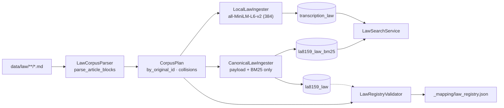
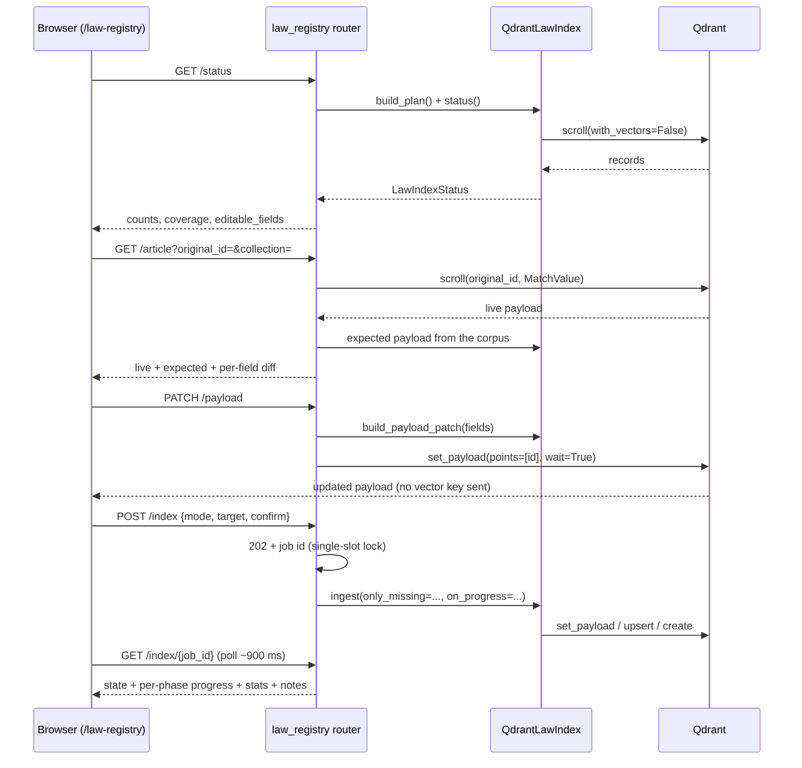

# SA-transcription Architecture

## Clean Architecture (Onion)

Dependencies flow inward only. Domain depends on nothing.

```
┌──────────────────────────────────────────────────────┐
│  PRESENTATION  (routers, middleware, schemas)         │
│    FastAPI routers with form parameters               │
│    Path validation middleware                         │
│    Depends on: Application                            │
├──────────────────────────────────────────────────────┤
│  INFRASTRUCTURE  (adapters, model manager)            │
│    WhisperASRAdapter      → implements ASRPort        │
│    PyAnnoteDiarizerAdapter → implements DiarizationPort│
│    PydubProcessorAdapter  → implements AudioProcessorPort│
│    JSONTranscriptStore    → implements TranscriptStorePort│
│    AudioFileAdapter       → implements AudioFilePort  │
│    ClaudeAnalyzerAdapter  → implements TranscriptAnalyzerPort│
│    QdrantTranscriptIndex  → implements TranscriptIndexPort│
│    ModelManager           → lazy model lifecycle      │
│    Depends on: Application (via Domain ports)         │
├──────────────────────────────────────────────────────┤
│  APPLICATION  (use cases, DTOs)                       │
│    TranscribeAudioUseCase — full pipeline orchestrator │
│    DiarizeExcerptUseCase  — excerpt diarization       │
│    AnalyzeTranscriptUseCase — Claude analysis         │
│    SearchTranscriptsUseCase — Qdrant semantic search  │
│    Depends on: Domain                                 │
├──────────────────────────────────────────────────────┤
│  DOMAIN  (entities, ports, services)                  │
│    Transcript, Segment, Speaker, DiarizationTurn      │
│    Protocol ports (structural subtyping)              │
│    Chilean Spanish post-processing                    │
│    Depends on: NOTHING                                │
└──────────────────────────────────────────────────────┘
```

## Directory Map

```
src/
├── domain/
│   ├── entities/
│   │   └── transcript.py       ← Speaker, Segment, DiarizationTurn, Transcript, AudioFile
│   ├── ports/
│   │   └── interfaces.py       ← ASRPort, DiarizationPort, AudioProcessorPort,
│   │                              TranscriptStorePort, AudioFilePort (all Protocol)
│   └── chilean_spanish.py      ← Pure post-processing function
│
├── application/
│   ├── dto/
│   │   └── schemas.py          ← Pydantic request/response models
│   └── use_cases/
│       ├── transcribe_audio.py ← Full pipeline: upload → preprocess → diarize → transcribe → persist
│       └── diarize_excerpt.py  ← Crop + diarize (no transcription)
│
├── infrastructure/
│   ├── model_manager.py        ← Lazy-load + cache Whisper & Pyannote models
│   ├── whisper_adapter.py      ← ASRPort implementation via OpenAI Whisper
│   ├── pyannote_adapter.py     ← DiarizationPort implementation via Pyannote 3.1
│   ├── pydub_processor.py      ← AudioProcessorPort: noise reduction, gain, silence
│   ├── json_store.py           ← TranscriptStorePort: JSON file persistence
│   ├── audio_file_adapter.py   ← AudioFilePort: upload, convert, crop, extract
│   ├── claude_analyzer.py      ← TranscriptAnalyzerPort: Anthropic Claude analysis
│   ├── qdrant_index.py         ← TranscriptIndexPort: transcript vector search
│   └── qdrant_law_index.py     ← Law corpus ↔ Qdrant: parse, ingest, validate, search, registry
│
├── presentation/
│   ├── routers/
│   │   ├── health.py           ← GET /, GET /health
│   │   ├── parameters.py       ← GET /api/diarization/parameters, /models/whisper
│   │   ├── diarization.py      ← POST excerpt, excerpt_by_path
│   │   ├── transcription.py    ← POST transcribe
│   │   └── transcripts.py      ← Transcript CRUD, analyze, search, SSE streaming
│   ├── middleware/
│   │   └── path_validator.py   ← Path traversal prevention
│   └── schemas/                ← (reserved for response-only schemas)
│
├── config.py                   ← Settings from env vars
├── logging_setup.py            ← Logging configuration
├── main.py                     ← Composition root — wires all layers
└── runpod_handler.py           ← Runpod serverless bridge
```

## Ports & Adapters

The Domain layer defines 5 ports as Python `Protocol` classes (structural subtyping — no inheritance required):

| Port | Methods | Adapter |
|------|---------|---------|
| `ASRPort` | `transcribe(path, lang)` → `str` | `WhisperASRAdapter` |
| `DiarizationPort` | `diarize(path, ...)` → `list[DiarizationTurn]` | `PyAnnoteDiarizerAdapter` |
| | `diarize_waveform(waveform, sr, ...)` | |
| `AudioProcessorPort` | `process(path, params)` → `str` | `PydubProcessorAdapter` |
| `TranscriptStorePort` | `save(transcript)` → `str` | `JSONTranscriptStore` |
| | `load(id)` → `Transcript \| None` | |
| | `list_ids()` → `list[str]` | |
| `AudioFilePort` | `save_upload()`, `convert_to_wav()`, `crop_audio()`, `get_duration()`, `extract_segment()` | `AudioFileAdapter` |
| `TranscriptAnalyzerPort` | `analyze(transcript, instructions)` → `dict` | `ClaudeAnalyzerAdapter` |
| `TranscriptIndexPort` | `index(transcript)` → `int`, `search(query, limit)` → `list[dict]`, `delete(id)` | `QdrantTranscriptIndex` |

## Composition Root

`src/main.py` is the **only** file that knows about all layers. It:

1. Creates infrastructure adapters (passing config/tokens)
2. Creates use cases (injecting adapters via constructor)
3. Injects use cases into routers via `init_*_router()` functions
4. Assembles the FastAPI app with middleware and mounts

No other file cross-references layers.

## Law Corpus Index

`src/infrastructure/qdrant_law_index.py` is a **standalone** infrastructure service
(not part of the transcript pipeline and not wired through the composition root).
It is driven by `scripts/ingest_law_corpus.py`.



| Component | Responsibility |
|-----------|----------------|
| `LawCorpusParser` | Walk the corpus, split `### ` blocks, extract ELI / title / theme / tags / content; resolve multi-locale `original_id` collisions |
| `LawArticle` | Frozen value object; derives `point_id`, `sha256_short`, `embed_text()`, `to_payload()` |
| `CanonicalLawIngester` | `set_payload` on **existing** ids only (never sends a `vector` key) + BM25 sparse re-upsert |
| `LocalLawIngester` | Lazy `SentenceTransformer`, own 384-dim collection, payload keyword indexes |
| `LawRegistryValidator` | Scrolls the live collection once; set diffs + payload parity (content / title / theme / tags / doc_type) |
| `LawSearchService` | Dense search on `transcription_law`, BM25 on `la8159_law_bm25`, exact lookup by `original_id` |
| `write_registry` | Emits a superset of the `build_law_registry.js` schema |

### Invariants

1. **Point IDs are derived, not stored lookup keys** — `uuid5(uuid.NAMESPACE_DNS, original_id)`.
   Re-ingesting is therefore idempotent: points are reused, never duplicated.
2. **`la8159_law` dense vectors are read-only from this service.** They are 768-dim,
   have no known producing model, and are treated as opaque. Semantic similarity
   must target `transcription_law` instead.
3. **`allow_new` is opt-in.** Creating a missing article would require a
   deterministic placeholder vector, which is explicitly *not* searchable content.
4. **Content parity preserves the authoring separator.** Live payloads keep the
   trailing `---`, so the parser default is `keep_separator=True`.
5. **The registry JSON is a superset** of the sibling JS pipeline's schema, so
   regenerating it cannot break `discovery/case-server` consumers.
6. **Payload edits never touch vectors or identity.** `build_payload_patch` accepts
   only `title` / `theme` / `tags` / `content` / `source_file` / `doc_type` and
   rejects `original_id`, `original_data`, `metadata`, `framework_code`,
   `jurisdiction`, `language`, `sha256_short`, `source_path`. Writes use
   `set_payload` on an existing id, so the 768-dim vectors and point IDs in the
   shared collection are untouched, and editing an un-indexed ELI fails instead of
   creating a placeholder point.
7. **Generated registry artifacts are never corpus input.**
   `LawCorpusParser.iter_files` skips `_CORPUS_EXCLUDED_FILES` by name in addition to
   the `_mapping` directory, and `write_registry` resolves its destination through
   `registry_paths()`, which maps a corpus root to its `_mapping` subdirectory. This
   keeps the writer and the read endpoints on the same path and prevents a stray
   `LAW_REGISTRY.md` from being counted (or parsed) as a law document.

### Registry service layer

`src/presentation/routers/law_registry.py` (mounted at `/api/law`, UI at
`/law-registry`) exposes the index for review and editing. It owns a lazily built
`QdrantLawIndex` singleton plus a single-slot background job runner.



**Job model.** `POST /index` returns immediately with a job id; the work runs on a
worker thread. `only_missing` is derived from `mode=incremental`, and canonical
payload refreshes are suppressed in that mode while BM25 sparse vectors are still
regenerated. Progress callbacks are namespaced `"{target}:{phase}"` and are invoked
from the ingesting thread, so the job store is guarded by a lock. Only one job runs
at a time.

## Transcription Pipeline

```
Upload audio → Save to disk → Convert to WAV → Preprocess
    ↓                                              ↓
    │                                    noise reduction
    │                                    band-pass filter
    │                                    loudness normalisation
    │                                    silence removal
    ↓
Diarize (Pyannote 3.1) → Speaker turns [{speaker, start, end}]
    ↓
For each turn:
    Extract segment → Whisper transcribe → Chilean Spanish cleanup
    ↓
Assemble Transcript → Save JSON → Return result with timings
```

## Model Management

`ModelManager` provides lazy loading with caching:

- **Whisper models**: Loaded on first use per model size, cached in memory
- **Pyannote pipeline**: Loaded once with HuggingFace auth, cached
- **GPU detection**: Automatic CUDA/CPU selection via PyTorch
- **Cache clearing**: `clear_cache()` with garbage collection for memory recovery

## Security Boundaries

- **Path validation**: All user-supplied file paths checked against allowed roots (`AUDIO_DIR`, `ORIGINALS_DIR`, `TRANSCRIPT_DIR`) — prevents path traversal
- **CORS**: Explicit origin list from `CORS_ORIGINS` env var — no wildcards
- **Secrets**: All tokens via environment variables, never in code
- **Docker**: Non-root process, health check enabled

## AI-Native Features (Optional)

When configured via environment variables, the platform gains:

- **Transcript Analysis** — Anthropic Claude analyzes transcripts for summaries, key facts, entities, speaker profiles, and sentiment. Enabled when `ANTHROPIC_API_KEY` is set.
- **Semantic Search** — Qdrant vector store with `all-MiniLM-L6-v2` sentence-transformer embeddings (384-dim). Transcripts are auto-indexed after transcription. Enabled when `QDRANT_URL` is set.
- **Graceful Degradation** — All AI features are optional. When env vars are not set, the corresponding adapters are `None` and endpoints return `503 Service Unavailable` with a clear message. Core transcription is never affected.
