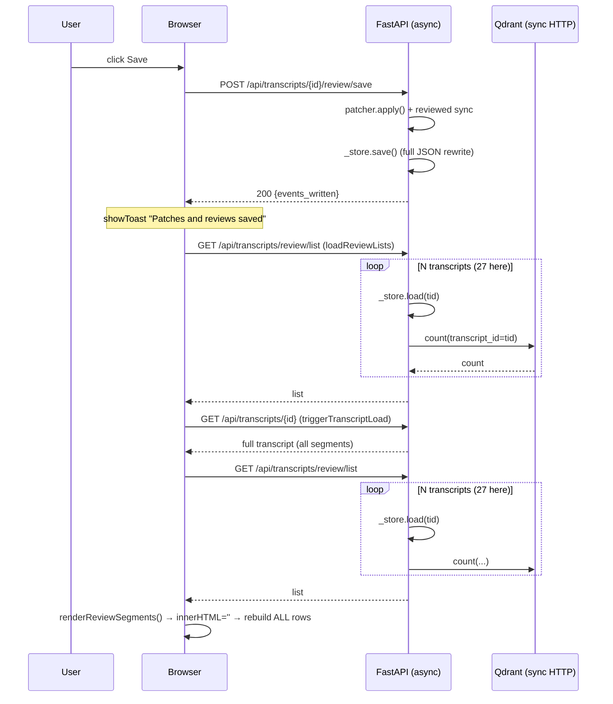

# Review — `templates/revision.html` (Curadoria + Metadados)

**Scope:** `templates/revision.html` (frontend), plus the backend paths it calls:
`src/presentation/routers/transcripts.py` (`/review/list`, `/review/save`, `PUT /{id}`)
and `src/infrastructure/json_store.py`.

**Symptom under review:** saving "takes quite long", "sometimes does not", overall unpleasant.

**Method:** traced every requests the page fires on Save and on load, measured the data volumes
in this workspace, and read the store/patch layer that persists the result.

---

## 1. What happens today when you click **Salvar Revisão de Segmentos**

Click handler: `revision.html:1959–1988`.



So **one save** = 1 write + **2× `/review/list`** + 1 full transcript fetch + a full table re-render.
Each `/review/list` re-reads all transcript JSON files **and** issues one query per transcript to Qdrant.

---

## 2. Executive summary — why it is slow and why it "sometimes does not save"

| # | Root cause | Severity |
|---|-----------|----------|
| **B1** | `/review/list` runs an **N+1 loop of synchronous Qdrant `count()` calls directly on the async event loop** (no `to_thread`, no timeout). 27 transcripts ⇒ 27 blocking HTTP calls per list request, 54 per save. If Qdrant is slow/unreachable this stalls the *entire server*, not just this page. | 🔴 Critical |
| **B2** | Save triggers **the same `/review/list` twice** (once directly, once inside `triggerTranscriptLoad`) plus a redundant full transcript reload. | 🔴 High |
| **F3** | **Reviewed flags are mapped onto post-patch positions**, but `reviewed_indices` are *original* indices. After any insert/delete/merge/split the mapping is off ⇒ reviews land on the wrong segments. Looks like "it did not save". | 🔴 High |
| **F4** | `patcher.apply()` **silently skips failed patches** and the endpoint still returns `200 OK`; the UI ignores which patches applied ⇒ false success. | 🔴 High |
| **F5** | Save button is **never disabled / no in-progress state** ⇒ double/triple submits, racing requests, duplicated work. | 🟠 High |
| **F6** | After save the page **fully reloads and re-renders the table** (`innerHTML=''`), losing scroll position, focus and any un-saved edits made during the round-trip. | 🟠 High |
| **F7** | **No dirty tracking / `beforeunload` guard / autosave.** If save fails, all edits are silently lost on navigation. | 🟠 High |
| **F8** | `json_store.save()` is a **non-atomic, synchronous, indented** rewrite of the whole file (`indent=2`). Crash mid-write can corrupt the transcript ("sometimes does not save" = corruption). | 🟠 Medium |
| **F9** | Error handling assumes a JSON body (`await res.json()`), so real errors (500/HTML/timeouts) surface as confusing `Unexpected token` alerts. | 🟡 Medium |
| **F10** | No request cancellation: rapid changes of the transcript dropdown can render **out-of-order results**. | 🟡 Medium |
| **F11** | `renderReviewSegments()` rebuilds **every row and every input** on load, save, and after each single-segment transcription ⇒ jank on long transcripts. | 🟡 Medium |
| **F12** | Dead/duplicated code: `selectAllRevChk` listener references a checkbox that does not exist (`revision.html:2048`); `updateReviewCounts` vs `updateCountsFromUI` duplicate logic. | 🔵 Low |

Data volumes measured in this workspace: **27 transcripts**, largest **148 KB**, `data/transcripts` ≈ **1.2 MB**.
That is small enough that the *disk* work is negligible — the latency is dominated by **B1/B2** (network/blocking)
and by **F6/F11** (full re-render), which is why the page feels slow even with tiny data.

---

## 3. Detailed findings and proposed changes

### B1 — N+1 blocking Qdrant counts on the event loop 🔴

**Where:** `transcripts.py:942–988` (esp. `953`, `956`).
`_index._client` is a **synchronous** `QdrantClient` (`qdrant_index.py:10,31`). `get_collections()` and a
`count()` per transcript are called directly inside `async def list_transcripts_review`. Sync HTTP inside an
async handler blocks the whole event loop, and there is **no timeout** configured on the client.

**Proposed change**
1. Fetch counts in **one** request: either
   `qdrant_client.count` for the whole collection and aggregate by `transcript_id` from a scroll/group-by, or
   use **`GroupBy`/`count` per collection with a single `Filter`**, or simply expose the per-transcript count
   from the transcript store instead of re-deriving it from Qdrant on every list call.
2. Make the listing **non-blocking**: `await asyncio.to_thread(...)` around any remaining sync client call
   (the adapter already does this in `index()`/`delete()` — see `qdrant_index.py:190,242`).
3. Add an explicit **timeout** and a circuit-breaker: if Qdrant is down, return `qdrant_indexed_segments: null`
   instead of letting the request hang.
4. Cache the result for a few seconds (see F7 backend note) and invalidate on save/index.

**Why:** removes ~54 blocking network calls per save and prevents one slow Qdrant from freezing every request on
the server. This is the single biggest latency win.

---

### B2 — Duplicate `/review/list` and redundant full reload on save 🔴

**Where:** `revision.html:1984–1985` (save then `loadReviewLists()` then `triggerTranscriptLoad()`), and
`triggerTranscriptLoad` itself calls `/review/list` again (`revision.html:1880`).

**Proposed change**
1. Have `POST /review/save` **return the canonical updated transcript** (or a compact summary + segment deltas),
   so the client does not need to re-fetch.
2. Drop the second `/review/list` from `triggerTranscriptLoad`: pass the already-loaded list down, or fetch the
   list only when the dropdown is opened/refreshed.
3. On save, do a **targeted update** (update the returned segments in place) instead of `loadReviewLists()` +
   `triggerTranscriptLoad()`.

**Why:** 3 of the 4 post-save round-trips are redundant. Eliminating them cuts perceived save time dramatically
and removes the race between the two list refreshes.

---

### F3 — Reviewed flags applied to post-patch positions 🔴

**Where:** `transcripts.py:1056` (`patched, applied = _patcher.apply(...)`, which reindexes by position, see
`transcript_patcher.py:32–34`) followed by `transcripts.py:1062–1065`:
```python
reviewed_set = {int(i) for i in payload.reviewed_indices}
patched.segments = [_replace(seg, reviewed=(i in reviewed_set))
                    for i, seg in enumerate(patched.segments)]
```
`reviewed_indices` come from the client as **original** segment indices (`revision.html:1963`), but they are
applied to the **already-patched/reindexed** list. Any insert/delete/merge/split shifts positions ⇒ the wrong
segments get flagged reviewed.

**Proposed change**
- Apply the reviewed state **before** patching (or carry `reviewed` through the patcher), so it is keyed by the
  same original index space as the patches; **or**
- have the patch engine emit an index map (original → new position) and remap `reviewed_indices` through it; **or**
- send reviewed state as part of each `replace`/`mark` patch keyed by original index.

**Why:** this is a correctness bug that directly matches "sometimes it does not save" — the save succeeds but the
result is wrong and looks unsaved.

---

### F4 — Silently skipped patches return `200 OK` 🔴

**Where:** `transcript_patcher.py:26–30` (`except _PatchError ... applied.append(self._note(...)); continue`),
and `transcripts.py:1092` returns `{"status": "ok", ...}` regardless. The client never inspects `applied`
(it isn't even returned).

**Proposed change**
1. Return `applied` / `skipped` counts (and the skipped reasons) from `/review/save`.
2. If any requested edit was skipped, respond with a **207-style partial status** and surface a clear warning in
   the UI ("3 de 120 edições não foram aplicadas: …").
3. Make the client **verify** the post-save state (compare returned segments) before showing the success toast.

**Why:** a save that silently drops edits is indistinguishable from "does not save". Users must be told.

---

### F5 — No in-progress state, button not disabled 🟠

**Where:** `revision.html:1959` — handler never disables `#saveReviewBtn`, never changes its label; there is no
`isSaving` guard and no `.btn:disabled` style (`revision.html:378`).

**Proposed change**
- Add an `isSaving` flag; disable the button and show a spinner (`<i class="fas fa-spinner fa-spin">` + "Salvando…")
  for the whole operation; re-enable in `finally`.
- Style disabled buttons (`opacity:.6; cursor:not-allowed; pointer-events:none`).
- Make the operation idempotent on the server (a save token / version) so a retried request cannot double-apply.

**Why:** prevents duplicate concurrent saves and gives the user immediate feedback that the click registered —
the core complaint ("takes long, no feedback, sometimes nothing").

---

### F6 — Full reload/re-render after save loses scroll & focus 🟠

**Where:** `revision.html:1984–1985` and `renderReviewSegments()` (`1456`) doing `tbody.innerHTML=''` then
rebuilding all rows. The table lives in a `height:60vh; overflow:auto` container (`revision.html` review panel),
so scroll resets to the top after every save.

**Proposed change**
1. On save, apply the **server response delta** to `displaySegments` and update only the changed rows (or, at
   minimum, preserve `scrollTop` across the re-render).
2. Avoid `innerHTML=''`; use a keyed row update, or save/restore the scroll container's `scrollTop` and the
   focused element/selection.
3. Keep the current row visible after save (scroll-into-view the segment the user was editing).

**Why:** a reviewer working through hundreds of segments is thrown back to the top after each save — this is
probably the strongest "unpleasant experience" contributor after the latency.

---

### F7 — No dirty tracking, no autosave, no unload guard 🟠

**Where:** entire script — no `beforeunload` handler, no "unsaved changes" indicator, no autosave
(grep for `beforeunload|dirty` returns nothing).

**Proposed change**
- Track a `dirty` flag set by any edit event (text/speaker/time/notes/reviewed).
- Show an "Alterações não salvas" badge and add `beforeunload` when dirty.
- Add **debounced autosave** (e.g. 5–10 s idle or on segment blur) that reuses the same P0 save path; keep the
  manual button for explicit save.
- Optionally persist a local draft (IndexedDB/localStorage) so a crash does not lose work.

**Why:** removes the fear of losing edits, which is what makes users hesitate and re-click (feeding F5) — and it
fixes the "sometimes does not save" perception when they navigate away.

---

### F8 — Non-atomic, sync, pretty-printed store write 🟠

**Where:** `json_store.py:20–66` — `json.dump(..., indent=2)` straight to the final path, blocking, no temp+rename.

**Proposed change**
- Write to a temp file in the same directory and `os.replace()` (atomic on POSIX); keep a `.bak` of the previous
  version.
- Drop `indent=2` for the on-disk artifact (or make it configurable) — it inflates file size and write time with
  no reader benefit; keep pretty output only for exports.
- Run the write via `asyncio.to_thread` (or make the store async) so it never blocks the event loop.

**Why:** guards against corruption/data loss (a real "does not save" cause) and trims write cost.

---

### F9 — Error handling masks real failures 🟡

**Where:** `revision.html:1979–1983` (`const err = await res.json()`) and similar patterns in
`saveMetadata`, `loadReviewLists`, `runRetranscribe`. On a non-JSON/HTML error body this throws, replacing the
real cause with a parse error; failures are shown via blocking `alert()`.

**Proposed change**
- Read as text, try `JSON.parse`, fall back to `res.statusText`/HTTP status.
- Use the existing `showToast` (with an error style) plus an inline error area instead of `alert()`.
- Add a retry affordance and keep the dirty state on failure so nothing is lost.

**Why:** users can act on a real message; `alert()` is disruptive and gives no path forward.

---

### F10 — No request cancellation / ordering guard 🟡

**Where:** `revision.html:1857` (`triggerTranscriptLoad`) fires on every dropdown change with no `AbortController`
and no "latest request wins" token.

**Proposed change:** keep a monotonic `loadToken`; ignore responses from stale tokens; use `AbortController` to
cancel the in-flight fetch when a new selection is made.

**Why:** prevents a slow earlier selection from overwriting a faster later one.

---

### F11 — Whole-table rebuild on every change 🟡

**Where:** `renderReviewSegments()` called on load (`1423`), after each single-segment transcription
(`1588–1590`), and after most segment mutations.

**Proposed change**
- For single-segment updates (transcribe/audio), update only that `<tr>` instead of the whole body.
- Consider virtualizing rows for very long transcripts (only render the visible viewport).
- Merge `updateReviewCounts` / `updateCountsFromUI` into one function.

**Why:** keeps the UI responsive as transcripts grow and avoids scroll/focus churn.

---

### F12 — Dead & duplicated code 🔵

- `document.addEventListener('change', … e.target.id === 'selectAllRevChk')` (`2048`) refers to an element that
  is **not in the markup** — either add the "select all reviewed" header checkbox or delete the listener.
- `updateReviewCounts` (`1835`) and `updateCountsFromUI` (`1847`) duplicate logic — consolidate.
- `saveMetadata` (`1318`) sends a full PUT and then `triggerTranscriptLoad()` (another full reload) — fold into the
  P0 targeted-update path.

---

## 4. Proposed plan (phased)

### Phase 0 — Correctness & feedback (smallest change, biggest trust win)
1. **F5** disable save button + spinner + `isSaving` guard.
2. **F4** return `applied`/`skipped` from `/review/save`; show partial-failure warning; only toast success when
   nothing was skipped.
3. **F3** key reviewed state to original indices (apply before patching or remap through the patcher's index map).
4. **F9** robust error parsing + toast instead of `alert()`.

### Phase 1 — Kill the latency
5. **B1** one-shot / non-blocking / timeout-bounded Qdrant counts (+ short-lived cache).
6. **B2** return the updated transcript from save; remove the duplicate `/review/list`; stop the post-save full reload.
7. **F6** preserve scroll/focus; delta-apply the save response.

### Phase 2 — Resilience & UX polish
8. **F7** dirty tracking + `beforeunload` + debounced autosave (+ local draft).
9. **F8** atomic temp+rename writes; drop `indent`; `to_thread`.
10. **F10** `AbortController` + latest-wins token.
11. **F11** targeted row updates; **F12** cleanup.

**Expected outcome:** Save becomes a single round-trip with immediate in-place feedback; `/review/list` stops
blocking the server; edits can no longer be silently lost or mis-assigned.
**Success metrics:** save p95 latency, no. of requests per save (target: 1), scroll position preserved, zero
silent-skip saves, dirty-state guard active.

---

## 5. Open questions

1. Is Qdrant expected to be reachable in the user's environment? The per-transcript count could be cached or
   served from the transcript store rather than queried live.
2. Are concurrent editors possible on the same transcript? If so we need optimistic-concurrency (version/ETag),
   which also hardens F5/F4.
3. Is `indent=2` on disk relied on by any external tooling? If yes, keep it for exports but not the store.
4. Should autosave be on by default, or opt-in to avoid surprising writes to evidence files?

---

## 6. Implementation status

Phase 0, Phase 1 and most of Phase 2 were implemented. Phase 2 item 8 (dirty tracking / autosave) was left
out deliberately pending the answers to open questions 2 and 4.

### Backend

| Finding | Change | File |
| --- | --- | --- |
| **B1** | `counts_by_transcript()` — one paginated `scroll` off-loop with a 15 s timeout, replacing N synchronous `count()` calls; returns `{}` on failure so listing never breaks | `src/infrastructure/qdrant_index.py` |
| **B1** | `/review/list` now off-loads `list_ids` and the transcript loading via `asyncio.to_thread`; uses the batched counter with a `_legacy_counts` fallback for custom adapters | `src/presentation/routers/transcripts.py` |
| **F3** | Reviewed flags **and** curation columns are now applied to the base transcript *before* patching, in the original index space the patches reference | `src/presentation/routers/transcripts.py` |
| **F4** | New `apply_with_report()` returns `(transcript, applied, skipped)`; `apply()` delegates to it and keeps the legacy 2-tuple, so all existing callers are unaffected | `src/application/services/transcript_patcher.py` |
| **F4** | `/review/save` returns `partial`, `applied_count` and a structured `skipped` list (`op`, `segment_indices`, `reason`) instead of silently dropping edits | `src/presentation/routers/transcripts.py` |
| **B2** | New shared `_transcript_to_dict()`; `/review/save` returns the canonical `transcript` so the client can update in place. `GET /{id}` now uses the same serializer (single source of truth) | `src/presentation/routers/transcripts.py` |
| **F8** | Atomic write via `mkstemp` → `fsync` → `os.replace`, with temp-file cleanup on failure. `indent=2` intentionally retained (open Q3) | `src/infrastructure/json_store.py` |
| — | `GET /{id}`, `PUT /{id}` and the `/review/save` read/write are off-loaded with `asyncio.to_thread` so file I/O never blocks the event loop | `src/presentation/routers/transcripts.py` |

### Frontend (`templates/revision.html`)

| Finding | Change |
| --- | --- |
| **F5** | `isSaving` guard + `setButtonBusy()` — the save button is disabled and shows a spinner while in flight, and is restored in `finally`. Same treatment for index/import/metadata-save buttons. New `.btn:disabled` CSS. |
| **F4** | Consumes `partial`/`skipped`/`applied_count`. Clean save → success toast with the patch count; partial save → error-styled toast listing the up-to-three skipped ops and reasons. |
| **F6** | `renderReviewSegments()` snapshots and restores `#reviewSegmentsWrap.scrollTop` plus the focused field and its caret position, so a save no longer bounces the reviewer to the top. |
| **B2** | New `applyServerTranscript()` adopts the transcript returned by save and re-renders in place. The save handler no longer calls `loadReviewLists()` or `triggerTranscriptLoad()`. |
| **B2** | `triggerTranscriptLoad()` no longer issues a second `/review/list` fetch; it reads from a new `reviewListCache` populated by `loadReviewLists()`, and `updateReviewListOption()` refreshes a single picker label after save. |
| **F9** | New `readError(res)` reads the body as text, tries `JSON.parse`, and falls back to `detail`/`error`/status text. All `alert()` calls in the review flow replaced with `showToast(msg, 'error')`. |
| **F10** | `triggerTranscriptLoad()` cancels the previous request with `AbortController` so a slow earlier selection cannot overwrite a newer one. |
| **F12** | Removed the dead `#selectAllRevChk` listener (the element does not exist in the markup). |
| **Layout** | Removed the clipping scroll container around the segment table (see §7). |
| **Config** | New "Ações dos Segmentos" sidebar section letting the reviewer choose which row actions are visible, with a built-in explanation of each action (see §7). |

### Verification

- `python3 -m py_compile` — clean on all modified modules.
- `ruff check` — identical error counts before and after on every file touched (52 in `transcripts.py`, 4 in
  `qdrant_index.py`, all pre-existing). `json_store.py`, `transcript_patcher.py` and the new test file are clean.
- New `tests/unit/test_review_save_pipeline.py` — **12 tests, all passing** under pytest. It locks in the
  behaviours the review flagged as regressions:
  - atomic save leaves no `.tmp` files and always writes complete JSON;
  - save round-trips `reviewed` / `correction_note` / `backchannel_events`;
  - `apply_with_report()` reports skipped patches, `apply()` keeps its legacy signature;
  - reviewed flags stay attached to their segment across an `INSERT` **and** a `DELETE` (the F3 regression), and
    a test explicitly demonstrates that the old post-patch ordering would have flagged the wrong row.

### Still open

- **F7** dirty tracking, `beforeunload` guard, debounced autosave — deferred pending open questions 2 and 4.
- **F11** targeted row updates instead of a whole-table rebuild — the scroll/focus restore mitigates the user-
  visible symptom; incremental rendering is a larger change.
- **Q3** external reliance on `indent=2` — the store still pretty-prints.
- The project `.venv` was empty; `pytest`, `pytest-asyncio` and `ruff` were installed into it from the versions
  already pinned in `requirements.txt` so the suite could be run.

## 7. Layout fix + configurable segment actions

### 7.1 The container that was hiding information

Four separate things combined to cut columns off inside the bordered box:

| Cause | Why it hid content | Fix |
| --- | --- | --- |
| `#reviewSegmentsWrap` carried inline `height:60vh; overflow:auto; resize:both` | A nested scrollbox in the middle of the page: rows below 60vh were invisible behind an inner scrollbar and any wide column was pushed out of the horizontal scroll area. The `resize` handle also let a reviewer accidentally shrink the box further. | Inline style reduced to `display:none;margin-bottom:14px;`. CSS now sets `overflow:visible` with no fixed height, so the table flows with the page and nothing can be hidden. |
| `tdActions.style.display = 'flex'` was applied **directly to the `<td>`** | Setting a non-`table-cell` display on a table cell removes it from the table layout algorithm, so the browser could no longer measure the `Ações` column. It mis-sized itself and stole width from `Texto` / `Correção` / `Backchannel`. | The buttons now live in an inner `<div class="segment-actions">`; the `<td>` stays a normal table cell with `table-layout:auto`. |
| `.card { overflow:hidden }` on `#transcriptReviewPanel` | Any content wider than the card (i.e. columns pushed past the reading column) was silently clipped at the card border. | `#transcriptReviewPanel { overflow:visible }` — the review panel must never clip. |
| `<input type="text">` intrinsic width in table auto-layout | An `<input>` has a min-content width of roughly 20 characters, and in `table-layout:auto` **that** — not CSS `width` — decides how narrow a column may be. `Correção` and `Backchannel` were therefore stuck at ~162px each and forced the table 174px wider than its container, pushing the last columns out of view. | `#reviewSegmentsTable td input[type="text"], #reviewSegmentsTable td select { width:100%; min-width:0; box-sizing:border-box }`. Combined with retuned header `min-width`s the table went from 1242px to **1036px**, which fits the 1068px reading column with every column visible. |

A `Largura total` button was added to the table toolbar (`.full-bleed` using
`width:calc(100vw - 64px)` + `margin:calc(50% - 50vw + 32px)`) so the reviewer can break the table out of the
1180px reading column when they want every column visible at once. The choice is persisted in `localStorage`
under `revision_segments_full_width`.

**Sticky header verified:** because the wrapper is no longer a scroll container, `<thead>` sticks against the page
scrollport (`top:44px` clears the sticky `.aw-backbar`) even though the loaded table is 25,000px tall. An earlier
attempt that used `overflow-x:auto` on the wrapper silently broke this — `overflow-x:auto` forces the block axis to
compute to `auto` too, which makes the wrapper a scroll container and pins the header 44px down inside it.

### 7.2 "Ações dos Segmentos" — user-selected actions, with documentation

A new `<details class="cfg-section">` at the top of the transcription sidebar lists every per-segment action with a
checkbox, its icon, its name and a one-line description. A nested `O que cada ação faz` section documents each
action in prose, grouped into **Áudio**, **Transcrição** and **Estrutura**.

Key pieces:

- **`SEGMENT_ACTIONS`** (`templates/revision.html`) is the single source of truth: `{id, icon, label, group, desc, help}`
  for `play`, `download`, `transcribe`, `upload`, `regenerate`, `delete`, `insert`, `merge`, `split`. Both the
  checkbox list and the help list are generated from it, so adding a new action means touching one array.
- **`ACTION_DEFAULTS`** preserves today's behaviour (everything on, except `merge` which was already conditional on
  the row not being last).
- **Persistence:** `localStorage['revision_segment_actions']`, read by `loadActionConfig()` which starts from the
  defaults and only accepts boolean values for known ids — a corrupt or stale entry can never hide an action
  unexpectedly.
- **`addAction(id, icon, title, onClick, opts)`** inside `renderReviewSegments()` is the only way a row button is
  created; it returns early when the action is disabled, so the DOM is smaller and `merge`'s last-row rule still
  applies.
- **Column behaviour:** when every action is disabled the `Ações` column is removed entirely
  (`#reviewSegmentsTable.hide-actions`) so the remaining columns take the full width. When some actions are enabled
  but a particular row has none (e.g. a row with no audio), a muted `—` placeholder keeps the column aligned.
- **Shortcuts:** `Mostrar todas` / `Ocultar todas` / `Restaurar padrão` buttons, plus an `Ações` button in the table
  toolbar that opens the sidebar with the section expanded.

### 7.3 Verification

- Inline-JS syntax harness (`new Function()` over all `<script>` blocks) — 1 block, 67,427 chars, parses clean.
- HTML structure check — no duplicate `id`s, no unbalanced structural tags.
- `pytest tests/ --continue-on-collection-errors` — **61 passed**, same 8 pre-existing collection errors.
- Live browser check at `localhost:8049/revision` with a real 278-segment transcript:
  - `#reviewSegmentsWrap` computed `overflow: visible`; the wrapper is 25,356px tall (the whole table, no inner
    scrollbox).
  - Table 1,036px inside a 1,068px column → `documentElement.scrollWidth === clientWidth` (no page overflow).
  - Every `<td>`, including the actions cell, computes `display: table-cell`.
  - After scrolling 4,000px the `<thead>` is still at `top: 44px` — the sticky header works.
  - `Ocultar todas` → `#reviewSegmentsTable.hide-actions`, `#thActions` and the cells report `display: none`, and
    the preference lands in `localStorage`.
  - `Restaurar padrão` restores all nine actions; the choice survives a full page reload.
  - `Largura total` widens the wrapper to 1,147px with zero page overflow and flips its label to `Largura normal`
    with `aria-pressed="true"`.

