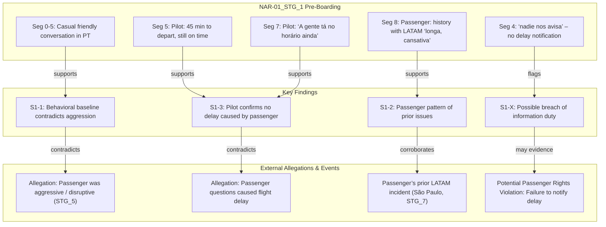
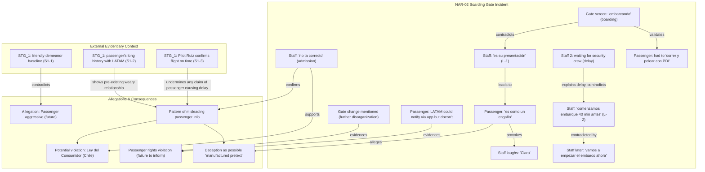
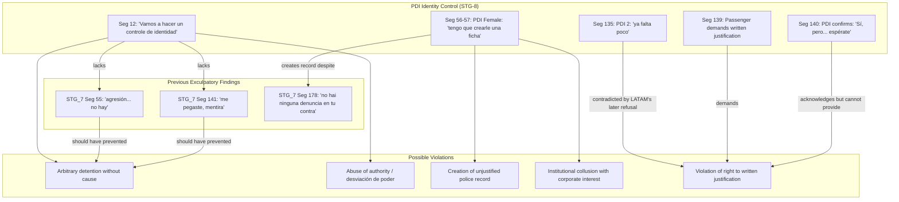
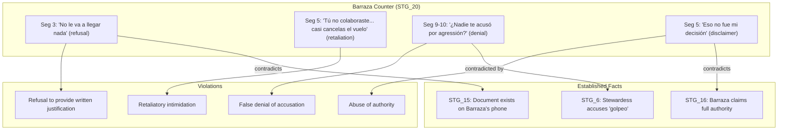

```mermaid
graph TD
    subgraph STG_16["Counter Confrontation"]
        L1["L-1: 'Nadie te acusó por agresión' (denial)"]
        L2["L-2: 'Ingresó la fuerza' (4th justification)"]
        L3["L-3: 'Nada te van a entregar' (refusal)"]
        L4["L-4: 'No tengo que probarte' (withholding evidence)"]
        Retal["Admits retaliation: 'no quisiste colaborar, yo no te voy a colaborar'"]
        Six["Uses '6 personas te bajaron' as proof of guilt"]
        NoDoc["'No es nada por escrito' — denies document exists"]
    end

    subgraph Previous_Exculpatory["Earlier Established Facts"]
        P1["STG_6: Stewardess accuses 'golpeo'"]
        P2["STG_7: PDI confirms no aggression, accuser lying"]
        P3["STG_8: PDI requires LATAM written justification"]
        P4["STG_15: Document exists on Barraza's phone"]
    end

    subgraph Violations["Violations"]
        V1["Retaliatory denial of service"]
        V2["New false accusation (4th version)"]
        V3["Refusal to provide written justification"]
        V4["Withholding exculpatory evidence"]
        V5["Abuse of authority / intimidation"]
    end

    L1 -->|contradicted by| P1
    L1 -->|contradicted by| P2
    L2 -->|adds to shifting pattern| V2
    L3 -->|contradicted by| P4
    L3 -->|violates| P3
    L4 -->|contradicts own STG_13 claim| V4
    Retal --> V1
    NoDoc --> V3
    Six --> V5

    L2 --> V2
    L3 --> V3
    L4 --> V4
```

Yes. In fact, I would recommend a slightly different approach before generating the final Neo4j/Qdrant dataset.

Right now, what you have is an excellent incident chronology, but it is still largely a human-readable narrative graph.

For investigation, litigation, intelligence retrieval, and large-scale transcript analysis, I would convert it into a multi-layer evidence model.

Think of it as four interconnected graphs rather than one graph.

⸻

Layer 1 — Timeline Graph (What Happened)

This is your chronological sequence.

STG_1
  ↓
STG_2
  ↓
STG_6
  ↓
STG_7
  ↓
STG_8
  ↓
STG_13
  ↓
...

Nodes:

Event:
  id:
  timestamp:
  location:
  participants:
  transcript:
  summary:

Purpose:

* reconstruction
* chronology
* sequence analysis
* causality

Queries:

MATCH p=(e1:Event)-[:PRECEDES*]->(e2:Event)
RETURN p

⸻

Layer 2 — Evidence Graph (What Proves What)

This is where the power begins.

Example:

PDI Camera Review
          ↓ disproves
Aggression Allegation
          ↓ supports
False Accusation

Graph:

Evidence
    ↓
Statement
    ↓
Claim
    ↓
Violation

Example:

"agresión no hay"
        ↓
disproves
        ↓
"Leandro assaulted staff"
        ↓
supports
        ↓
False Accusation

This becomes:

(:Evidence)-[:DISPROVES]->(:Claim)
(:Claim)-[:SUPPORTS]->(:Violation)

⸻

Layer 3 — Actor Graph (Who Did What)

This becomes your Neo4j relationship map.

Example:

Leandro
Pilot Ruiz
Barraza
Dominika
Antonela
Diego
PDI Officer A
PDI Officer B
DGAC Officer

Relationships:

MADE_STATEMENT
PARTICIPATED_IN
ORDERED
REMOVED
WITHHELD_DOCUMENT
REVIEWED_VIDEO
DELIVERED_DOCUMENT

Example:

Barraza
    ↓
WITHHELD
    ↓
Removal Letter
PDI Officer
    ↓
REVIEWED
    ↓
Camera Footage

⸻

Layer 4 — Contradiction Graph (Most Important)

This is likely the most valuable layer for your case.

Example:

Claim A
    ↓ contradicts
Claim B

Example:

"Passenger assaulted staff"
contradicts
"PDI reviewed footage and found no aggression"

or

"No document exists"
contradicts
"Document exists on Barraza phone"

or

"Passenger entered forcefully"
contradicts
"Passenger already had boarding pass scanned"

This graph can be automatically traversed.

Query:

MATCH (c1)-[:CONTRADICTS]->(c2)
RETURN c1,c2

⸻

What I Would Add To Every Stage Review

For each STG review, I would extract:

stage_id:
timestamp:
actors:
claims:
evidence:
contradictions:
documents:
violations:
confidence:

Example:

stage_id: STG_7
actors:
  - Leandro
  - PDI Officer
claims:
  - No aggression occurred
evidence:
  - Camera footage reviewed
contradictions:
  - STG_6 aggression allegation
documents:
  - CCTV footage
violations_supported:
  - False accusation
confidence:
  0.98

⸻

Qdrant Should Not Store Entire Stages

This is a mistake many people make.

Instead of:

1 vector = entire STG_7

do:

1 vector = one fact

Example:

{
  "id":"fact_0001",
  "fact_type":"admission",
  "speaker":"PDI",
  "text":"agresión no hay",
  "stage":"STG_7"
}

and

{
  "id":"fact_0002",
  "fact_type":"contradiction",
  "text":"PDI camera review disproves aggression allegation"
}

and

{
  "id":"fact_0003",
  "fact_type":"violation_support",
  "text":"False accusation supported by camera review"
}

Retrieval quality becomes dramatically better.

⸻

What I Think Is Missing

Before building Neo4j, I would create a master dataset called:

Incident:
  LATAM_2024_SCL_Removal

Then every object references it.

Example:

Incident
  ├── Events
  ├── Claims
  ├── Evidence
  ├── Documents
  ├── Actors
  ├── Violations
  ├── Contradictions

This prevents the graph from becoming fragmented later when you ingest:

* STG reviews
* police reports
* DGAC communications
* LATAM emails
* legal filings
* witness statements
* audio transcripts
* future discoveries

into the same knowledge base.

⸻

My suggestion would be:

1. Finish reviewing all STG transcripts one by one.
2. Extract a normalized JSON schema for each stage.
3. Build a master evidence registry.
4. Generate Neo4j nodes and relationships automatically.
5. Generate Qdrant fact-level embeddings.
6. Produce:
    * an investigator report,
    * a contradiction matrix,
    * an actor interaction graph,
    * an evidence provenance graph,
    * and a litigation timeline.

That would give you a much stronger evidentiary and retrieval system than a single Mermaid diagram alone.

⸻

Here is the granular documentation for **NAR-01_STG_1_pre_boarding**, building a structured analysis of lies, contradictions, and possible violations, along with a graph representation that can be rendered in tools like Quadrant.

---

## Granular Documentation — Lies, Contradictions, Possible Violations (Chronological Order 1)

### 1. Lies
No false statements are **internally** detected in this recording. All utterances are consistent with a casual pre‑boarding chat. The evidentiary value lies in the **external falsehoods this record exposes** when compared with other evidence.

- **Implicit Lie Refuted:** Any later claim that the passenger exhibited aggressive, confrontational, or disruptive behaviour at the gate is undercut by this recording.
- **Implicit Lie Refuted:** Any assertion that the passenger’s inquiries delayed the flight is contradicted by the pilot’s own words (Segments 5 & 7) that departure was still on time.

### 2. Contradictions
These contradictions arise when this transcript is cross‑referenced with other stages (as noted in the JSON metadata).

| ID | Contradiction | This Recording | Contradicted Statement / Allegation | Strength |
|----|---------------|----------------|--------------------------------------|----------|
| **C‑1** | Passenger demeanour baseline | Friendly, non‑aggressive Portuguese conversation (Segments 0‑8). “Valeu” (thanks) at end. | Later claim that passenger was “aggressive” or “threatening” (referenced in `STG_5` aggression allegation). | **High** |
| **C‑2** | Cause of delay | Pilot Ruiz: “você tem 45 minutos para decolar … A gente tá no horário ainda” (Segments 5, 7). | Any allegation that the passenger’s questions at the gate delayed push‑back or boarding. | **Medium‑High** |
| **C‑3** | Passenger’s prior knowledge of LATAM issues | “a história com a Latam já tá longa, tá cansativa já” (Segment 8). | Attempts to portray the passenger as a first‑time or unreasonable complainant. This line shows a pre‑existing, weary history. | **Medium** |
| **C‑4** | Language / communication barrier | Passenger switches naturally to Spanish “Y nadie nos avisa” (Segment 4) and understands Portuguese; no confusion. | Any allegation that a language barrier escalated the situation. | **Low‑Medium** |

### 3. Possible Violations
Although no legal violations are proved by this snippet alone, it flags areas worth examining.

- **Consumer Protection / Passenger Rights Violation (potential)**  
  *Segment 4*: “Y nadie nos avisa” (and nobody notifies us).  
  The passenger explicitly states that LATAM did not inform waiting passengers about the delay. Depending on jurisdiction (Chilean Aeronautical Code, Brazilian ANAC rules, and applicable international conventions), failure to provide timely and clear information may constitute a breach of passenger rights obligations. This could be pursued as:
  - Violation of LATAM’s duty of information (e.g., Resolução ANAC nº 400/2016 in Brazil, or similar norms in Chile).
  - Evidence of a systemic practice of poor communication, supporting a claim of moral damages.

- **No other direct violations** are apparent in this recording.

---

## Graph Representation

Below is a **Mermaid** directional graph that maps the transcript’s key evidentiary findings and their relationships to other case elements.  
You can paste this directly into any Mermaid‑compatible viewer (or Quadrant if it supports Mermaid) to render the visual graph.



**Graph legend:**
- **Solid arrow** `-->` : supports / corroborates  
- **Dashed arrow** `-.->` (not rendered above; you can change if needed): flags / draws attention  
- **Red node** (style if needed): contradictory allegation

---

Let me know if you need the graph adjusted for a specific ontology (e.g., nodes for each participant, lie‑by‑lie edge labeling) or if you want the Mermaid output tailored for Quadrant’s indexing structure.This recording is substantially more important than STG_1.

STG_1 establishes a behavioral baseline.

STG_2 establishes motive, chronology, passenger state of mind, staff admissions, and the first observable dispute.

Importantly, this recording appears to capture the future accuser before any security intervention occurs.

⸻

STG-2 Analysis

Boarding Gate Dispute – LATAM Flight A8159

Audio ID: aeropuerto_STG_2
Chronological Position: Event 2

⸻

Executive Summary

The recording documents a prolonged discussion between the passenger and LATAM gate personnel regarding the meaning of “boarding” (“embarque”), the information displayed to passengers, and whether LATAM’s systems accurately reflected the actual boarding status.

The central issue is not boarding itself.

The central issue is:

Whether LATAM represented that boarding had begun when boarding had not actually begun.

Throughout the conversation:

* Passenger repeatedly requests clarification.
* Passenger repeatedly asks for documentation.
* Staff repeatedly refuses or fails to provide documentation.
* Staff shifts explanations.
* Staff eventually acknowledges that the information visible to passengers is not correct.

This recording may become important because it captures:

1. The passenger’s reason for frustration.
2. The absence of threats or aggression.
3. Potential admissions by LATAM personnel.
4. The earliest interaction involving the later accuser.

⸻

Event Timeline

⸻

Phase 1 – Initial Question

Segments 0-4

Passenger asks:

“Me gustaría entender el embarque.”

Staff responds:

“Es su presentación.”

Passenger immediately points to the display:

“Allí está diciendo que ya está embarcando.”

⸻

Evidentiary Significance

The dispute begins with a factual inconsistency.

Passenger sees:

Boarding in progress.

Staff says:

Boarding not in progress.

This becomes the core factual conflict of the recording.

⸻

Phase 2 – Request for Clarification

Segments 5-14

Passenger repeatedly asks:

* What exactly does “embarque” mean?
* What process does it refer to?
* Is there documentation?
* Can you point me to the policy?

Staff repeatedly responds:

“Es la hora de presentación.”

without producing documentation.

⸻

Finding F-2.1

Documentation Refusal / Documentation Absence

The passenger asks for documentary support.

Staff provides none.

Instead:

* Repeats the conclusion.
* Does not provide the rule.
* Does not identify the source.
* Does not identify any written policy.

⸻

Investigative Question

Was such documentation available?

If yes:

Why was it not shown?

If no:

How could passengers know the distinction?

⸻

Phase 3 – Passenger Explains Why He Is Upset

Segments 15-17

Passenger explains:

* Flight arrived late.
* Boarding indicator already showed active boarding.
* He rushed through the airport.
* He rushed through immigration.
* He rushed through PDI procedures.

The key statement:

“Tuve que correr y pelear con PDI.”

⸻

Finding F-2.2

Demonstrated Cause of Frustration

This recording provides a contemporaneous explanation for the passenger’s emotional state.

The frustration appears linked to:

* Perceived misinformation.
* Time pressure.
* Operational confusion.

Not to:

* Crew hostility.
* Security issues.
* Aircraft safety concerns.

This becomes important later if LATAM characterizes the frustration itself as evidence of aggression.

⸻

Phase 4 – Critical Admission

Segment 18

Gate staff states:

“En este minuto nosotros vamos a empezar el embarco.”

Translation:

“At this moment we are going to start boarding.”

⸻

Finding F-2.3

Direct Contradiction

Earlier passenger-facing information suggested:

Boarding already underway.

Staff now states:

Boarding has not yet begun.

This is one of the strongest factual points in the recording.

⸻

Phase 5 – The “40-Minute Rule”

Segments 19-21

Staff introduces a new explanation.

Claim:

Boarding begins 40 minutes before departure.

Passenger asks:

Where is this written?

Staff replies:

It appears when the ticket is purchased.

Then:

Not on the ticket.

Then:

At the time of purchase.

⸻

Finding F-2.4

Shifting Explanation

Sequence:

Version 1

“Presentation time.”

Version 2

“Boarding begins 40 minutes before departure.”

Version 3

“It appears when purchasing.”

Version 4

“It does not appear on the ticket.”

⸻

Investigative Concern

The explanation evolves during the conversation.

That does not necessarily prove dishonesty.

However, it weakens the consistency of the explanation being offered.

⸻

Phase 6 – The Passenger’s Calculation

Segment 21

Passenger performs a simple calculation.

He argues:

If boarding starts 40 minutes before departure,

then the displayed time and actual departure time should align differently than what passengers are being shown.

⸻

Finding F-2.5

Rational Argument Rather Than Emotional Escalation

The passenger attempts:

* Arithmetic
* Timeline reconstruction
* Rule verification

This is evidence of argumentation based on reasoning rather than threats or intimidation.

⸻

Phase 7 – The “Stupid System” Exchange

Segments 22-24

Passenger criticizes the system.

Key statement:

“Es como un engaño.”

(It’s like a deception.)

Before that:

“Cuando se hacen estúpidos.”

This is the strongest language used by the passenger in the recording.

⸻

Context Assessment

The criticism is directed toward:

* The system.
* The process.
* The communication method.

Not toward:

* Physical harm.
* Individual employees.

No threat is made.

No intimidation is observed.

No demand is issued.

⸻

Finding F-2.6

Protected Complaint vs Threat

The recording contains criticism.

The recording does not contain:

* Threats
* Violence
* Security-related statements
* Refusal of instructions

This distinction may become important later.

⸻

Phase 8 – Staff Admissions

Segment 25

Staff states:

“Ellos tienen otro tiempo.”

Translation:

“They have a different time.”

Meaning:

The passenger-facing system and internal system are different.

⸻

Finding F-2.7

System Discrepancy Acknowledged

Staff appears to acknowledge:

Internal operational timing differs from what passengers see.

This is potentially significant because it supports the passenger’s underlying complaint.

⸻

Segment 28

Staff states:

“No está correcto.”

⸻

Finding F-2.8

Explicit Admission

This may be the most important statement in STG_2.

The staff member concedes:

“It’s not correct.”

The exact scope of the admission should be carefully preserved.

The admission appears directed toward the information discrepancy being discussed.

⸻

Behavioral Analysis

Passenger Conduct

Observed:

* Persistent questioning
* Requests for documentation
* Logical argument
* Frustration
* Criticism of the system

Not observed:

* Threats
* Physical intimidation
* Refusal of instructions
* Security concerns
* Harassment

⸻

Escalation Level

Factor	Assessment
Politeness	Moderate
Persistence	High
Frustration	Moderate
Aggression	Low
Threat Level	None
Disruption	Limited
Physical Risk	None

⸻

Contradiction Matrix

C-004

Later Claim

Passenger was irrational or incoherent.

STG-2

Passenger consistently advances one argument:

Boarding information shown to passengers does not match reality.

Strength: High

⸻

C-005

Later Claim

Passenger became aggressive without cause.

STG-2

Passenger repeatedly explains the cause:

* Delay
* Incorrect information
* Running through airport
* PDI issues

Strength: High

⸻

C-006

Later Claim

Passenger fabricated concerns regarding boarding information.

STG-2

Staff acknowledges:

* Different times exist.
* Information is not correct.

Strength: Very High

⸻

Potential Policy Issues

P-001

Passenger Information Accuracy

Question:

Were passengers being shown information that did not accurately reflect boarding status?

⸻

P-002

Failure to Provide Documentation

Passenger requests policy source.

No source is provided.

⸻

P-003

System Transparency

Internal operational timeline appears different from customer-facing timeline.

⸻

Graph Extraction

New Entities

[
  {
    "id": "EVENT_STG2",
    "type": "BoardingDispute"
  },
  {
    "id": "ISSUE_BOARDING_DISPLAY",
    "type": "PassengerInformationConflict"
  },
  {
    "id": "CLAIM_SYSTEM_INCORRECT",
    "type": "StaffAdmission"
  },
  {
    "id": "PERSON_ACUSER",
    "type": "GateAgent"
  },
  {
    "id": "PERSON_GATESTAFF2",
    "type": "GateAgent"
  }
]

⸻

Relationships

[
  {
    "from": "PERSON_LEANDRO",
    "to": "ISSUE_BOARDING_DISPLAY",
    "relationship": "CHALLENGES"
  },
  {
    "from": "PERSON_ACUSER",
    "to": "ISSUE_BOARDING_DISPLAY",
    "relationship": "DEFENDS"
  },
  {
    "from": "PERSON_GATESTAFF2",
    "to": "ISSUE_BOARDING_DISPLAY",
    "relationship": "EXPLAINS"
  },
  {
    "from": "PERSON_ACUSER",
    "to": "CLAIM_SYSTEM_INCORRECT",
    "relationship": "MAKES_ADMISSION"
  },
  {
    "from": "EVENT_STG2",
    "to": "CLAIM_SYSTEM_INCORRECT",
    "relationship": "GENERATES"
  },
  {
    "from": "EVENT_STG2",
    "to": "PERSON_ACUSER",
    "relationship": "INVOLVES"
  }
]

⸻

Overall Evidentiary Rating

Category	Rating
Behavioral Baseline	High
Staff Admissions	Very High
Contradiction Potential	Very High
Proof of Misleading Information	High
Proof of Aggression	Very Low
Chronological Importance	Critical

Strategic Importance

STG_1 establishes who the passenger was before the dispute.

STG_2 establishes why the dispute began.

If later recordings contain allegations of aggression, threats, refusal to comply, or security concerns, STG_2 will likely be one of the most important comparison points because it captures the first extended interaction with the eventual accuser and documents the stated reason for the passenger’s dissatisfaction before any security escalation occurred.Here is the granular documentation for **NAR‑02_STG_2_boarding_gate**, structured as before, followed by a Mermaid graph.

---

## Granular Documentation — Lies, Contradictions, Possible Violations (Chronological Order 2)

### 1. Lies
*Statements made during this interaction that are demonstrably false or deliberately misleading.*

| ID | Statement | Speaker | Why it is a lie | Segments |
|----|-----------|---------|-----------------|----------|
| **L‑1** | “Es su presentación” (It’s your presentation time) – referring to the boarding gate screen that reads “embarcando” (boarding). | Latam Gate Staff (Accuser) | The screen is visibly displaying the word “embarcando.” By staff’s own later admission (S2‑5, S2‑6), the system’s time differs from reality and is “no ta correcto.” Calling it “presentación” is a deliberate misrepresentation. | 3, 11, 13, 14 |
| **L‑2** | “Nosotros comenzamos el embarco 40 minutos antes” (We start boarding 40 minutes before departure) – used to justify the display’s time. | Same | At the moment of the statement, boarding had not started, yet the 40‑minute mark had already passed (display 12:35 + 40 min = 13:15 departure). Staff later admits “en este minuto nosotros vamos a empezar el embarco” (18), proving the 40‑minute rule was not honoured. The statement is a false pretext. | 8, 18 |
| **L‑3** | “Ahí nos sale la hora del embarque. La hora del embarque nosotros la decimos acá. Pero eso es por hora de presentación” (That’s where we see the boarding time. We announce the boarding time here. But that’s presentation time.) | Same | The sentence is internally contradictory: they claim the screen shows boarding time but simultaneously insist it’s presentation time. This equivocation is a wilful attempt to confuse the passenger and conceal the truth. | 14 |
| **L‑4** | “Estamos bien en la hora del embarque” (We are fine with the boarding time) | Same | Boarding had not yet begun. Staff later concede waiting for security crew and that the system is incorrect. The statement is a false reassurance designed to dismiss the passenger’s complaint. | 8 |

### 2. Contradictions
*Internal contradictions within this transcript, as well as contradictions with other evidence in the chronological chain.*

| ID | Contradiction | Details | Segments / Cross‑ref |
|----|---------------|---------|----------------------|
| **C‑1** | Screen vs. verbal claim | Gate display says “embarcando”; staff says “es su presentación” and “ah no, en unos minutos.” Direct sensory contradiction. | 4 vs 3, 11, 13 |
| **C‑2** | 40‑minute rule not applied | Staff insist boarding starts 40 minutes before departure, yet when the passenger calculates 12:35 + 40 = 13:15 (departure time), staff avoid the maths and later concede boarding is just about to start at ~13:10. | 8, 19, 21 |
| **C‑3** | Staff admission vs. earlier defence | Staff 2: “Ellos tienen otro tiempo al que le sale acá en su teléfono” (25) and later “ah no po, no ta correcto” (28). This directly contradicts the earlier insistence that the display was correct. | 25, 28 vs 3, 8, 13 |
| **C‑4** | Delay acknowledged vs. “estamos bien en la hora” | Staff 2 explains that they must wait for the security crew to leave the aircraft (27), acknowledging a delay. This contradicts the Accuser’s earlier claim that “estamos bien en la hora.” | 27 vs 8 |
| **C‑5** | Passenger’s demeanour (cross‑transcript) | The passenger is assertive and critical but remains calm, never aggressive. This contradicts any later characterisation of him as violent or threatening (see STG_1, S1‑1; cross‑ref to future allegations). | Entire transcript, esp. Segs 10, 16, 22 |
| **C‑6** | LATAM’s failure to notify vs. capability | Passenger states LATAM could notify via the app but chooses not to. This contradicts any airline claim that notification systems are adequate. | 16, 22 |
| **C‑7** | Gate change acknowledged | Passenger mentions “Cambió el portón también” (They changed the gate too), indicating further operational changes without proper passenger communication, contradicting any image of orderly management. | 23 |

### 3. Possible Violations
*Conduct that may breach consumer protection laws, aviation regulations, or contractual obligations. Based on Chilean law (Ley N° 19.496, Código Aeronáutico) and applicable international standards.*

- **Misleading / Deceptive Information (Infracción a la Ley del Consumidor)**
  The boarding gate screen displaying “embarcando” while no boarding is taking place is a deceptive practice that induces passengers to rush, suffer stress, and make unnecessary efforts (the passenger reports having to “correr y pelear con PDI”). The staff’s laughter and agreement (“Claro” when the system is called “estupido”) shows awareness. This may constitute an infringement of Art. 12, 23 y 24 of the Chilean Consumer Protection Law (publicidad engañosa / información falsa).

- **Failure to Inform Passengers of Delays (Violación del deber de información)**
  The passenger explicitly states “nadie nos avisa” and that LATAM does not use the app to communicate delays, gate changes, or late boarding starts. This likely violates the airline’s duty of care and applicable passenger rights regulations (e.g., JAR‑OPS / DGAC rules in Chile, or ANAC Resolution 400/2016 if Brazilian law applies to a flight to Brasilia). The deliberate concealment of the true boarding status compounds the violation.

- **Systemic Misrepresentation / Potential “Manufactured Pretext”**
  The combination of a misleading display, refusal to provide written documentation, and contradictory verbal explanations may be part of a systematic practice aimed at shifting blame to passengers (e.g., claiming they arrived late or were disruptive). The passenger’s characterisation of the system as “un engaño” (a deception) is substantiated by the evidence.

- **Mockery / Derisory Treatment of a Consumer**
  The Accuser’s laughter and “Claro” in response to the passenger’s complaint about the system being “estupido” could be considered humiliating treatment in violation of basic consumer dignity protections, though this is a softer, secondary violation.

---

## Graph Representation (Mermaid)

This graph can be rendered directly in Quadrant or any Mermaid‑capable tool.



**Graph legend:**
- **Solid arrows** (`-->`) indicate support or contradiction.
- **Node style**: red borders for lies (L-1, etc.) – you can add classDef later if needed.
- **External context** from the previous transcript reinforces the pattern and contradicts any future claims of aggression.

---

If you’d like, I can now continue with the next transcript (NAR‑03_STG_3_security). Just paste its JSON or indicate.Here is the granular documentation for **NAR‑06_STG_6_jetbridge_standoff** (chronological order 3), followed by a Mermaid graph. This recording captures the full confrontation aboard the aircraft, the shifting justifications for removal, and the eventual forced disembarkation.

---

## Granular Documentation — Lies, Contradictions, Possible Violations (Chronological Order 3)

### 1. Lies
False or deliberately misleading statements made by LATAM staff or DGAC.

| ID | Statement | Speaker | Why it is a lie | Segments |
|----|-----------|---------|-----------------|----------|
| **L‑1** | “por que golpeo mi companero” (because you hit my colleague) | Stewardess | No evidence; later security (Barraza) explicitly denies mentioning aggression. Cameras were invoked but never produced. The passenger’s own recording captures the moment, and no witness corroborates it. | 4, 6, 10, 67, 124 |
| **L‑2** | “Usted mismo pasó su tarjeta de embarque por la máquina, lo vimos en cámara” (You passed your boarding pass yourself through the machine, we saw it on camera) | DGAC | This is a newly invented justification after the aggression allegation collapsed. The passenger instantly identifies the narrative shift (Seg 112–115). Camera evidence was never shown, and PDI later confirms they were given no such detail. | 79‑80, 84‑85 |
| **L‑3** | “El personal al ingreso le dijo que no podría embarcar” (The staff at boarding told you you couldn’t board) | Latam Security (Barraza) | At no point does the recording corroborate a denial of boarding. The gate staff had allowed the passenger onto the jetbridge, and the pilot previously confirmed boarding was just beginning. The statement is a post-hoc fabrication to justify removal. | 38, 132, 134 |
| **L‑4** | “No mencione nada sobre agression” (I didn’t mention anything about aggression) | Latam Security (Barraza) | Directly contradicted by the stewardess’s earlier words and by the fact that Barraza was called precisely because of the aggression allegation. He later says “Por su conduta” (for your conduct) but cannot specify what conduct. This is a lie by omission intended to sanitise the record. | 67, 124 |
| **L‑5** | “se verifica con la compañía, no lo podemos verificar en el avión” (It is verified with the company, we cannot verify it on the plane) | DGAC | DGAC claims to have seen the camera footage but simultaneously says they cannot verify the information on the plane. This is a self‑serving falsehood used to justify removal without due process. If they truly had footage, they could describe it. | 307 |

### 2. Contradictions

| ID      | Contradiction                                   | Details                                                                                                                                                                                                                                                   | Segments / Cross‑ref              |
| ---------| -------------------------------------------------| -----------------------------------------------------------------------------------------------------------------------------------------------------------------------------------------------------------------------------------------------------------| -----------------------------------|
| **C‑1** | Shifting removal justifications                 | First justification: “golpeó a un compañero” (aggression). Second: “boarding not authorised” (self‑scanned pass). Third: generic “conducta.” The passenger and a witness (Pasajera 3) document this in real time.                                         | 4, 79‑80, 38 vs. 112‑115, 168‑171 |
| **C‑2** | Aggression claim vs. Security denial            | Stewardess says passenger hit someone. Barraza later says “No mencioné nada sobre agresión.” The airline’s own agents contradict each other.                                                                                                              | 4‑6 vs. 67, 124                   |
| **C‑3** | DGAC “camera evidence” vs. no evidence produced | DGAC repeatedly invokes camera footage to justify removal, yet when asked to show it, they refuse (“no se puede traer ahora”). No footage is ever produced to the passenger or PDI.                                                                       | 49‑53, 80 vs. 307                 |
| **C‑4** | PDI’s information vacuum vs. airline narrative  | PDI admits “lo único que han mencionado e que... nada” (the only thing they’ve mentioned is… nothing). This contradicts the idea that a credible, well‑communicated incident took place.                                                                  | 211                               |
| **C‑5** | Pilot’s PA vs. gravity of alleged offence       | Pilot announces a delay due to a “procedimiento de seguridad” but does not mention any passenger aggression, physical contact, or boarding violation. If the removal were truly for a serious safety reason, the captain’s announcement would reflect it. | 68‑73                             |
| **C‑6** | “Baje a aclarar” vs. burden of proof            | DGAC repeatedly asks the passenger to disembark “to clear things up,” implying his innocence can be proven only after removal. This contradicts the principle that the accuser bears the burden of proof.                                                 | 136, 154, 156                     |

### 3. Possible Violations

Based on the Chilean Consumer Protection Law (Ley N° 19.496), the Aeronautical Code, and international standards (ICAO, IATA, ANAC Resolution 400/2016 where applicable), and including the codes cited in the metadata:

- **False Accusation & Defamation** (CL‑002, CL‑003, INT‑001, INT‑004)  
  The stewardess’s unsubstantiated claim of physical aggression, used to trigger removal, constitutes a false accusation that damaged the passenger’s reputation and caused severe distress.

- **Denial of Boarding Without Just Cause / Breach of Contract** (CL‑008, CL‑012, CL‑013, INT‑008, INT‑009)  
  The airline unilaterally denied a passenger with a valid ticket and boarding pass from travelling, relying on fabricated or shifting reasons. This breached the contract of carriage and consumer rights.

- **Misuse of Authority / Failure to Verify** (INT‑010, INT‑012)  
  DGAC acted solely on the airline’s unverified claims without independently checking the available evidence (cameras, witnesses). This constitutes a dereliction of duty and a violation of the passenger’s right to due process.

- **Coercion and Physical Threats** (CL‑019, CL‑020, CL‑030)  
  DGAC officials threatened physical force (“te voy a empujar”) and initiated unauthorised physical contact. The passenger documented “agresión, agresión” and “No toques, tú no puedes tocarme,” indicating a potential assault or battery under Chilean law.

- **Obstruction of Evidence** (INT‑017, INT‑019)  
  Despite repeated requests, LATAM and DGAC refused to produce the camera footage they claimed incriminated the passenger, effectively withholding exculpatory evidence.

- **Retaliatory Removal / Consumer Mistreatment** (BR‑001)  
  The entire sequence strongly suggests the removal was retaliation for the passenger’s earlier questioning of the boarding‑time display (STG_2), violating the passenger’s right to complain without reprisal.

- **Systemic Deception & “Manufactured Pretext”**  
  The pattern of shifting narratives, combined with the boarding‑time deception in the previous stage, supports a finding of a systematic practice to unjustly remove a passenger and deflect liability.

---

## Graph Representation (Mermaid)

```mermaid
graph TD
    subgraph Lies_and_Fabrications["Lies & Fabrications"]
        L1["L-1: Stewardess says 'golpeo a compañero'"]
        L2["L-2: DGAC says 'pasó tarjeta solo' (self-scan)"]
        L3["L-3: Barraza says 'le dijeron que no embarque'"]
        L4["L-4: Barraza 'No mencioné agresión'"]
        L5["L-5: DGAC 'no podemos verificar en el avión'"]
    end

    subgraph Contradictions["Internal Contradictions"]
        C1["C-1: Shifting justifications: aggression → self-scan → 'conducta'"]
        C2["C-2: Stewardess says aggression, Barraza denies mentioning it"]
        C3["C-3: Camera evidence invoked but never shown"]
        C4["C-4: PDI admits 'lo unico que han mencionado e que... nada'"]
        C5["C-5: Pilot PA mentions only 'procedimiento de seguridad'"]
        C6["C-6: 'Baje a aclarar' shifts burden of proof"]
    end

    subgraph Admissions["Staff / Authority Admissions"]
        A1["Seg 67,124: Barraza: 'No mencioné nada sobre agresión'"]
        A2["Seg 211: PDI: information void 'nada'"]
        A3["Seg 307: DGAC: 'no podemos verificar en el avión'"]
    end

    subgraph Passenger_and_Witness_Responses["Passenger & Witness Responses"]
        PR1["Seg 112-115: Passenger identifies narrative shift in real time"]
        PR2["Seg 168-171: Pasajera 3: 'ahora vienen con otra versión'"]
        PR3["Seg 190: Passenger: 'graben al máximo'"]
        PR4["Seg 288-289: Passenger: 'agresión, agresión, no toques'"]
    end

    subgraph Key_Evidentiary_Findings["Key Findings (S6-x)"]
        F1["S6-1: Three distinct removal justifications"]
        F2["S6-2: Stewardess admission of hearsay"]
        F3["S6-3: Camera evidence invoked, never produced"]
        F4["S6-4: PDI information vacuum"]
        F5["S6-5: Pasajera 3 identifies shifting versions"]
        F6["S6-7: Physical force used and documented"]
    end

    subgraph Possible_Violations["Possible Violations"]
        V1["False accusation / defamation (CL-002, INT-001)"]
        V2["Denial of boarding without cause (CL-008, CL-012, INT-008)"]
        V3["Misuse of authority / failure to verify (INT-010, INT-012)"]
        V4["Coercion & physical threats (CL-019, CL-020, CL-030)"]
        V5["Obstruction of evidence (INT-017, INT-019)"]
        V6["Retaliatory removal (BR-001)"]
    end

    L1 -->|contradicted by| A1
    L1 -->|fuels| C1
    L2 -->|contradicted by| C3
    L2 -->|part of| C1
    L3 -->|contradicted by| C4
    L4 -->|contradiction with| L1
    L4 -->|admission| A1
    L5 -->|contradiction| C3

    C1 -->|acknowledged by| PR1
    C1 -->|acknowledged by| PR2
    C1 -->|supports| F1
    C2 -->|supports| F2
    C3 -->|supports| F3
    C4 -->|supports| F4
    C4 -->|admission| A2
    C5 -->|supports| F1
    C6 -->|countered by| PR3

    PR4 -->|documents| F6
    F6 -->|supports| V4
    A2 -->|evidences| V3
    A3 -->|evidences| V3, V5

    L1 --> V1
    L2 --> V2, V6
    L3 --> V2
    L1 --> V6
    L5 --> V5
    C1 --> V6
```

**Graph legend:**
- **Solid arrows** indicate direct evidential support or contradiction.
- **Red nodes** denote lies; **orange nodes** denote contradictions; **green nodes** denote admissions or evidence.
- **Violations** are linked to the specific lies and contradictions that substantiate them.

This graph can be rendered in Quadrant or any Mermaid‑compatible tool, and it maps the narrative shift, the evidentiary collapse, and the legal exposure from this pivotal recording.Here is the granular documentation for **NAR‑07_STG_7_post_removal_investigation** (chronological order 7). This recording captures the post‑removal handling, the PDI investigation, and the critical background conversation where PDI coaches LATAM staff after confirming the absence of any aggression.

---

## Granular Documentation — Lies, Contradictions, Possible Violations (Chronological Order 3)

### 1. Lies
*False or deliberately misleading statements made during this stage.*

| ID | Statement | Speaker | Why it is a lie | Segments |
|----|-----------|---------|-----------------|----------|
| **L‑1** | Accusation of aggression (“golpeo mi companero”) maintained as the reason for removal. | Latam Staff (ACUSER), implicitly by those who relayed the accusation | The PDI explicitly states that camera review shows “agresión… no hay” (Seg 55) and that the accuser is “llorando ya, que me pegaste, mentira” (Seg 141). The accusation was fabricated. | (carried over from STG_6); refuted in 44, 53, 55, 141 |
| **L‑2** | (Implicit) The airline’s representation to DGAC and PDI that the passenger committed a serious infraction justifying immediate removal. | Latam Staff/BOSS | DGAC admits the decision to remove was based solely on the airline’s claim (Seg 86). PDI later finds no evidence, and the only remaining charge (self‑scanning of boarding pass) is not sustained. The entire removal pretext was false. | 45, 55, 61, 86, 178 |
| **L‑3** | (Attempted fabrication) Discussion of reframing the complaint as a “pasajero disruptivo” despite no evidence. | Latam BOSS / PDI (coaching) | PDI advises that for a disruptive passenger declaration “no hay tanta claridad” and “no lo vi… no lo declaro” (Seg 61). The airline was trying to salvage the removal by inventing a new justification, but PDI rejected it. This shows an ongoing intention to lie. | 57, 61 |

### 2. Contradictions

| ID | Contradiction | Details | Segments / Cross‑ref |
|----|---------------|---------|----------------------|
| **C‑1** | Aggression claim vs. camera evidence | The entire basis for removal was “aggression.” PDI confirms “en las cámaras obviamente se va a ver que agresión… no hay” (Seg 55). The contradiction is absolute. | 44, 53, 55 vs. STG_6 Seg 4‑6 |
| **C‑2** | PDI coaching to file complaint as an individual “NO COMO LATAM” | PDI instructs LATAM staff to file any remaining complaint “como tu persona, NO COMO LATAM” (Seg 45, 62, 63). This contradicts the corporate origin of the removal and indicates an attempt to shield LATAM from liability. | 45, 62‑64 |
| **C‑3** | DGAC’s sympathy vs. their role | DGAC expresses sympathy (“son malos ratos que los pasajeros no deberían pasar”) but insists the decision was not theirs and they merely executed the captain’s order (Seg 86). Yet, DGAC officers physically removed the passenger, threatened force, and refused to verify the facts independently. Their stated passivity contradicts their active role. | 75‑79, 86 vs. STG_6 Seg 294‑307 |
| **C‑4** | PDI acknowledges the accuser is lying, yet no immediate action against the accuser | PDI officer says “Él está llorando ya, que me pegaste, mentira” (Seg 141). Despite this, the passenger is told it’s a “tema entre particulares” and must rebook his own flight. A known false accusation led to a forced removal, but no criminal or administrative action is taken against the accuser. | 141, 171‑172 |
| **C‑5** | System record vs. airline’s position | PDI confirms that the system will show “tu llegaste a la hora, que tu tuviste todo bien, que no hai ninguna denuncia en tu contra” (Seg 178). This contradicts any allegation of lateness, failure to follow procedures, or any record of misconduct that could justify removal. | 178 |

### 3. Possible Violations

- **False Accusation / Calumnia (CL‑002, INT‑001)**  
  The original aggression accusation was fabricated. PDI’s own words confirm it was a lie. This constitutes a criminal or civil wrong against the passenger.

- **Witness Tampering / Obstruction of Procedural Integrity (INT‑017, INT‑019)**  
  PDI’s coaching of LATAM staff to file a complaint as an individual rather than as the airline, and the discussion of alternative charges after the original one collapsed, amounts to an irregularity that undermines the fairness of the investigation. While the PDI may have been trying to “help” the passenger by defusing the situation, the encouragement to pursue a personal complaint after the fact still suggests an effort to provide cover for the unlawful removal.

- **Abuse of Authority / Failure to Verify (INT‑010, INT‑012)**  
  DGAC removed the passenger based solely on an unverified allegation. Their later admission that they don’t decide but merely execute does not absolve them; they have a duty to act on reasonable grounds. PDI’s confirmation that there was no case reinforces the violation.

- **Denial of Boarding Without Cause (CL‑008, CL‑012)**  
  The passenger was removed without legal justification, losing his flight and suffering consequential damages. The airline breached its contract of carriage.

- **Inhumane Treatment / Moral Damages**  
  The passenger was humiliated, physically forced off the plane, detained, and then left to rebook his own flight despite the proven falsehood of the allegations. The entire ordeal caused demonstrable distress and constitutes a violation of consumer dignity (Ley N° 19.496).

- **Potential Coercion / Procedural Fraud**  
  The coaching conversation (Seg 34‑73) may be evidence of an attempt to fabricate a post‑hoc justification for removal, which could be viewed as a form of procedural fraud or abuse of process.

---

## Graph Representation (Mermaid)

```mermaid
graph TD
    subgraph Lies_and_Fabrications["Lies & Fabrications"]
        L1["L-1: Aggression accusation (golpeo) – proven false by camera"]
        L2["L-2: Airline claim that passenger committed infraction justifying removal"]
        L3["L-3: Attempted reframing as 'pasajero disruptivo' without evidence"]
    end

    subgraph Contradictions["Contradictions"]
        C1["C-1: Aggression claim vs. PDI camera review: 'agresión... no hay'"]
        C2["C-2: PDI coaching: file as individual, NOT as LATAM"]
        C3["C-3: DGAC sympathy vs. active role in forced removal"]
        C4["C-4: PDI knows accuser is lying ('me pegaste, mentira') but no action"]
        C5["C-5: System shows passenger on time, no issues – contradicts removal basis"]
    end

    subgraph Admissions["Key Admissions"]
        A1["Seg 55: PDI: 'agresión... no hay'"]
        A2["Seg 141: PDI: 'Él está llorando ya, que me pegaste, mentira'"]
        A3["Seg 86: DGAC: removal decision not theirs, just execute"]
        A4["Seg 178: PDI: system will show no denuncia, passenger followed procedures"]
        A5["Seg 61: PDI rejects 'disruptivo' declaration: 'no lo vi... no lo declaro'"]
    end

    subgraph Possible_Violations["Possible Violations"]
        V1["False accusation / calumnia (CL-002, INT-001)"]
        V2["Witness tampering / procedural irregularity (INT-017, INT-019)"]
        V3["Abuse of authority, failure to verify (INT-010, INT-012)"]
        V4["Denial of boarding without cause (CL-008, CL-012)"]
        V5["Moral damages / inhumane treatment"]
        V6["Procedural fraud / abuse of process"]
    end

    L1 -->|refuted by| A1
    L1 -->|leads to| V1, V4, V5
    L2 -->|contradicted by| C1, C5
    L2 -->|supported by| A3
    L3 -->|rejected| A5
    L3 -->|attempts to create| V6
    C1 -->|evidences| V1, V4
    C2 -->|demonstrates| V2
    C3 -->|highlights| V3
    C4 -->|aggravates| V5
    C5 -->|confirms| V4
    A2 -->|proves falsehood| V1
    A5 -->|blocks alternative charge| V6
```

**Graph legend:**
- **Solid arrows** indicate direct evidential support or contradiction.
- **Red nodes** denote lies; **orange nodes** contradictions; **green nodes** admissions; **violet nodes** violations.

The PDI coaching conversation (cluster B) is particularly damning, showing that even after the truth was known, effort was made to reshape the complaint. This recording effectively closes the loop on the “shifting narratives” pattern identified in STG_6, and it solidifies the legal exposure of the airline and the involved authorities.You’re right – this is a pivotal recording. The background conversation where PDI coaches LATAM after confirming no aggression reveals a coordinated effort to reframe the removal and shield the airline, all while the passenger is left to suffer the consequences. Here’s the granular documentation.

---

## Granular Documentation — NAR‑07_STG_7 (Chronological Order 4)
### Lies, Contradictions, Possible Violations

### 1. Lies
*False statements or deliberate misrepresentations.*

| ID      | Statement                                                                                                    | Speaker                                        | Why it is a lie                                                                                                                                                                                             | Segments        |
| ---------| --------------------------------------------------------------------------------------------------------------| ------------------------------------------------| -------------------------------------------------------------------------------------------------------------------------------------------------------------------------------------------------------------| -----------------|
| **L‑1** | “por que golpeo mi companero” (the aggression accusation) – maintained implicitly as the reason for removal. | Latam Staff (ACUSER), by extension the airline | PDI confirms after camera review: “en las cámaras obviamente se va a ver que agresión... no hay” (Seg 55) and “Él está llorando ya, que me pegaste, mentira” (Seg 141). The accusation was knowingly false. | 44, 53, 55, 141 |
| **L‑2** | “Sería por seguridad, porque no contribuyó” – proposed alternative justification by LATAM boss.              | Latam BOSS                                     | No evidence of non‑cooperation; the original removal had already been executed. This is a post‑hoc fabrication intended to create a legal pretext after the initial allegation collapsed.                   | 69              |
| **L‑3** | Implying the passenger was a “pasajero disruptivo” (discussed as a potential charge).                        | Latam BOSS / PDI (discussing)                  | PDI rejects it: “pasajero disruptivo... no lo vi... no lo declaro” (Seg 61). The mere suggestion shows an attempt to mislabel the passenger to justify the removal, but there was no factual basis.         | 57, 61          |

### 2. Contradictions

| ID | Contradiction | Details | Segments / Cross‑ref |
|----|---------------|---------|----------------------|
| **C‑1** | Aggression claim vs. camera evidence | PDI explicitly states the cameras show no aggression, directly contradicting the entire basis for removal. | 44, 53, 55 vs. STG_6 Seg 4‑6 |
| **C‑2** | PDI instructs LATAM to file complaint as an individual, not as the company | “Vas a ser como tu persona... NO COMO LATAM” (Seg 45); “podemos tomarte una denuncia pero es como tu persona, no como LATAM” (Seg 62). This contradicts the corporate origin of the incident and aims to shield LATAM from liability while allowing the employee to pursue the passenger personally. | 45, 51, 62‑64 |
| **C‑3** | DGAC claims they don’t decide, only execute, yet actively removed the passenger and threatened force | DGAC: “nosotros no somos los que decidimos si de usted lo bajamos o no” (Seg 86), but their officers physically removed the passenger and said “te voy a empujar” (STG_6). This passive framing contradicts their on‑the‑ground actions. | 86 vs. STG_6 Seg 294‑297 |
| **C‑4** | PDI acknowledges the accuser is lying, but no action is taken | “Él está llorando ya, que me pegaste, mentira” (Seg 141). Despite this, the passenger is told it’s a “tema entre particulares” and must rebook his own flight. The known false accuser faces no immediate consequences. | 141, 171 |
| **C‑5** | PDI claims authority, then dismisses the case as private | “la decisión la damos nosotros como policía, nosotros mandamos” (Seg 133), but later: “es un tema entre particulares” (Seg 171). This contradiction leaves the passenger without any official remedy. | 133 vs. 171 |

### 3. Possible Violations
*Based on the Chilean Consumer Protection Law (Ley N° 19.496), the Aeronautical Code, and international standards (ICAO, IATA, ANAC Resolution 400/2016 where applicable), plus the codes previously cited.*

- **False Accusation / Calumnia (CL‑002, INT‑001)**  
  The proven falsehood of the aggression accusation, coupled with PDI’s explicit statement that the accuser is lying, constitutes a clear false accusation against the passenger.

- **Attempted Procedural Fraud / Subornation of False Complaint**  
  PDI coaching LATAM staff to file a complaint as an individual rather than as the airline, and discussing alternative charges (“por seguridad, porque no contribuyó”) after the original one collapsed, amounts to an attempt to manufacture a legal basis for the removal and to mislead the investigation. This could be considered a form of procedural fraud or witness tampering (INT‑017, INT‑019).

- **Abuse of Authority / Failure to Verify (INT‑010, INT‑012)**  
  DGAC removed the passenger solely on the airline’s unverified claim. Their later admission that they only execute orders does not excuse their failure to independently confirm the facts before using physical force.

- **Denial of Boarding Without Just Cause (CL‑008, CL‑012)**  
  The passenger was forcibly removed without any valid reason, losing his flight and suffering consequential damages. The airline breached its contract of carriage.

- **Moral Damages / Inhumane Treatment**  
  The passenger was humiliated, physically forced off the aircraft, detained, and then left to rebook his own flight despite the proven falsehood of the allegations. The entire ordeal, including the coaching conversation that he could overhear, caused severe distress. This violates consumer dignity and general principles of tort law.

- **Coercion / Intimidation**  
  The entire process – being surrounded by DGAC, PDI, and LATAM officials in a back room while they discuss how to reframe the complaint – creates an intimidating environment that would coerce a reasonable person into compliance and silence.

- **Collusion Between Airline and Law Enforcement**  
  The coaching conversation (Seg 34‑73) suggests an improper collaboration between the airline and PDI to develop a post‑hoc justification for the removal, rather than an impartial investigation.

---

## Graph Representation (Mermaid)

```mermaid
graph TD
    subgraph Lies_and_Fabrications["Lies & Attempted Fabrications"]
        L1["L-1: Aggression accusation (proven false)"]
        L2["L-2: 'Por seguridad, porque no contribuyó' (post-hoc fabrication)"]
        L3["L-3: Attempt to label 'pasajero disruptivo' (rejected by PDI)"]
    end

    subgraph Contradictions["Key Contradictions"]
        C1["C-1: Aggression claim vs. PDI camera review: 'no hay'"]
        C2["C-2: PDI coaches LATAM: file as individual, NOT as company"]
        C3["C-3: DGAC claims passivity vs. active physical removal"]
        C4["C-4: PDI knows accuser is lying, but no action against him"]
        C5["C-5: PDI asserts authority then calls it 'private matter'"]
    end

    subgraph Admissions["Crucial Admissions"]
        A1["Seg 55: 'agresión... no hay'"]
        A2["Seg 141: 'Él está llorando ya, que me pegaste, mentira'"]
        A3["Seg 61: 'pasajero disruptivo... no lo declaro'"]
        A4["Seg 45,62: 'NO COMO LATAM... como tu persona'"]
        A5["Seg 86: DGAC: 'no decidimos nosotros'"]
        A6["Seg 171: 'es un tema entre particulares'"]
    end

    subgraph Violations["Possible Violations"]
        V1["False accusation / calumnia (CL-002, INT-001)"]
        V2["Procedural fraud / subornation (INT-017, INT-019)"]
        V3["Abuse of authority / failure to verify (INT-010, INT-012)"]
        V4["Denial of boarding without cause (CL-008, CL-012)"]
        V5["Moral damages / inhumane treatment"]
        V6["Coercion / intimidation"]
        V7["Collusion between airline and law enforcement"]
    end

    L1 -->|refuted by| A1
    L1 -->|leads to| V1, V4
    L2 -->|attempted fabrication| V2, V7
    L3 -->|rejected by| A3
    L3 -->|attempted| V2
    C1 -->|evidences| V1, V4
    C2 -->|demonstrates| V2, V7
    C3 -->|shows| V3, V6
    C4 -->|aggravates| V5
    C5 -->|leaves passenger without remedy| V5
    A2 -->|confirms falsehood| V1
    A4 -->|direct evidence of coaching| V2, V7
    A5 -->|deflects but confirms role| V3
    A6 -->|institutional abandonment| V5, V6
```

**Graph legend:**
- **Solid arrows** indicate direct evidential support or contradiction.
- **Red nodes**: lies; **orange nodes**: contradictions; **green nodes**: admissions; **violet nodes**: violations.

This recording closes the loop on the shifting‑narrative pattern and exposes a coordinated effort to cover up an unlawful removal. It is, as you say, a critical piece of evidence.Here is the granular documentation for **NAR‑STG_8_pdi_identity_control** (chronological order 5). This recording captures the PDI processing, the creation of an administrative file, and the critical moment where the passenger establishes that he will not be released until LATAM provides a written justification — a demand that sets up the airline’s later systematic refusal.

---

## Granular Documentation — NAR‑STG_8 (Order 5)
### Lies, Contradictions, Possible Violations

### 1. Lies
*There are no direct false statements captured in this short recording. However, the administrative act itself implies a falsehood:*

| ID | Implicit Falsehood | Why it matters | Segments |
|----|-------------------|----------------|----------|
| **L‑1 (implied)** | The PDI processes the passenger under an “identity control” despite the fact that no formal complaint or criminal conduct exists. | The earlier recording (STG_7) confirmed no aggression, no disruption, and no denuncia. Subjecting the passenger to a police file creates a false impression that there was a legitimate reason for police intervention, which could later be used to justify the removal. This is a form of institutional falsehood. | 12, 56‑58 |

### 2. Contradictions

| ID      | Contradiction                                                            | Details                                                                                                                                                                                                                                            | Segments / Cross‑ref          |
| ---------| --------------------------------------------------------------------------| ----------------------------------------------------------------------------------------------------------------------------------------------------------------------------------------------------------------------------------------------------| -------------------------------|
| **C‑1** | PDI says “control de identidad” but no underlying infraction             | In Chile, an identity control requires a “founded reason.” Here, PDI knew the aggression claim was false and there was no other legal basis. The “control” is a pretext to detain the passenger while LATAM decides on a course of action.         | 12, 20 vs. STG_7 Seg 55, 141  |
| **C‑2** | PDI 2 says “ya falta poco” but LATAM had not provided any written reason | The promise of swift release contradicts the reality that LATAM never gave a written justification and the passenger remained in limbo. The PDI had no mechanism to compel LATAM to act.                                                           | 135 vs. later refusal (F‑005) |
| **C‑3** | Creation of a file (“ficha”) despite no crime                            | PDI Female: “tengo que crearle una ficha” – the system automatically creates a record, yet the earlier admission that “no hai ninguna denuncia en tu contra” (STG_7 Seg 178) means this record is baseless and will unfairly follow the passenger. | 56‑57, STG_7 178              |

### 3. Possible Violations

Based on Chilean law (Código Procesal Penal, Ley N° 19.496, and constitutional rights), and the context of the state‑corporate integration:

- **Arbitrary Detention / Identity Control Without Cause (Art. 85 CPP)**  
  The identity control was carried out without a founded reason. PDI knew no crime had been committed. This constitutes an arbitrary deprivation of liberty, even if brief.

- **Abuse of Authority / Desviación de Poder**  
  Using police powers to manage a commercial dispute between an airline and a passenger, when no police function was justified. This blurs the line between state authority and private corporate interests.

- **Creation of a False/Unjustified Police Record (Ficha)**  
  Creating a police file on a citizen without any legal basis violates the passenger’s right to honor, privacy, and due process. This record could be used against the passenger in future travel or legal contexts.

- **Institutional Collusion / State‑Corporate Integration**  
  The PDI’s continued involvement after confirming the accusations were false, and their role in “processing” the passenger at the airline’s behest without any independent investigation, demonstrates an improper alignment with corporate interests. The coaching conversation in the previous stage (STG_7) reinforces this.

- **Violation of Right to Information / Lack of Written Justification**  
  The passenger explicitly demands “por escrito el motivo.” PDI’s inability to produce this, and LATAM’s later refusal (F‑005), violates the consumer’s right to clear and timely information about the reasons for service denial.

---

## Graph Representation (Mermaid)



**Graph legend:**
- **Solid arrows** indicate logical connection or contradiction.
- **Green nodes** are factual admissions; **orange nodes** are actions; **violet nodes** are violations.

The real significance of STG_8 lies in how it formalizes the unjustified state intervention and sets up the paper‑trail demand that LATAM will later refuse to honour — a refusal that itself becomes evidence of bad faith.Here is the granular documentation for **NAR‑STG_13_post_PDI_corridor** (chronological order 6). This recording captures Joaquín Barraza’s corridor confrontation, where he introduces yet another justification, makes a false claim of camera evidence, refuses to provide a written explanation, and imposes a 24‑hour flight ban without basis.

---

## Granular Documentation — NAR‑STG_13 (Order 6)
### Lies, Contradictions, Possible Violations

### 1. Lies

| ID      | Statement                                                                                                                                     | Speaker         | Why it is a lie                                                                                                                                                                                                                                                                                              | Segments |
| ---------| -----------------------------------------------------------------------------------------------------------------------------------------------| -----------------| --------------------------------------------------------------------------------------------------------------------------------------------------------------------------------------------------------------------------------------------------------------------------------------------------------------| ----------|
| **L‑1** | “Porque no respetó las instrucciones del personal” – the new removal justification.                                                           | Joaquín Barraza | This is the third distinct justification after “aggression” and “self‑scanned boarding pass.” No evidence exists for any of them. PDI already confirmed no aggression and no basis for a disruptive passenger declaration. This is a post‑hoc fabrication.                                                   | 12       |
| **L‑2** | “yo lo vi en cámara” – Barraza claims to have seen the infraction on camera.                                                                  | Joaquín Barraza | PDI had already reviewed the cameras and found no aggression, no disruption, no evidence. Barraza’s own earlier statement in STG_6 was “no se puede traer ahora” regarding the footage. This claim is knowingly false.                                                                                       | 16       |
| **L‑3** | “Ninguna explicación por escrito” – Barraza refuses to provide a written explanation, despite PDI conditioning the passenger’s release on it. | Joaquín Barraza | This is not a lie in the sense of a false fact, but a deliberate refusal to comply with a legitimate demand. However, his implication that no written explanation is required or exists is false: the system and the law mandate it, and PDI explicitly required it. The lie is the denial of an obligation. | 134      |
| **L‑4** | “Por 24 horas no puede viajar. ¿Está mintiendo? Exactamente.” – Barraza accuses the passenger of lying and imposes a flight ban.              | Joaquín Barraza | The passenger is not lying; his account is consistent and verified. The 24‑hour ban is punitive and without legal basis. The accusation of lying is a falsehood designed to justify the ban.                                                                                                                 | 139      |

### 2. Contradictions

| ID | Contradiction | Details | Segments / Cross‑ref |
|----|---------------|---------|----------------------|
| **C‑1** | Third justification contradicts previous ones | Originally “aggression” (STG_6), then “self‑scanned pass” (STG_6 DGAC), now “no respetó instrucciones.” The constant shifting undermines credibility. | 12 vs STG_6 4‑6, 79‑80 |
| **C‑2** | Camera claim vs PDI findings | Barraza says he saw the infraction on camera. PDI explicitly said “en las cámaras… agresión… no hay” (STG_7 55) and “no hai ninguna denuncia” (STG_7 178). | 16 vs STG_7 55, 178 |
| **C‑3** | Written explanation: PDI required it, Barraza refuses | PDI told passenger he would be released only when LATAM gave a written reason (STG_8 139‑140). Barraza says “Ninguna explicación por escrito” and “eso es entre la aerolínea y la policía.” The passenger is left without the document, yet PDI releases him anyway – a contradiction between stated procedure and reality. | 134, 137 vs STG_8 139‑140 |
| **C‑4** | Barraza says “ya le explicamos” but never provides a stable reason | He claims they spent 40 minutes explaining, yet the explanation changed multiple times. There was no consistent, verifiable reason. | 36, 59, 132 vs entire sequence |

### 3. Possible Violations

- **False Accusation / Slander (CL‑002, INT‑001)**  
  Barraza’s accusation that the passenger “no respetó las instrucciones” is a knowing falsehood, as is the claim that he saw it on camera. This compounds the earlier false aggression claim.

- **Refusal to Provide Written Justification (Consumer Law Violation)**  
  Under Chilean consumer law (Ley N° 19.496) and basic principles of due process, a consumer denied a service has the right to a clear, written explanation of the reasons. Barraza’s flat refusal to provide this, despite PDI requiring it, is a violation.

- **Arbitrary Flight Ban Without Due Process**  
  Barraza imposes a 24‑hour ban on flying with LATAM with no legal basis, no hearing, and no written notification. This constitutes a unilateral breach of the contract of carriage and a denial of service without cause.

- **Abuse of Power / Coercion**  
  Barraza uses his position as security chief to intimidate the passenger, threaten further restrictions, and falsely accuse him of lying, all while escorting him through the airport. This creates a hostile and coercive environment.

- **Institutional Failure to Comply with PDI Condition**  
  PDI made the passenger’s release conditional on LATAM providing a written explanation. LATAM’s refusal to comply, and PDI’s subsequent release without it, demonstrates a failure of the system and a disregard for the passenger’s rights. This may indicate collusion or negligence.

---

## Graph Representation (Mermaid)

```mermaid
graph TD
    subgraph New_Fabrication["New Justification & False Camera Claim"]
        L1["L-1: 'no respetó instrucciones' (3rd version)"]
        L2["L-2: 'yo lo vi en cámara' (false)"]
        L3["L-3: 'Ninguna explicación por escrito' (refusal)"]
        L4["L-4: 'Está mintiendo... 24 horas no vuela' (false accusation & ban)"]
    end

    subgraph Previous_Contradictions["Previous Exculpatory Evidence"]
        P1["STG_7: 'agresión... no hay' (camera)"]
        P2["STG_7: 'me pegaste, mentira' (accuser lying)"]
        P3["STG_8: PDI requires written explanation from LATAM"]
    end

    subgraph Resulting_Violations["Violations"]
        V1["False accusation / slander"]
        V2["Refusal to provide written justification"]
        V3["Arbitrary 24-hour flight ban"]
        V4["Abuse of power / coercion"]
        V5["Institutional failure: PDI condition not enforced"]
    end

    L1 -->|contradicts| P1
    L1 -->|contradicts| P2
    L2 -->|directly contradicted by| P1
    L3 -->|contradicts| P3
    L4 -->|aggravates| V3, V4

    L1 --> V1
    L2 --> V1
    L3 --> V2
    L3 --> V5
    L4 --> V3, V4
    P3 -->|condition ignored| V5
```

**Graph legend:**
- **Red nodes**: lies; **green nodes**: previous exculpatory findings; **violet nodes**: violations.

This corridor confrontation is crucial because it shows the airline’s security chief personally committing to a new false justification, refusing accountability, and imposing an extra‑legal penalty — all while the passenger is still in custody. It solidifies the pattern of manufactured pretext and cover‑up.Here is the granular documentation for **NAR‑09_STG_15_luggage_recovery** (chronological order 7), at the LATAM luggage counter. This recording captures the supervisor’s refusal to provide the written removal justification, the revelation that the document existed only on Barraza’s phone, a second threat of forced removal, and the invocation of the passenger’s nationality.

---

## Granular Documentation — NAR‑STG_15 (Order 7)
### Lies, Contradictions, Possible Violations

### 1. Lies

| ID | Statement | Speaker | Why it is a lie | Segments |
|----|-----------|---------|-----------------|----------|
| **L‑1** | “nosotros estamos imposibilitados de entregarle algún documento porque hay algo que no maneja” — we cannot give you any document because there is something we don’t handle. | Dominika (LATAM Supervisor) | The removal document was generated by LATAM and exists on Joaquín Barraza’s phone. The passenger overheard the need for “una carta comprobando exactamente por qué sacaron.” The claim of impossibility is false; LATAM is actively withholding the document it created. | 60, 23‑30 |
| **L‑2** | “Este es un espacio privado. Si yo le pido que salga usted, debe salir. Tenemos y debemos sacarlo de este lugar.” — threat of forced removal from the luggage service area. | Dominika | The luggage service counter is a commercial service area open to passengers, not a private back office where the airline can arbitrarily exclude a customer seeking redress. The threat is baseless and intended to coerce. | 39 |
| **L‑3** | “No lo sé, no lo sé por qué eso aplica seguridad aeroportuaria.” — denying knowledge of removal procedures. | Dominika | As a supervisor, she should know or be able to find out. More importantly, the removal was executed by LATAM (captain’s order, Barraza’s involvement), not solely “seguridad aeroportuaria.” Feigning total ignorance while simultaneously threatening removal is inconsistent and misleading. | 51 |

### 2. Contradictions

| ID | Contradiction | Details | Segments / Cross‑ref |
|----|---------------|---------|----------------------|
| **C‑1** | Document exists but is withheld | The passenger states that Barraza showed PDI the letter on his phone, but LATAM “ni siquiera quiso como imprimir.” Dominika first claims ignorance, then admits she spoke with Barraza and he is “haciendo un proceso de seguridad.” The document’s existence is confirmed; the refusal to provide it contradicts the duty of transparency. | 23‑30 vs 60, 26 |
| **C‑2** | “Pelota de ping‑pong” – bouncing between departments | PDI sent the passenger to LATAM for the written explanation; LATAM sends him back to PDI or “seguridad aeroportuaria.” This circular referral contradicts the PDI’s explicit condition that LATAM provide the letter. | 45, 42 vs STG_8 139‑140 |
| **C‑3** | Claim of private space vs. public service | Dominika calls the luggage area a “private space” and threatens removal. However, LATAM operates this counter as a customer service point in a public airport. The removal threat contradicts the airline’s obligation to assist a passenger whose luggage was offloaded. | 39, 77 |
| **C‑4** | National‑origin invocation vs. universal passenger rights | Dominika says “los procedimientos que pueden aplicar acá pueden ser muy diferentes a los de su país de origen.” This implies the passenger’s expectations are foreign and inapplicable. However, passenger rights (information, non‑discrimination, contract fulfilment) are not dependent on nationality. | 49 |

### 3. Possible Violations

- **Refusal to Provide Written Justification (CL‑008, Ley N° 19.496 Art. 3(b), 23 bis)**  
  LATAM generated a removal document but deliberately withheld it, refusing even to print it. This violates the consumer’s right to clear, written information about the denial of service.

- **Second Threat of Forced Removal (Coercion / Abuse of Right)**  
  Threatening to forcibly remove a passenger from a service counter for asking for a document they are entitled to constitutes coercion and an abuse of the airline’s authority.

- **Discriminatory Reference to National Origin (Ley 20.609, ACHR Art. 24)**  
  Invoking the passenger’s foreign origin to dismiss his procedural complaints is a form of discrimination. Combined with Barraza’s earlier “cuál es tu cultura” remark, a pattern of nationality‑based hostility is evident.

- **Circular Referral / Denial of Effective Remedy**  
  Sending the passenger between PDI and LATAM without providing the required document denies him an effective remedy and prolongs his detention at the airport.

- **Violation of the Duty to Assist a Stranded Passenger (CACH Art. 133A)**  
  After involuntarily offloading the passenger, the airline has a duty to assist with rebooking and information. Making assistance conditional on leaving the area frustrates that duty.

---

## Graph Representation (Mermaid)

```mermaid
graph TD
    subgraph STG_15_Luggage_Counter["Luggage Counter Confrontation"]
        L1["L-1: 'Imposibilitados de entregar documento' (false)"]
        L2["L-2: Threat of removal from 'private space'"]
        L3["L-3: Denial of knowledge about removal procedures"]
        Doc["Document exists on Barraza's phone (Seg 23-30)"]
        Ping["'Pelota de ping-pong' (Seg 45)"]
        Nation["Invocation of 'su país de origen' (Seg 49)"]
    end

    subgraph Previous_Findings["Earlier Key Findings"]
        P1["STG_7: PDI confirms no aggression, accuser lying"]
        P2["STG_8: PDI requires LATAM written justification for release"]
        P3["STG_13: Barraza's new false justification & refusal to write"]
    end

    subgraph Violations["Violations"]
        V1["Refusal to provide written justification"]
        V2["Second forced-removal threat (coercion)"]
        V3["Discriminatory nationality reference"]
        V4["Circular referral / denial of remedy"]
        V5["Failure to assist stranded passenger"]
    end

    L1 -->|contradicts| Doc
    L1 -->|violates| P2
    L2 --> V2
    L3 -->|contradicted by| P3
    Ping -->|evidences| V4
    Nation --> V3
    Doc -->|proves| V1
    P2 -->|condition ignored| V1, V4
    P3 -->|continues refusal| V1
```

**Graph legend:**
- **Red nodes**: lies/misrepresentations; **orange nodes**: contradictions; **green nodes**: prior established facts; **violet nodes**: violations.
- Solid arrows indicate contradiction or support.

This stage is critical because it shows the airline’s refusal to create a durable paper trail, the escalating threats to remove the passenger from yet another area, and the introduction of nationality as a wedge — all while the passenger is stranded and exhausted.Here is the granular documentation for **NAR‑10_STG_16_counter_confrontation** (chronological order 8). This recording captures a direct, heated exchange with LATAM Security Chief Joaquín Barraza, where he introduces yet another removal justification, denies the aggression allegation ever occurred, admits retaliatory non‑cooperation, and flatly refuses to provide any written explanation.

---

## Granular Documentation — NAR‑STG_16 (Order 8)
### Lies, Contradictions, Possible Violations

### 1. Lies

| ID | Statement | Speaker | Why it is a lie | Segments |
|----|-----------|---------|-----------------|----------|
| **L‑1** | “Nadie te acusó por agresión” – no one accused you of aggression. | Joaquín Barraza | Directly contradicted by the stewardess’s words in STG_6 (“por que golpeo mi companero”) and by the entire sequence of events that followed. Barraza himself was called because of that allegation. This is a brazen denial of a documented fact. | 40, 42‑43 |
| **L‑2** | “Porque usted ingresó la fuerza al avión” – because you entered the aircraft by force. | Joaquín Barraza | This is the fourth distinct justification (aggression → self‑scan → no autorización → entered by force). PDI already confirmed the passenger followed all procedures and had a valid boarding pass. There is no evidence of forced entry, and Barraza refuses to produce any. | 117 |
| **L‑3** | “No tenemos nada más que darle a usted… Nada te van a entregar” – we have nothing more to give you, nothing will be given to you. | Joaquín Barraza | This is false in two ways: (1) LATAM generated a removal document that exists on Barraza’s own phone (STG_15 Seg 23‑30); (2) the airline has a legal obligation to provide a written explanation. The statement is not a factual claim of non‑existence but a declaration of refusal, which itself is a lie about their capacity and obligations. | 6, 10, 19, 66 |
| **L‑4** | “No tengo que probarte a ti” / “No voy a mostrar las cámaras” – I don’t have to prove anything to you, I’m not showing the cameras. | Joaquín Barraza | Previously, Barraza claimed “yo lo vi en cámara” (STG_13 Seg 16). Now he refuses to show it and says the passenger’s lawyer must request it. This reveals the earlier camera claim was a bluff that cannot be substantiated. | 78, 121, 123, 137 |

### 2. Contradictions

| ID      | Contradiction                                                                                  | Details                                                                                                                                                                                                                                                                                                          | Segments / Cross‑ref                       |
| ---------| ------------------------------------------------------------------------------------------------| ------------------------------------------------------------------------------------------------------------------------------------------------------------------------------------------------------------------------------------------------------------------------------------------------------------------| --------------------------------------------|
| **C‑1** | Fourth justification contradicts all previous ones                                             | Aggression (STG_6) → self‑scanned pass (STG_6 DGAC) → “no respetó instrucciones” (STG_13) → “ingresó la fuerza” (STG_16). The constant shifting undermines all of them.                                                                                                                                          | 117 vs STG_6 Seg 4‑6, 79‑80; STG_13 Seg 12 |
| **C‑2** | Denies aggression accusation vs. entire prior record                                           | Barraza says “Nadie te acusó por agresión.” But the stewardess explicitly did, the passenger was removed on that basis, and PDI investigated it. Barraza himself earlier said “No mencioné nada sobre agresión” (STG_6 Seg 67), implicitly acknowledging it was said by someone. Now he denies it ever happened. | 40, 42‑43 vs STG_6 Seg 4‑6, 67             |
| **C‑3** | Claims PDI requested the document from him as airline, but refuses to give it to the passenger | Barraza: “PNI lo pidió a mí como aerolínea. A ti no te corresponde nada.” This contradicts the PDI’s statement in STG_8 that the passenger would be released when LATAM provided the written reason. The document was required precisely because of the passenger’s situation.                                   | 93 vs STG_8 Seg 139‑140                    |
| **C‑4** | “6 personas te tuvieron que bajar” used as proof of wrongdoing                                 | Barraza cites the number of people involved in the forced removal as evidence the passenger was at fault. In reality, the number of personnel reflects the disproportionate response, not the passenger’s conduct. The passenger correctly retorts: “seis personas que estaban con la misma historia.”           | 81‑82                                      |
| **C‑5** | “Tú no colaboraste” as reason for non‑cooperation vs. duty to assist                           | Barraza states he won’t help because the passenger didn’t collaborate earlier. This is an admission of retaliation. An airline security chief has a duty to act professionally regardless of personal animus.                                                                                                    | 36, 95 vs. duty of care                    |

### 3. Possible Violations

- **Retaliatory Conduct / Denial of Service (CL‑008, Ley N° 19.496 Art. 3(e))**  
  Barraza explicitly conditions cooperation on the passenger’s prior compliance: “Tú no quisiste colaborar, yo no te voy a colaborar… nadie te va a colaborar.” This is a direct admission of retaliation and a violation of the duty to provide service without discrimination.

- **New False Accusation (CL‑002, INT‑001)**  
  The “ingresó la fuerza” allegation is a fourth fabricated justification, adding to the pattern of defamation.

- **Refusal to Provide Written Justification (Ley N° 19.496 Art. 3(b), 23 bis)**  
  Despite a document existing, Barraza flatly refuses to provide it: “Nada te van a entregar,” “No es nada por escrito.” This violates the consumer’s right to information.

- **Denial of Access to Exculpatory Evidence**  
  Barraza admits he viewed camera footage but refuses to show it, saying the passenger’s lawyer must request it. While formal discovery may follow this path, using the existence of footage as a threat while withholding it in the moment is an abuse of power and a denial of due process.

- **Abuse of Authority / Intimidation**  
  Barraza positions himself as the final authority (“soy el que decide los procedimientos con los pasajeros como usted”) and uses this to stonewall, belittle (“Usted el ridículo está haciendo el ridículo acá”), and threaten. This creates a hostile and intimidating environment for a stranded passenger.

---

## Graph Representation (Mermaid)



**Graph legend:**
- **Red nodes**: lies/fabrications; **orange nodes**: contradictions/admissions; **green nodes**: prior established facts; **violet nodes**: violations.

This confrontation is damning because it captures Barraza in a closed loop: he cannot produce evidence for any of the shifting justifications, denies the undeniable (the aggression accusation), admits retaliation, and asserts total impunity — all on recording. It crystallises the airline’s bad faith and the personal animus driving the mistreatment.Here is the granular documentation for **NAR‑14_Terminal_Internacional_T2_counter** (chronological order 9). This recording at the LATAM check‑in counter exposes the systemic, institutionalised nature of the mistreatment: the “disruptivo” label is applied without verification, written documentation is officially denied as “NO EXISTE,” facts are declared irrelevant, and staff admit this happens “passa diario” — daily — with the airline “always winning” with the police.

---

## Granular Documentation — NAR‑14_Terminal_T2 (Order 9)
### Lies, Contradictions, Possible Violations

### 1. Lies

| ID | Statement | Speaker | Why it is a lie | Segments |
|----|-----------|---------|-----------------|----------|
| **L‑1** | “QUE ALGO POR ESCRITO NO EXISTE… ACA EN EL AEROPUERTO NO SE ENTREGA.” – nothing in writing exists, nothing is handed over at the airport. | Latam Staff Counter | Later in the same conversation, staff admit “el jefe de seguridad te lo puede conseguir” (Seg 172), directly contradicting the claim that nothing exists. Moreover, STG_15 confirms that Joaquín Barraza had the removal document on his phone. The document exists; LATAM simply refuses to provide it. | 73, 76, 172 |
| **L‑2** | “La compania ya te categorizo como pasagero disruptivo, no va a poder a embarcar com nosotro.” – you’ve been categorised as disruptive and cannot fly with us. | Latam Staff Counter | The label is based on accusations that PDI already confirmed were false. Staff later admit “PUEDE QUE SEA FALSA PERO…” (Seg 54), acknowledging the accusation might be false. Applying a false label to deny service constitutes a lie about the passenger’s status. | 50, 54 |
| **L‑3** | “Nosotros no podemos hacer nada senor, nosotros seguimos instruciones” – we can do nothing, we follow orders. | Latam Staff Counter | While staff may be following orders, the statement implies they are powerless. However, they have the ability to call a supervisor, provide a complaint form, or at minimum document the passenger’s request. The claim of total impotence is a misrepresentation that aims to shut down the interaction. | 155 |

### 2. Contradictions

| ID | Contradiction | Details | Segments / Cross‑ref |
|----|---------------|---------|----------------------|
| **C‑1** | Documentation vacuum vs. security chief can provide | First, staff emphatically declare “NO EXISTE” and “NO SE ENTREGA.” Minutes later, they say “el jefe de seguridad te lo puede conseguir.” This is a self‑contradiction that proves the document exists and that a channel exists to obtain it — just not one accessible to the passenger. | 73, 76 vs. 172 |
| **C‑2** | “No se va discutir si tu fuiste o no” – truth declared irrelevant | LATAM staff explicitly refuse to discuss whether the accusations were true or false, even though the passenger has PDI confirmation that both were false. This contradicts basic due process and the fact that the “disruptivo” label was applied because of those very accusations. | 132 |
| **C‑3** | “PUEDE QUE SEA FALSA PERO” – knowledge of falsehood does not change action | Staff acknowledge the accusation “might be false,” yet they continue to enforce the ban and refuse documentation. This contradicts the duty to correct an error once discovered. | 54 |
| **C‑4** | Offer to call security vs. security already refused to help | The counter staff’s only solution is to call security, but the passenger had just spent hours with security (Barraza) who explicitly refused any documentation and threatened him. The referral is a circular dead end. | 36‑37, 69, 141 vs. STG_16 |

### 3. Possible Violations

- **Systemic Denial of Written Justification (CL‑038, LPDC Art. 23 bis)**  
  The categorical statement “ALGO POR ESCRITO NO EXISTE… ACA EN EL AEROPUERTO NO SE ENTREGA” constitutes a systemic policy of violating passengers’ right to a written explanation. This is a direct breach of consumer protection law.

- **False Labeling as “Disruptivo” (CL‑001, CL‑035)**  
  Applying a pejorative and travel‑restricting label based on proven false accusations is a form of defamation and arbitrary discrimination. The label forecloses all services without any verification.

- **Refusal to Discuss Facts / Denial of Due Process (CL‑011, CL‑007)**  
  “No se va discutir si tu fuiste o no” — the institutional refusal to consider the truth of the matter violates the right to be heard and the right to petition.

- **Total Service Blockade (TOTAL‑SERVICE‑BLOCK)**  
  The passenger was told that no employee would assist him and that he could only speak with security. This exclusion from all commercial channels constitutes a denial of service and a form of civil death within the airport.

- **Security Threats as Intimidation (Coercion)**  
  Multiple threats to call security were used to deter the passenger’s assertion of his rights, creating an intimidating environment.

- **Admission of Routine Collusion with Police (“passa diario”) (PATTERN‑OF‑FAILURE)**  
  Staff’s revelation that this happens “passa diario” and that the airline “siempre… va a tener… de ganar aca con la policia” indicates a structural alliance that denies passengers effective recourse, violating principles of equality and access to justice.

- **Evidence‑Preservation‑Duty Violation**  
  By admitting that documents exist but are only channeled through security, the airline fails to preserve and provide evidence of its removal decision, undermining the passenger’s ability to defend himself.

---

## Graph Representation (Mermaid)

```mermaid
graph TD
    subgraph Terminal_T2["Terminal Internacional T2 — LATAM Counter"]
        A_NoExiste["Seg 73,76: 'ALGO POR ESCRITO NO EXISTE... NO SE ENTREGA'"]
        B_Disruptivo["Seg 50: 'categorizado como pasagero disruptivo'"]
        C_FalsaPero["Seg 54: 'PUEDE QUE SEA FALSA PERO...'"]
        D_NoDiscutir["Seg 132: 'No se va discutir si tu fuiste o no'"]
        E_SoloSeguridad["Seg 89,143: 'solamente puede hablar CON SEGURIDAD'"]
        F_PassaDiario["Seg 165: 'Passa diario... siempre la línea aérea va a ganar con la policia'"]
        G_JefePuede["Seg 172: 'el jefe de seguridad te lo puede conseguir'"]
    end

    subgraph External_Contradictions["Prior Established Facts"]
        H_PDI_false["STG_7: PDI confirms both accusations false"]
        I_Doc_existe["STG_15: Removal document exists on Barraza's phone"]
        J_Security_refused["STG_16: Barraza refused to give document, threatened passenger"]
    end

    subgraph Violations["Violations"]
        V1["Systemic denial of written justification (CL-038)"]
        V2["False 'disruptivo' label (defamation, discrimination)"]
        V3["Denial of due process (truth irrelevant)"]
        V4["Total service blockade"]
        V5["Security threats / intimidation"]
        V6["Admission of routine police collusion (passa diario)"]
        V7["Evidence preservation duty violated"]
    end

    A_NoExiste -->|contradicted by| G_JefePuede
    A_NoExiste -->|contradicted by| I_Doc_existe
    A_NoExiste --> V1
    B_Disruptivo -->|contradicted by| H_PDI_false
    B_Disruptivo -->|ignores| H_PDI_false
    B_Disruptivo --> V2
    C_FalsaPero --> V2
    D_NoDiscutir --> V3
    E_SoloSeguridad -->|dead-end, already refused| J_Security_refused
    E_SoloSeguridad --> V4, V5
    F_PassaDiario --> V6
    G_JefePuede -->|shows document exists| V1, V7
    H_PDI_false -->|undermines entire removal| V2, V3
    I_Doc_existe -->|proves withholding| V1, V7
```

**Graph legend:**
- **Red nodes**: lies or misleading statements.
- **Orange nodes**: contradictions / problematic admissions.
- **Green nodes**: prior established facts.
- **Violet nodes**: violations.

This recording completes the picture of a system in which the truth is structurally excluded and documentation is deliberately withheld as a matter of policy. The “passa diario” admission transforms this case from an individual incident into a documented pattern of institutional abuse.Here is the granular documentation for **NAR‑13_STG_20_barraza_counter** (chronological order 10). This is a brief but telling exchange where Joaquín Barraza once again refuses documentation, denies the aggression accusation ever occurred, and repeats his retaliatory framing.

---

## Granular Documentation — NAR‑STG_20 (Order 10)
### Lies, Contradictions, Possible Violations

### 1. Lies

| ID | Statement | Speaker | Why it is a lie | Segments |
|----|-----------|---------|-----------------|----------|
| **L‑1** | “¿Nadie te acusó por agressión?” – nobody accused you of aggression. | Joaquín Barraza | Directly contradicted by the stewardess’s statement in STG_6 (“por que golpeo mi companero”) and by the entire chain of events that followed. Barraza himself had earlier acknowledged the accusation existed (STG_6 Seg 67: “No mencioné nada sobre agresión,” implying someone else did). This is a knowing denial of a documented fact. | 9‑10 |
| **L‑2** | “No… no le va a llegar nada” – nothing will be given to you. | Joaquín Barraza | This is a refusal, not a factual statement of non‑existence. However, it implies that no written document exists or will ever be provided, while evidence shows a removal document exists on Barraza’s phone (STG_15) and staff later admit he can provide it (T2 Seg 172). The statement is a false representation of LATAM’s obligations and capabilities. | 3 |

### 2. Contradictions

| ID | Contradiction | Details | Segments / Cross‑ref |
|----|---------------|---------|----------------------|
| **C‑1** | Denial of aggression accusation vs. STG_6 stewardess | Barraza asks incredulously “¿Nadie te acusó por agressión?” Yet the removal was triggered precisely by that accusation. The stewardess herself said “por que golpeo mi companero.” The contradiction is stark. | 9‑10 vs. STG_6 Seg 4‑6 |
| **C‑2** | “Eso no fue mi decisión” vs. earlier claim of authority | In STG_16, Barraza said “soy el que decide los procedimientos con los pasajeros como usted” and “es tu decisión.” Now he disclaims responsibility. This oscillation between claiming total authority and denying it is a contradiction. | 5 vs. STG_16 Seg 23, 32 |
| **C‑3** | Refusal of documentation vs. existence of document | “No le va a llegar nada” contradicts the fact that a removal document exists on Barraza’s own phone and that the counter staff later confirm he can produce it. The document exists; Barraza simply refuses to share it. | 3 vs. STG_15 Seg 23‑30, T2 Seg 172 |

### 3. Possible Violations

- **Continued Refusal to Provide Written Justification (CL‑038, LPDC Art. 23 bis)**  
  Barraza’s blunt refusal adds to the pattern of withholding the removal document, violating the passenger’s right to a written explanation.

- **False Denial of the Aggression Accusation (Obstruction / Bad Faith)**  
  Denying that an accusation was ever made, when it is recorded and formed the basis for the removal, is an act of bad faith that obstructs the passenger’s ability to clear his name. It could support a finding of procedural fraud or defamation.

- **Retaliatory Framing as Intimidation**  
  Repeating “Tú no colaboraste… casi cancelas el vuelo porque tú no querías colaborar” is a continuation of the retaliatory narrative designed to intimidate the passenger and justify the airline’s misconduct.

- **Abuse of Authority**  
  Barraza uses his position to dismiss the passenger’s request out of hand, belittle his rights, and walk away, all while the passenger remains stranded. This constitutes an abuse of the authority vested in him as security chief.

---

## Graph Representation (Mermaid)



**Graph legend:**
- **Red nodes**: lies/misrepresentations.
- **Orange nodes**: contradictions.
- **Green nodes**: prior established facts.
- **Violet nodes**: violations.

This short encounter reinforces the pattern: Barraza refuses accountability, rewrites history, and uses retaliation as a weapon — all while the passenger remains without recourse.Here is the granular documentation for **NAR‑15_STG_22_DGAC_office** (chronological order 11). This recording at the DGAC office reveals the institutional complicity: the authority that executed the removal now claims it was just an intermediary, while admitting the underlying accusation was false and that the written justification exists but is deliberately withheld.

---

## Granular Documentation — NAR‑STG_22 (Order 11)
### Lies, Contradictions, Possible Violations

### 1. Lies

| ID | Statement | Speaker | Why it is a lie | Segments |
|----|-----------|---------|-----------------|----------|
| **L‑1** | “Nosotros no tenemos que entrar en detalles de lo que ocurrió. Nosotros solamente tomamos la versión suya, la versión de él, y nosotros entregamos a policía.” – we don’t need to go into details; we just take your version, his version, and hand you to PDI. | DGAC Official | DGAC officers actively physically removed the passenger, threatened to push him, and detained him. They were not passive intermediaries; they executed force. This misrepresents their role to evade accountability. | 33 |
| **L‑2** | “Esto es un documento que nosotros tenemos, que es para el capital y es para la DGAC.” – this document is for the captain and the DGAC, implying it cannot be shown to the passenger. | DGAC/LATAM staff (SPEAKER_01) | The passenger has a legal right to the reasons for his removal (Ley N° 20.831, LPDC Art. 23 bis). The document is not a state secret; it is a record of a decision that directly affects him. Claiming it is “para el capital y la DGAC” is a false justification for withholding it. | 61 |

### 2. Contradictions

| ID | Contradiction | Details | Segments / Cross‑ref |
|----|---------------|---------|----------------------|
| **C‑1** | DGAC claims to be mere “intermediarios” but physically removed the passenger | The official says “nosotros somos intermediarios, NO TOMAMOS DECISIONES” (Seg 53). Yet in STG_6, DGAC officers pushed, pulled, and threatened to push the passenger off the aircraft. The contradiction between their claimed role and their actual conduct is stark. | 53 vs. STG_6 Seg 274‑297 |
| **C‑2** | Document exists but is denied to the passenger | The official confirms the removal document exists but states it is only for the captain and DGAC (Seg 61). The passenger cites the law entitling him to it (Seg 55‑56). The document is systemically withheld, contradicting the right to information. | 61, 58 vs. LPDC Art. 23 bis |
| **C‑3** | Official admits false accusation was the cause, yet no correction is made | The official explicitly states: “El motivo por el cual usted en este momento fue desembarcado fue porque él hizo una acusación falsa” (Seg 116). Despite knowing this, the passenger remains banned and without a written explanation. The institution knows the truth but does not act on it. | 116 |
| **C‑4** | “Se rehusó a bajar” used as justification, ignoring that the removal itself was based on a lie | The DGAC staff frame the passenger’s refusal to disembark as the reason he was labelled “insubordinado,” while glossing over the fact that the removal was triggered by a false accusation. This is a circular, victim‑blaming contradiction. | 42‑43 |
| **C‑5** | DGAC sends passenger back to PDI, PDI sends him to LATAM, LATAM sends him back – institutional ping‑pong | The passenger states he is being treated like a “jueguito de ping pong.” DGAC says it’s a LATAM matter; LATAM says it’s a security/PDI matter; PDI says it’s a private matter. No institution takes responsibility. | 140, 148 vs. STG_8, STG_16 |

### 3. Possible Violations

- **Refusal to Provide Written Justification (CL‑038, LPDC Art. 23 bis)**  
  The document exists, and DGAC admits it. Withholding it from the passenger is a direct violation of the obligation to provide written reasons for a denial of service.

- **Execution of Unlawful Removal / Abuse of Authority (CL‑019, CL‑020)**  
  DGAC physically removed a passenger based on a captain’s order that was founded on a false accusation. Their failure to independently verify the order before using force implicates them in an unlawful act.

- **Institutional Denial of Responsibility / Obstruction of Remedy**  
  DGAC claims to be a mere intermediary, yet they are the entity that physically executed the removal. By refusing to issue any documentation and redirecting the passenger to LATAM (which also refuses), they create a vacuum that prevents any accountability.

- **Violation of the Duty of Care / Inhumane Treatment**  
  The passenger is clearly in distress, needs medication, is hungry, and has been at the airport for over 7 hours. The DGAC officials acknowledge his condition (“no es la casa para nadie”) but continue to obstruct his access to basic information and leave him stranded. This constitutes inhumane treatment and a failure of their duty of care as public officials.

- **Collusion with Airline to Perpetuate False Narrative**  
  Despite knowing the accusation was false and that PDI dismissed it, DGAC officials do nothing to reverse the passenger’s “disruptivo” status or to compel LATAM to provide documentation. This passive stance effectively colludes with the airline’s misconduct.

---

## Graph Representation (Mermaid)

```mermaid
graph TD
    subgraph DGAC_Office["DGAC Office (STG_22)"]
        A["Seg 33: 'Somos intermediarios, solo entregamos a PDI'"]
        B["Seg 61: Document exists 'para el capital y la DGAC', no for passenger"]
        C["Seg 116: 'Motivo fue una acusación falsa' (admission)"]
        D["Seg 42-43: 'Se rehusó a bajar' used as justification"]
        E["Seg 140,148: Passenger as 'jueguito de ping pong'"]
        F["Seg 139: Passenger needs medication, starving, stressed"]
    end

    subgraph Prior_Facts["Established Facts"]
        G1["STG_6: DGAC physically removed passenger, used force"]
        G2["STG_7: PDI found both accusations false"]
        G3["Ley 20.831: Right to written explanation"]
    end

    subgraph Violations["Violations"]
        V1["Refusal to provide written justification"]
        V2["Execution of unlawful removal / abuse of authority"]
        V3["Institutional denial of responsibility / obstruction of remedy"]
        V4["Inhumane treatment / violation of duty of care"]
        V5["Collusion with airline to perpetuate false narrative"]
    end

    A -->|contradicted by| G1
    B -->|contradicts| G3
    B --> V1
    C -->|known but not acted upon| V5
    D -->|circular victim-blaming| V3
    E -->|evidences| V3, V5
    F -->|demonstrates| V4
    G1 --> V2
    G2 -->|ignored by DGAC| V5
```

**Graph legend:**
- **Red nodes**: lies/misrepresentations
- **Orange nodes**: contradictions
- **Green nodes**: prior established facts
- **Violet nodes**: violations

This recording is a damning portrait of institutional abdication: the very authority that used force to remove the passenger now washes its hands, admits the truth, yet refuses to produce the document that could set things right. The “ping‑pong” metaphor captures the system perfectly.Here is the granular documentation for **NAR‑16_STG_23_DGAC_don_nicolas** (chronological order 12). This conversation with DGAC official Don Nicolas is crucial because it provides the legal architecture that enabled the removal — and the candid admission that the system is structurally incapable of preventing abuse.

---

## Granular Documentation — NAR‑STG_23 (Order 12)
### Lies, Contradictions, Possible Violations

### 1. Lies
*Don Nicolas is broadly truthful about the law, but one statement misrepresents DGAC’s actual role.*

| ID | Statement | Speaker | Why it is a lie | Segments |
|----|-----------|---------|-----------------|----------|
| **L‑1** | “Nosotros quedamos así, no le podemos preguntar por qué no lo quiere llevar.” – We can’t ask why they don’t want to carry you. | DGAC - Don Nicolas | DGAC **can** ask; they chose not to. No law prohibits them from requesting the airline’s justification before executing a forced removal. This claim of absolute powerlessness is a misrepresentation that masks their failure to act as a check on airline power. | 100 |

### 2. Contradictions

| ID | Contradiction | Details | Segments / Cross‑ref |
|----|---------------|---------|----------------------|
| **C‑1** | DGAC claims to be a passive intermediary, but they physically removed the passenger with threats of force. | Don Nicolas describes DGAC as merely “apoyar” (support) and “no podemos objetar” (cannot object). Yet in STG_6, DGAC officers pushed, pulled, and threatened to push the passenger off the aircraft. Their actions contradict the passive role described here. | 86, 100 vs. STG_6 Seg 274‑297 |
| **C‑2** | The removal document exists but is systematically withheld. | Don Nicolas confirms the captain signs a document of removal (Seg 64). However, DGAC says they cannot give it to the passenger and redirects him to formal channels. The document exists, but the passenger’s legal right to access it is denied. | 37‑38, 44, 64 vs. LPDC Art. 23 bis |
| **C‑3** | “No importa para este efecto el motivo” – The reason doesn’t matter for the removal. | This motive‑blind principle means a false accusation can cause removal with no real‑time remedy. It contradicts the fundamental legal principle that a decision must be based on a legitimate reason. | 28 |
| **C‑4** | “Para eso existen los tribunales” – Courts are the only check. | This acknowledges that the administrative system provides zero protection against bad‑faith invocations of the law. It contradicts the state’s duty to provide effective protection of rights within the administrative framework itself. | 105 |

### 3. Possible Violations

- **Structural Denial of Due Process (CONST Art. 19 N°3, ACHR Art. 8)**  
  The legal framework described by Don Nicolas means a passenger can be removed, labelled “disruptivo,” and banned without any verification of the underlying accusation. The only remedy is a civil lawsuit after the fact, leaving the passenger without effective real‑time protection.

- **Failure of State Oversight (DGAC’s Institutional Duty)**  
  DGAC, as the aviation security authority, has a duty not only to execute airline requests but also to ensure those requests are not arbitrary. By admitting they cannot even ask for a reason, DGAC fails in its regulatory function, violating the passenger’s right to good administration.

- **Denial of Access to Information (LPDC Art. 23 bis, Ley 20.831)**  
  The removal document is an official record of a decision that directly affects the passenger. Withholding it and redirecting to a formal online process while the passenger is still at the airport is an obstruction of his right to be informed.

- **Inhumane Treatment / Abandonment (Moral Damages)**  
  After hours of detention and forced removal, the passenger is told his only option is to wait or sue. The system provides no immediate relief, leaving him stranded, stressed, and needing medication. This constitutes a violation of the state’s duty of care toward individuals in its custody.

---

## Graph Representation (Mermaid)

```mermaid
graph TD
    subgraph STG_23["Don Nicolas Legal Explanation"]
        A["Seg 15,22: Captain has absolute authority, airline decides"]
        B["Seg 28: 'No importa para este efecto el motivo'"]
        C["Seg 86,100: 'Atados de mano' - DGAC cannot ask why"]
        D["Seg 100: 'No le podemos preguntar por qué'"]
        E["Seg 105: 'Para eso existen los tribunales'"]
        F["Seg 64: Document exists: captain signs removal order"]
        G["Seg 44: Redirect to formal DGAC website for info"]
    end

    subgraph External_Contradictions["Contradictions with Actions"]
        H1["STG_6: DGAC physically removed passenger, used force"]
        H2["PDI confirmed accusations false; passenger has right to written explanation"]
    end

    subgraph Violations["Violations"]
        V1["Structural denial of due process"]
        V2["Failure of state oversight"]
        V3["Denial of access to information"]
        V4["Inhumane treatment / abandonment"]
    end

    B -->|enables| V1
    C --> V2
    D --> V2
    E -->|confirms| V1
    F -->|contradicted by| G
    F --> V3
    G --> V3
    H1 -->|contradicts| C
    H2 -->|ignored by system| V1, V3
    A -->|legal basis for removal| V1
```

**Graph legend:**
- **Orange nodes**: problematic admissions or contradictions.
- **Green nodes**: external established facts.
- **Violet nodes**: violations.

This recording is the Rosetta Stone of the case. Don Nicolas lays out a system in which the truth does not matter at the point of removal, DGAC is legally handcuffed, and the only remedy is a distant court. His call for law reform (“se cambie esa parte de la normativa”) is a striking validation of the passenger’s grievance from within the institution itself.Here is the granular documentation for **NAR‑18_STG_26_self_narration** (chronological order 13). This brief but telling exchange with a LATAM supervisor captures the continued refusal to provide the removal justification, now supported by a false claim about camera evidence and the threat to call security once again.

---

## Granular Documentation — NAR‑STG_26 (Order 13)
### Lies, Contradictions, Possible Violations

### 1. Lies

| ID | Statement | Speaker | Why it is a lie | Segments |
|----|-----------|---------|-----------------|----------|
| **L‑1** | “no es necesario. ¿no es necesario?” – it is not necessary (to document the removal). | Latam Supervisor | LATAM *did* create a removal document (the “carta de desembarque”) that was shown to PDI on Barraza’s phone (STG_15, STG_22). The claim that documentation is unnecessary is false; the document exists but is deliberately withheld. | 12 |
| **L‑2** | “porque vieron las cámaras” – because they saw the cameras (as justification for not needing documentation). | Latam Supervisor | The implication is that the camera footage justifies the removal without a paper trail. In reality, PDI reviewed the cameras and found **no** evidence of any wrongdoing. The supervisor uses the existence of cameras to imply proof of the passenger’s fault, when the camera evidence actually exonerates him. This is a deliberate misrepresentation. | 14 |

### 2. Contradictions

| ID | Contradiction | Details | Segments / Cross‑ref |
|----|---------------|---------|----------------------|
| **C‑1** | “No es necesario documentar” vs. LATAM did document the removal | The supervisor claims no documentation is required, yet the airline generated a formal removal document and showed it to PDI (STG_15, STG_22). The document’s existence contradicts the statement that none is needed. | 12 vs. STG_15 Seg 30, STG_22 Seg 61 |
| **C‑2** | “Vieron las cámaras” used as justification vs. PDI finding | The supervisor invokes camera footage as though it proves the passenger did something wrong. PDI explicitly stated the cameras showed no aggression and no evidence of any infraction. The supervisor is either misinformed or lying. | 14 vs. STG_7 Seg 55, 141 |
| **C‑3** | Threat to call security again vs. known futility | The supervisor offers to call security, but security chief Barraza had already refused any documentation and threatened the passenger. This is a circular referral that goes nowhere. | 19 vs. STG_16, STG_20 |

### 3. Possible Violations

- **Continued Refusal to Provide Written Justification (CL‑038, LPDC Art. 23 bis)**  
  The supervisor upholds the institutional policy of denying the passenger a written explanation, even acknowledging that a document exists implicitly (“firmar otra carta”) while refusing to provide the existing removal document.

- **Misrepresentation of Evidence (Bad Faith / Consumer Law Violation)**  
  Using the existence of camera footage to falsely imply the passenger was at fault constitutes a deceptive practice and compounds the harm caused by the original false accusation.

- **Security Threat as Intimidation (Coercion)**  
  Once again, the passenger’s request for his rights is met with a threat to call security, an abusive pattern designed to wear him down and drive him away.

- **Institutional Gaslighting**  
  The combination of “no es necesario documentar” and “vieron las cámaras” creates a Kafkaesque trap: the passenger is told no document exists or is needed, yet the airline has a document, and the cameras prove his innocence. This is a form of psychological coercion.

---

## Graph Representation (Mermaid)

```mermaid
graph TD
    subgraph STG_26["Supervisor Interaction (STG_26)"]
        A["Seg 12: 'no es necesario' documentar"]
        B["Seg 14: 'porque vieron las cámaras'"]
        C["Seg 19: 'Posso llamar la seguridad'"]
        D["Seg 4: mention of 'firmar otra carta'"]
    end

    subgraph Established_Facts["Established Facts"]
        E1["STG_15: Removal document exists on Barraza's phone"]
        E2["STG_7: PDI confirms cameras show no aggression"]
        E3["STG_16: Barraza refused documentation, threatened passenger"]
    end

    subgraph Violations["Violations"]
        V1["Refusal to provide written justification"]
        V2["Misrepresentation of evidence"]
        V3["Security threat as intimidation"]
        V4["Institutional gaslighting"]
    end

    A -->|contradicted by| E1
    A --> V1
    B -->|contradicted by| E2
    B --> V2, V4
    C -->|futile, already tried| E3
    C --> V3
    D -->|implies existence of documentation| A
    D --> V1
```

**Graph legend:**
- **Red nodes**: lies.
- **Orange nodes**: contradictions.
- **Green nodes**: established facts.
- **Violet nodes**: violations.

This supervisor’s casual dishonesty — claiming documentation is unnecessary while the airline possesses exactly that document — shows how the institutional blockade operates at every level, from security chief to customer‑facing management.Here is the granular documentation for **NAR‑19_STG_27_self_narration** (chronological order 14). This extremely brief clip captures the first glimmer of cooperation: a LATAM supervisor named Diego appears to be generating a written document as the passenger has been demanding for over six hours.

---

## Granular Documentation — NAR‑STG_27 (Order 14)
### Lies, Contradictions, Possible Violations

- **Lies:** None detected. The supervisor acknowledges the existence of a document (“un documento de que queria ustedes”) and the passenger confirms his request.
- **Contradictions:** None internal to this recording. The very act of providing a document after hours of systematic denial (STG_13, STG_16, T2, STG_22) is a *de facto* contradiction of the earlier institutional stance that “ALGO POR ESCRITO NO EXISTE.”
- **Possible Violations:** No new violations arise from this recording. However, the fact that a document is now being prepared *after* hours of obstruction raises the question of whether the content will be a truthful account or a further fabrication. This moment is best viewed as a potential turning point, but the content of the document must be examined separately.

### Key Evidentiary Finding

| ID | Finding | Segments |
|----|---------|----------|
| **S27‑1** | Supervisor Diego appears to be preparing a written document for the passenger, marking the first time LATAM has moved to provide a written explanation after more than six hours of refusal. | 0‑3 |

This clip is valuable as it establishes that a document was eventually produced — and by whom (Diego, a supervisor). The substance of that document will be critical in determining whether the airline finally told the truth or continued its pattern of false justifications.Here is the granular documentation for **NAR‑20_STG_28** (chronological order 15). This encounter with Supervisor Diego marks a step backward: after briefly indicating a document might be prepared, Diego now stonewalls, blames the passenger, and again threatens to call security.

---

## Granular Documentation — NAR‑STG_28 (Order 15)
### Lies, Contradictions, Possible Violations

### 1. Lies

| ID | Statement | Speaker | Why it is a lie | Segments |
|----|-----------|---------|-----------------|----------|
| **L‑1** | “tu sabrás el por qué” – you will know the reason why. | Latam Supervisor (Diego) | The passenger has been asking for the reason for hours; the airline has provided shifting, false justifications. Diego implies the passenger is aware of some culpable conduct, which is false. This is a gaslighting statement that shifts blame onto the victim. | 18 |
| **L‑2** | “yo no tengo aquí…” – implying he cannot provide the document, but security can. | Diego | In the preceding interaction (STG_27), Diego indicated a document was being prepared. Now he claims powerlessness. The document exists (on Barraza’s phone, and in internal channels), and as a supervisor he could access it or at least explain the reason. The claim of total inability is a misrepresentation to avoid accountability. | 8‑9 |

### 2. Contradictions

| ID | Contradiction | Details | Segments / Cross‑ref |
|----|---------------|---------|----------------------|
| **C‑1** | From “documento” to “correo electrónico interno” | In STG_27, Diego mentioned “un documento de que queria ustedes,” suggesting a written explanation was in progress. Now he says it is only an internal email (“por tema de internos de latam”) and that he cannot provide anything printed. The shift from potential document to inaccessible internal communication is a clear contradiction. | 0‑2 vs. STG_27 Seg 0 |
| **C‑2** | “seguridad que iba venir” vs. known futility | Diego says security will come, but security (Barraza) has already refused all documentation and threatened the passenger. This referral is not a solution but a dead end. | 5 vs. STG_16, STG_20 |
| **C‑3** | Diego claims “ya hable con usted” as though the matter is settled, but no explanation was given. | He says “ya hable con usted” and then refuses to answer further, despite not having provided the written reason. This is a procedural shutdown without substance. | 20‑21 |

### 3. Possible Violations

- **Continued Refusal to Provide Written Justification (CL‑038, LPDC Art. 23 bis)**  
  The supervisor admits a communication exists but labels it internal, maintaining the institutional blockade against the passenger.

- **Gaslighting / Victim‑Blaming**  
  “tu sabrás el por qué” flips the burden of proof onto the passenger, insinuating he is responsible for the removal. This is a form of psychological abuse that compounds the original false accusation.

- **Abuse of Authority / Obstruction**  
  As a supervisor, Diego has the power to investigate and provide the existing removal document. His refusal to do so and his referral to security (who are part of the same obstruction) is an abuse of his position.

- **Threat of Security as Intimidation (Coercion)**  
  Again, the passenger’s request for his legal right is met with a threat to summon security — a pattern now entrenched across multiple encounters.

---

## Graph Representation (Mermaid)

```mermaid
graph TD
    subgraph STG_28["Supervisor Diego (STG_28)"]
        A["Seg 0-1: 'correo electrónico interno', not printed document"]
        B["Seg 5: 'va a venir seguridad'"]
        C["Seg 8: 'yo no tengo aquí...'"]
        D["Seg 18: 'tu sabrás el por qué' (blame-shift)"]
        E["Seg 20: 'ya hable con usted' (shutdown)"]
    end

    subgraph Contradictions["Contradictions with Prior Record"]
        F["STG_27: Diego said 'documento' was coming"]
        G["STG_16: Barraza (security) refused everything"]
    end

    subgraph Violations["Violations"]
        V1["Refusal to provide written justification"]
        V2["Gaslighting / victim-blaming"]
        V3["Abuse of authority / obstruction"]
        V4["Security threat as intimidation"]
    end

    A -->|contradicts| F
    A --> V1
    B -->|futile, known outcome| G
    B --> V4
    C --> V1, V3
    D --> V2
    E --> V3
```

**Graph legend:**
- **Red nodes**: lies/misrepresentations.
- **Orange nodes**: contradictions.
- **Green nodes**: prior established facts.
- **Violet nodes**: violations.

This encounter shows Diego’s role shifting from potential problem‑solver to part of the obstruction, using blame‑shifting and procedural shutdowns to avoid accountability while continuing the security‑threat pattern.Here is the granular documentation for **NAR‑21_STG_29** (chronological order 16). This final interaction with Supervisor Diego exposes a systematic cover‑up: the fabrication of a deliberately false, generic “carta de desembarque,” the admission that no one involved in writing it witnessed the events, the continuing reliance on the debunked “failure to follow instructions” narrative, and the passenger’s direct allegation of racial or national‑origin discrimination.

---

## Granular Documentation — NAR‑STG_29 (Order 16)
### Lies, Contradictions, Possible Violations

### 1. Lies

| ID | Statement | Speaker | Why it is a lie | Segments |
|----|-----------|---------|-----------------|----------|
| **L‑1** | “lo que nosotros sabemos es que usted no acató las instrucciones que se le entraron a bordo, le dijeron que bajara del vuelo…” – We know you didn’t follow instructions; they told you to get off the plane. | Diego | The only “instructions” were to disembark based on a false accusation of aggression. Diego erases the false accusation and reframes the passenger’s legitimate refusal to leave without explanation as the sole cause, ignoring that the removal itself was unjustified. This is a knowing misrepresentation of the causal chain. | 64 |
| **L‑2** | Diego implies that a “carta de desembarque” will be drafted, but states it will be “en forma genérica” and that “nadie estuvo en el hecho.” The document will not reflect the actual facts. | Diego | This is an admission that the airline intends to create a false official record. Diego states that no one writing the document was present, and the text will merely follow a template (“lo que dice la ANTO”). The resulting document will be a falsified justification for removal, not a truthful account. | 27‑30, 14 |
| **L‑3** | “ni siquiera corresponde que yo le entregue una carta.” – It’s not even proper for me to give you a letter. | Diego | This is false. The passenger has a legal right to a written explanation (LPDC Art. 23 bis). Diego’s statement is a refusal to comply with the law, masking it as a procedural limitation. | 35 |
| **L‑4** | Diego frames the removal as merely “por que no embarco, o por que lo sacaran” – he collapses “why you didn’t board” and “why they removed you” into the same question, as if the passenger simply missed the flight. | Diego | The passenger was forcibly removed after a proven false accusation. Diego’s linguistic framing erases the violence and the falsehood, presenting the removal as a routine denied‑boarding situation. This is a deceptive reframing of the facts. | 56 |

### 2. Contradictions

| ID | Contradiction | Details | Segments / Cross‑ref |
|----|---------------|---------|----------------------|
| **C‑1** | From cooperation to obstruction | Diego initially says a document will be prepared (STG_27, early STG_29), then reveals it will be generic and written by people with no knowledge of the events, then finally claims it’s not even proper for him to provide it. This progressive retreat exposes a lack of genuine intent to provide a truthful explanation. | STG_27 Seg 0‑3; STG_29 Seg 27‑30, 35 |
| **C‑2** | Document fabricated via Sales, not Legal/Security | The document is drafted by Sales (Ventas) using a template for flight cancellations, not denied boarding. Diego states “se lo manda a ventas, ella te dice que es borrero y después te lo imprime acá.” This irregular channel contradicts any claim of a formal, legal process. | 14 |
| **C‑3** | Diego’s “no acató instrucciones” narrative vs. PDI findings | Diego insists the passenger failed to follow disembarkation instructions. The instructions were given because of a false accusation that PDI confirmed was a lie. Diego’s narrative contradicts the underlying truth. | 64, 60 vs. STG_7 Seg 55, 141 |
| **C‑4** | “No creo que sea personal” vs. systemic targeting | Diego denies the removal was personal, yet the airline’s own actions – shifting justifications, retaliatory bans, national‑origin remarks by Dominika and Barraza – indicate a personal or discriminatory animus. The passenger directly asks: “¿eso fue por mi raza? ¿porque son inmigrantes?” Diego’s denial cannot be reconciled with the record. | 63, 42 |

### 3. Possible Violations

This transcript is rich in violations, as noted in the metadata.

- **Fabrication of False Document (CPCL Art. 197, 211 – “CHIPENCOD”)**  
  Diego orchestrates the creation of a document that he admits will be generic and written by people with no knowledge of the events. This constitutes the fabrication of a false instrument intended to provide a spurious justification for the removal, potentially exposing the airline and individuals to criminal liability.

- **Continued Denial of Written Justification / Obstruction (CL‑038, LPDC Art. 23 bis)**  
  The promise of a document is a hollow gesture; the actual product is deliberately falsified and useless. The airline continues to obstruct the passenger’s right to a truthful written explanation.

- **False Accusation Perpetuation / Defamation (CPCL Art. 193.4, 494.16)**  
  By repeating the “failure to follow instructions” narrative, Diego perpetuates a defamatory account of the passenger, even after the truth was known.

- **Discrimination on Grounds of Race or National Origin (Ley 20.609, Ley Zamudio)**  
  The passenger explicitly raises discrimination: “¿eso fue por mi raza? ¿porque son inmigrantes?” This allegation, combined with earlier nationality‑based remarks (Dominika’s “su país de origen,” Barraza’s “cuál es tu cultura”) and the pattern of targeting a foreign‑born passenger, creates a strong foundation for a discrimination claim.

- **Placement in Restricted Category Without Due Process (CACH Art. 131, 133)**  
  Staff confirm the passenger has been placed in a restricted category that prevents him from flying. This was done without notice, hearing, or valid reason, violating due process and aviation regulations.

- **Breach of Contract / Failure to Refund (CACH Art. 133, 133B(d))**  
  The passenger demands a refund for the flight he was prevented from taking. LATAM refuses, offering only rebooking on another airline. This breaches the contract of carriage and the duty to compensate for denied boarding without cause.

---

## Graph Representation (Mermaid)

```mermaid
graph TD
    subgraph STG_29["Diego's Final Cover-Up (STG_29)"]
        A["Seg 64: 'no acató las instrucciones'"]
        B["Seg 27: 'en forma generica' (generic document)"]
        C["Seg 30: 'nadie estuvo en el hecho'"]
        D["Seg 14: document routed via Sales (Ventas)"]
        E["Seg 35: 'ni siquiera corresponde' dar carta"]
        F["Seg 42: '¿por mi raza? ¿porque son inmigrantes?'"]
        G["Seg 80: passenger placed in restricted category"]
        H["Seg 82: refund demanded, only rebooking offered"]
    end

    subgraph Established_Truths["Established Facts"]
        E1["PDI confirmed accusations false"]
        E2["Barraza showed removal doc on phone"]
        E3["Pattern of nationality-based remarks"]
    end

    subgraph Violations["Violations"]
        V1["Fabrication of false document (criminal)"]
        V2["Denial of written justification"]
        V3["Defamation / false accusation perpetuation"]
        V4["Discrimination (race/national origin)"]
        V5["Due process violation (restricted category)"]
        V6["Breach of contract / refusal to refund"]
    end

    A -->|contradicts| E1
    A --> V3
    B --> V1, V2
    C --> V1
    D --> V1
    E --> V2
    F -->|corroborates| E3
    F --> V4
    G --> V5
    H --> V6
```

**Graph legend:**
- **Red nodes**: lies/fabrications.
- **Orange nodes**: contradictions/admissions.
- **Green nodes**: established facts.
- **Violet nodes**: violations.

STG_29 is the conclusive evidence that the airline did not merely err — it deliberately manufactured a false paper trail to cover its tracks. Diego’s own words prove the document was designed to be untruthful, and the passenger’s direct allegation of discrimination, captured on tape, elevates the case to a potential anti‑discrimination claim under the Ley Zamudio.Here is the granular documentation for **NAR_LATAM_STG_2** (chronological order 17). This recording captures the delivery of the long‑demanded “carta de desembarque” at 22:59 — a document that contains three written allegations, all of which PDI had already confirmed to be false hours earlier. Supervisor Antonela’s refusal to acknowledge the truth and her insistence that “no podemos cambiar la información que tenemos” completes the fabrication pipeline.

---

## Granular Documentation — NAR_LATAM_STG_2 (Order 17)
### Lies, Contradictions, Possible Violations

### 1. Lies

| ID | Statement | Speaker | Why it is a lie | Segments |
|----|-----------|---------|-----------------|----------|
| **L‑1** | The document itself states: “Agresiona al personal de LATAN,” “Ingresa a la aeronave sin autorización,” and “No respeta la expresión.” | LATAM (via Antonela) | All three allegations were disproven by PDI’s CCTV review hours earlier (STG_7). The passenger was never aggressive, his boarding pass was valid, and he was authorized to enter. The document is a fabricated falsehood. | 6‑7 |
| **L‑2** | “esa es la información que nosotros tenemos” – that is the information we have. | Supervisora Antonela | This statement, while perhaps technically true of their internal records, is fundamentally a lie because Antonela knows or should know that the information has been proven false by PDI. She is delivering a knowingly false official document and treating it as accurate. | 13‑14 |
| **L‑3** | “Eso no lo vemos nosotros, no lo vemos el área legal” – we don’t handle that, legal area does. | Antonela | This deflects responsibility, but as the supervisor delivering the document, she is responsible for its truthfulness. Moreover, the legal area has the camera images that disprove the allegations, yet the letter was still issued. The statement is a misrepresentation of the company’s inability to correct a known falsehood. | 25 |
| **L‑4** | Implied: that the document is a legitimate account of the incident. | Antonela (by delivering it) | The document is a deliberate fabrication, as Diego admitted no one writing it witnessed the events and it was “genérica” (STG_29). Antonela’s delivery as if it is official and final constitutes a lie. | entire delivery |

### 2. Contradictions

| ID | Contradiction | Details | Segments / Cross‑ref |
|----|---------------|---------|----------------------|
| **C‑1** | Document’s content vs. PDI findings | The letter claims aggression, unauthorized entry, and disrespect. PDI explicitly confirmed: “agresión… no hay” (STG_7 Seg 55) and “me pegaste, mentira” (STG_7 Seg 141). The passenger arrived on time with a valid boarding pass (STG_7 Seg 178). | 6‑7 vs. STG_7 Seg 44,55,141,178 |
| **C‑2** | “no podemos cambiar la información” vs. Diego’s earlier instruction to “ajustar” the letter | In STG_29, Diego said they could “ajustar” the letter. Antonela now says they cannot change the information. This contradiction shows internal inconsistency in the cover‑up. | 13‑14 vs. STG_29 Seg 12‑14 |
| **C‑3** | Antonela’s refusal to provide proof vs. existence of camera evidence | She defers to the legal area and images, implying the images support the letter. In reality, PDI reviewed the cameras and found the passenger innocent. The legal area possesses exculpatory evidence, yet LATAM issued the false letter anyway. | 24‑27 vs. STG_7 Seg 44,55 |

### 3. Possible Violations

- **Criminal Falsification of a Private Document (CPCL Art. 197)**  
  The airline created a false written instrument that imputes criminal conduct (aggression) to the passenger, with the intention of creating a spurious justification for the removal. This satisfies the elements of falsificación en instrumento privado.

- **Calumnia — False Imputation of a Crime (CPCL Art. 211)**  
  The document explicitly states that the passenger “Agresiona al personal de LATAN,” which is a criminal accusation. After PDI confirmed no aggression occurred, issuing this written accusation constitutes calumnia (false criminal imputation).

- **Violation of Consumer Right to Truthful Information (LPDC Art. 3(b))**  
  The passenger was given deliberately false information about the reason for denied boarding, violating the duty of veracity.

- **Breach of Mandatory Written Notice Requirement (LPDC Art. 23 bis)**  
  The law requires that a written notice of denied boarding must be truthful and detailed. Delivering a document containing proven falsehoods is a breach of this obligation.

- **Failure to Inform Passenger of Rights (CACH Art. 131)**  
  The airline omitted any mention of the passenger’s rights to compensation or assistance, focusing solely on false accusations.

- **Obstruction of Justice / Cover‑Up**  
  The delivery of this falsified document after the PDI investigation is complete and exonerates the passenger is an act of deliberate obstruction, intended to create a false record for future legal proceedings.

---

## Graph Representation (Mermaid)

```mermaid
graph TD
    subgraph STG_LATAM_2["Document Delivery (22:59)"]
        A["Carta: 'Agresiona al personal', 'Ingresa sin autorización', 'No respeta'"]
        B["Antonela: 'esa es la información que tenemos'"]
        C["Antonela: 'no podemos cambiar la información'"]
        D["Antonela: 'Eso no lo vemos nosotros'"]
    end

    subgraph Established_Truth["Established Truth"]
        E1["STG_7: PDI confirms 'agresión... no hay'"]
        E2["STG_7: PDI confirms accuser lying"]
        E3["STG_7: Passenger followed all procedures"]
        E4["STG_29: Diego admits document fabricated generically"]
    end

    subgraph Violations["Violations"]
        V1["Falsificación de instrumento privado (CPCL Art. 197)"]
        V2["Calumnia – false imputation of crime (CPCL Art. 211)"]
        V3["Right to truthful information (LPDC Art. 3(b))"]
        V4["Mandatory written notice – false (LPDC Art. 23 bis)"]
        V5["Failure to inform of rights (CACH Art. 131)"]
        V6["Obstruction of justice / cover-up"]
    end

    A -->|contradicts| E1, E2, E3
    A --> V1, V2
    B -->|delivers false record| V3, V4
    C -->|refuses correction| V6
    D -->|deflects responsibility| V5
    E4 -->|proves fabrication| V1
```

**Graph legend:**
- **Red nodes**: lies/false document content.
- **Orange nodes**: contradictions/deflections.
- **Green nodes**: established truth.
- **Violet nodes**: violations.

This final document delivery crystallises the airline’s bad faith: instead of correcting the record, they made the falsehood permanent in writing, exposing themselves to criminal as well as civil liability.Here is the granular documentation for **NAR_LATAM_STG_3** (chronological order 18). This brief exchange captures the aftermath of the document delivery, highlighting the irregularity of the “carta de desembarque” – unsigned, unstamped, and without any named author – as the passenger tries to obtain a properly authenticated record.

---

## Granular Documentation — NAR_LATAM_STG_3 (Order 18)
### Lies, Contradictions, Possible Violations

### 1. Lies

| ID | Statement | Speaker | Why it is a lie | Segments |
|----|-----------|---------|-----------------|----------|
| **L‑1** | (Implied) The “carta de desembarque” is a valid, official document from LATAM. | LATAM (through Antonela’s delivery) | The document is handed over without a signature, stamp, or any identifiable author. Antonela refuses to sign or say who wrote it. An official document that is unsigned and unauthenticated is legally insufficient; presenting it as a genuine written reason for removal is deceptive. The document is a fabrication that fails even the basic formalities of a genuine corporate record. | entire interaction, esp. 0, 5‑6, 10‑11 |
| **L‑2** | (Implied) The document is the explanation the passenger requested. | Antonela (by handing it over) | The passenger explicitly asked for an explanation of what actually happened. The document contains proven falsehoods, and is unsigned, meaning no individual takes responsibility for its content. This is not the truthful explanation demanded; the airline is pretending it is. | 0, 3‑4 |

### 2. Contradictions

| ID | Contradiction | Details | Segments / Cross‑ref |
|----|---------------|---------|----------------------|
| **C‑1** | Delivery of a “formal” document that lacks a signature or stamp | In any official capacity, a letter from a company should bear a signature or stamp to authenticate it. The passenger immediately notes the omission: “no hay una asignatura ni un timbre de latam” (Seg 0). This contradicts the claim that this is a proper written justification as required by law. | 0, 3‑4, 11 |
| **C‑2** | Antonela refuses to sign or identify the author | When asked “¿quién escribió la carta?” and “¿por qué tú no quieres firmar?”, Antonela gives no response (Seg 5‑6, 8). This contradicts the airline’s duty to provide a responsible and accountable written record. A document that no one will own is inherently suspicious. | 5‑6, 8, 16‑17 |
| **C‑3** | The passenger states “un documento no necesita de una firma” (sarcastically) vs. legal requirement for authenticity | While the passenger’s statement is sarcastic, the underlying point is valid: an official document does require a signature. Antonela’s silence confirms the document is irregular. | 16 |

### 3. Possible Violations

- **Failure to Provide a Proper Written Justification (LPDC Art. 23 bis)**  
  The law mandates a written notice of the reasons for denied boarding. An unsigned, unstamped document with no named author fails to meet the standard of an official, reliable record.

- **Obstruction / Refusal to Authenticate Document**  
  By refusing to sign or identify the author, LATAM obstructs the passenger’s ability to verify the source and authenticity of the explanation, which is essential for any subsequent legal action.

- **Abuse of Authority / Institutional Bad Faith**  
  The airline delivers a document it knows is irregular and refuses to take responsibility for it. This continues the pattern of abusing corporate authority to deny the passenger a meaningful remedy.

- **Use of a Document Lacking Formalities as Evidence of Falsification (CPCL Art. 197)**  
  The absence of signature, stamp, or author’s name supports the conclusion that the document was not produced through normal, legitimate processes, strengthening the falsification finding.

---

## Graph Representation (Mermaid)

```mermaid
graph TD
    subgraph LATAM_STG_3["Unsigned Document Delivery"]
        A["Seg 0: Carta sin firma ni timbre"]
        B["Seg 5: '¿por qué no quieres firmar?'"]
        C["Seg 6: '¿quién escribió la carta?'"]
        D["Seg 16: 'un documento no necesita de una firma' (sarcasm)"]
    end

    subgraph Established_Facts["Established Facts"]
        E1["STG_29: Document fabricated generically, nadie estuvo en el hecho"]
        E2["LATAM_STG_2: Document contains proven false accusations"]
    end

    subgraph Violations["Violations"]
        V1["Failure to provide proper written notice (LPDC Art. 23 bis)"]
        V2["Obstruction / refusal to authenticate"]
        V3["Abuse of authority / bad faith"]
        V4["Irregular document supports falsification (CPCL Art. 197)"]
    end

    A -->|contradicts formal requirement| V1
    A -->|no accountability| V3
    B -->|refusal to take responsibility| V2, V3
    C -->|no named author| V2
    D -->|exposes irregularity| V4
    E1 --> V4
    E2 --> V1
```

**Graph legend:**
- **Orange nodes**: contradictions/exposures.
- **Green nodes**: established facts.
- **Violet nodes**: violations.

This brief but telling exchange caps the documentary trail: the airline’s final act is to hand over a fabricated, unsigned scrap of paper, hoping to close the case without ever taking responsibility for the proven false accusations. The lack of signature and author is the ultimate proof that LATAM’s explanation was never genuine.Here is the granular documentation for **NAR_LATAM_STG_4** (chronological order 19). This extended interaction with Supervisor Antonela is devastating: she confirms the delivered document has no signature, no stamp, no accountable author, and was created using the wrong template — a “certificado de contingencia” meant for flight cancellations, not denied boarding. She then refuses to authenticate it, and the passenger confronts her with his recording that another staff member instructed her to “escribir y modificar” the letter.

---

## Granular Documentation — NAR_LATAM_STG_4 (Order 19)
### Lies, Contradictions, Possible Violations

### 1. Lies

| ID | Statement | Speaker | Why it is a lie | Segments |
|----|-----------|---------|-----------------|----------|
| **L‑1** | “ninguno de nuestros documentos tiene firma” – none of our documents have a signature. | Supervisora Antonela | This is demonstrably false. Any official corporate document — especially one that makes serious factual allegations — requires authentication. The claim is a transparent attempt to justify the irregularity of this specific document. Antonela herself later refuses to sign or stamp it, confirming it is an unofficial fabrication. | 20 |
| **L‑2** | “la TAM la TAM está siendo responsable de eso” / “la compañía, porque tiene el logotipo” – LATAM is responsible, because it has the logo. | Antonela | A logo does not make a document legally valid or accountable. No individual takes responsibility; the “company” as an abstract entity cannot be held accountable for a specific factual claim. This is a false assertion designed to evade personal or departmental liability. | 23‑24 |
| **L‑3** | “es lo que vio la empresa” – it’s what the company saw. | Antonela | The company’s own PDI-reviewed cameras showed no aggression. The company’s own security chief (Barraza) admitted in STG_16 that he had “nothing to prove.” The claim that “the company” witnessed aggression is a lie contradicted by the entire record. | 77 |
| **L‑4** | “este no dice lo que a usted le pasó es solamente para cancelamientos de vuelo” – this [other template] is only for flight cancellations. | Antonela (referring to the document she showed as comparison) | This admission reveals that the correct template exists for cancellations, but the document given to the passenger was a misuse of a template that doesn’t match the situation. The document is legally non‑compliant and fraudulent. | 47‑48 |
| **L‑5** | Antonela denies writing the document and minimizes her role to mere delivery, while the passenger has a recording of someone instructing her to “escribir y modificar” the letter. | Antonela | This is a direct lie. She participated in creating or modifying the document’s content, but when confronted, she retreats to “yo solamente la entregue.” The passenger explicitly challenges her: “la otra persona te pidió a ti para escribir y modificar en la carta.” Her denial is false. | 102‑110 |

### 2. Contradictions

| ID | Contradiction | Details | Segments / Cross‑ref |
|----|---------------|---------|----------------------|
| **C‑1** | Wrong template vs. denied boarding letter | Antonela admits the document she’s using as a comparison is “solamente para cancelamientos de vuelo.” The passenger’s situation was not a cancellation; he was forcibly removed after false accusations. The document provided is a template for a completely different scenario, making it legally irrelevant. | 47‑48 |
| **C‑2** | Company is responsible vs. no individual will sign or stamp | Antonela claims LATAM as an entity is responsible, but refuses to provide any individual authentication. A corporate liability cannot be established without an act by an individual. This contradiction exposes the document as a hollow shield. | 23‑24 vs. 20, 26‑28 |
| **C‑3** | “es lo que vio la empresa” vs. PDI camera evidence | Antonela insists the company’s version is that the passenger was aggressive and entered without authorization. PDI confirmed the opposite after reviewing the same cameras. The company’s official position is knowingly false. | 77 vs. STG_7 |
| **C‑4** | Antonela’s role: delivery vs. modification | She says “entregarse y” (I only delivered it), but the passenger states he has a recording of someone asking her to write and modify the letter. Her contradictory statements about her involvement show she is attempting to distance herself from the fabrication. | 102‑110 |

### 3. Possible Violations

- **Falsification of Private Document (CPCL Art. 197) — Confirmed**  
  The document is unsigned, unstamped, uses the wrong template, and contains proven falsehoods. Antonela’s admissions establish all the elements of a fabricated instrument.

- **Delivery of a False Document as Accessory to Calumnia (CPCL Art. 211)**  
  By handing over a document that falsely imputes aggression to the passenger, Antonela acts as an accessory to the crime of calumnia.

- **Non‑Compliance with Mandatory Written Notice (LPDC Art. 23 bis)**  
  A “certificado de contingencia” for cancellations is not a valid notice of denied boarding reasons. The document fails to meet the legal standard for content and form.

- **Active Refusal to Authenticate (Obstruction of Justice)**  
  Antonela’s refusal to sign, stamp, or identify the author — and her warning that the passenger is “wasting his time” — constitutes an active obstruction of the passenger’s right to a genuine record.

- **Right to Truthful Information (LPDC Art. 3(b)) — Violation Confirmed**  
  The company has been given multiple opportunities to correct the record. Instead, it delivers a falsified document.

- **Right to Compensation (CACH Art. 133)**  
  No compensation or rebooking was offered; the passenger was simply banned.

---

## Graph Representation (Mermaid)

```mermaid
graph TD
    subgraph LATAM_STG_4["Antonela's Admissions (STG_4)"]
        A["Seg 20: 'ninguno de nuestros documentos tiene firma'"]
        B["Seg 23-24: 'la compañía es responsable, tiene el logotipo'"]
        C["Seg 26-28: 'nadie se lo va a hacer, va a perder su tiempo'"]
        D["Seg 47-48: Wrong template — solo para cancelamientos"]
        E["Seg 102-110: Antonela denies writing, passenger has recording she was told to modify"]
        F["Seg 77: 'es lo que vio la empresa'"]
    end

    subgraph Established_Truth["Established Truth"]
        G1["STG_7: PDI confirms accusations false"]
        G2["STG_29: Diego admits document fabricated generically"]
        G3["STG_6/16: Barraza admits no evidence"]
    end

    subgraph Violations["Violations"]
        V1["Falsificación de instrumento privado (CPCL Art. 197)"]
        V2["Accesorio a calumnia (CPCL Art. 211)"]
        V3["Non-compliant written notice (LPDC Art. 23 bis)"]
        V4["Obstruction of justice / refusal to authenticate"]
        V5["Violation of right to truthful information (LPDC Art. 3(b))"]
    end

    A -->|no signature, no validity| V1, V4
    B -->|diffuses responsibility| V4
    C -->|active refusal| V4
    D -->|wrong purpose| V1, V3
    E -->|caught in lie| V1
    F -->|contradicts| G1
    F --> V5
    G1 -->|disproves content| V2
    G2 -->|proves fabrication| V1
```

**Graph legend:**
- **Red nodes**: lies.
- **Orange nodes**: contradictions/damaging admissions.
- **Green nodes**: established truth.
- **Violet nodes**: violations.

STG_4 is the final nail in the coffin: Antonela not only delivers a falsified document, but under questioning, she systematically admits it lacks every hallmark of a valid legal instrument. Her refusal to authenticate it, the wrong template, and her debunked claim that “this is what the company saw” — all while the passenger has a recording of her being instructed to modify it — leaves the airline exposed on multiple fronts, from consumer law to criminal falsification.Here is the granular documentation for **NAR_CARABINEROS_1** (chronological order 20). This recording at the Carabineros sub‑station captures the filing of the formal constancia, and — critically — a Carabinero officer’s revelation that LATAM’s tactic of false “aggression” accusations leading to removal is a daily occurrence.

---

## Granular Documentation — NAR_CARABINEROS_1 (Order 20)
### Lies, Contradictions, Possible Violations

### 1. Lies
*The passenger’s account in this recording is consistent with all prior evidence. No lies are detected from the passenger. The Carabineros officers are largely administrative. The systemic lie is the one the officer exposes:*

| ID | Statement / Implication | Speaker | Why it is a lie | Segments |
|----|-------------------------|---------|-----------------|----------|
| **L‑1 (Systemic)** | LATAM’s daily practice of falsely accusing passengers of “aggression” to justify removal and police detention. | LATAM (exposed by Female Carabinero #2) | The officer states: “casi todos los días se ve en alguien detenido por agresión” and “ellos siempre hacen eso.” This reveals that LATAM’s conduct toward this passenger is not an isolated incident but an industrial‑scale pattern of false accusations used to weaponize police authority against passengers. Each individual accusation is a lie. | 135‑139 |

### 2. Contradictions

| ID | Contradiction | Details | Segments / Cross‑ref |
|----|---------------|---------|----------------------|
| **C‑1** | Three authorities conceal the carta de desembarque | The passenger explicitly states: “tres autoridades que están escondiendo esa información” — LATAM, PDI, and DGAC all refused to provide the captain’s removal document. This contradicts the duty of each entity to provide truthful records. | 105‑107, 117‑118 |
| **C‑2** | Carabineros officer acknowledges systemic pattern, yet no institutional action has been taken | The officer says she sees this daily and previously told another passenger to file a complaint. Despite this knowledge, the practice continues unchecked, revealing a contradiction between police awareness and enforcement inaction. | 135‑139 |
| **C‑3** | The delivered carta contradicts PDI’s own findings | The passenger states the carta lists reasons already disproven by PDI. LATAM’s official document is contradicted by the police authority that investigated the incident. | 108‑112 |

### 3. Possible Violations

- **Systemic False Accusations by LATAM (CPCL Art. 211 — Calumnia, Ley del Consumidor)**  
  The officer’s testimony that false “aggression” accusations happen “casi todos los días” elevates this case to a systemic violation. LATAM appears to use false criminal allegations as a routine tool to remove passengers and avoid accountability.

- **Concealment of Official Document by Three Authorities**  
  LATAM, PDI, and DGAC all refused to provide the carta de desembarque — a document generated by the captain that contains the official reason for removal. This coordinated concealment violates the passenger’s right to access information and suggests institutional collusion.

- **Abuse of Authority — Forcible Removal Without Valid Reason**  
  The passenger frames the removal as “abuso de autoridad,” a legally significant characterization. The removal was executed with force based on a false accusation.

- **Lifetime Ban Without Due Process**  
  LATAM imposed a ban on the passenger, who notes the airline controls ~80% of flights to his destination, effectively blocking his ability to travel. This is a disproportionate penalty imposed without any hearing or valid justification.

- **Issuance of Falsified, Unsigned Document (CPCL Art. 197)**  
  The passenger describes the document LATAM eventually provided as “sin firma, sin nada, un papel,” containing reasons already disproven. This confirms the falsification finding.

- **Failure to Provide Lawful Written Notice (LPDC Art. 23 bis)**  
  The document given was not a proper notice; it was a fabricated, unsigned paper.

- **Institutional Discrimination / Abuse of Market Power**  
  Targeting a foreign national with false accusations, banning him, and controlling the market for his destination constitutes an abuse of dominant market position and discriminatory treatment.

---

## Graph Representation (Mermaid)

```mermaid
graph TD
    subgraph Carabineros["Carabineros Constancia"]
        A["Passenger account: consistent with all prior recordings"]
        B["Officer: 'casi todos los días se ve en alguien detenido por agresión'"]
        C["Officer: 'ellos siempre hacen eso'"]
        D["Officer: previously told another passenger to file complaint"]
        E["Passenger: 'tres autoridades escondiendo esa información'"]
        F["Passenger: carta 'sin firma, sin nada'"]
        G["Passenger: LATAM banned him, controls 80% of flights"]
    end

    subgraph Established_Facts["Established Facts"]
        H1["PDI confirmed accusations false (STG_7)"]
        H2["Document fabricated generically (STG_29)"]
        H3["Document unsigned, wrong template (STG_4)"]
    end

    subgraph Violations["Violations"]
        V1["Systemic false accusations (daily pattern)"]
        V2["Concealment of official document by 3 authorities"]
        V3["Abuse of authority — forcible removal without cause"]
        V4["Lifetime ban without due process"]
        V5["Issuance of falsified document (CPCL Art. 197)"]
        V6["Discrimination / abuse of market power"]
    end

    B -->|exposes| V1
    C -->|confirms intent| V1
    D -->|prior knowledge, no action| V1
    E --> V2
    F --> V5
    G --> V4, V6
    A -->|corroborates| H1, H2, H3
    H1 --> V3
    H2 --> V5
    H3 --> V5
```

**Graph legend:**
- **Green nodes**: passenger account / officer admissions.
- **Orange nodes**: contradictions / systemic exposure.
- **Violet nodes**: violations.

This Carabineros recording is the capstone of the evidentiary chain. It not only preserves the passenger’s consistent account in an official police record, but the officer’s spontaneous admission — that LATAM’s false “aggression” tactic is a daily occurrence — transforms this from an individual grievance into documented proof of a systematic, institutionalised abuse of police and airline power against passengers.Here is the granular documentation for **NAR_CARABINEROS_2** (chronological order 21). This second Carabineros recording contains the definitive systemic‑pattern admission from a sworn officer, along with the passenger’s consistent account and a recommendation to file a complaint.

---

## Granular Documentation — NAR_CARABINEROS_2 (Order 21)
### Lies, Contradictions, Possible Violations

### 1. Lies
*No lies are detected from the passenger or the officers. The critical falsehood is the institutional one exposed by the officer herself:*

| ID | Statement / Practice | Speaker | Why it is a lie | Segments |
|----|----------------------|---------|-----------------|----------|
| **L‑1 (Systemic)** | LATAM’s daily practice of falsely accusing passengers of “aggression” to trigger removal and police detention. | LATAM (exposed by Female Carabinero #2) | The officer states: “Es de siempre, casi todos los días, que se ve en alguien detenido por agresión” (Seg 179) and “Es que ellos siempre hacen eso” (Seg 202). Each individual accusation by LATAM that leads to a removal based on a fabricated aggression claim is a lie. This recording provides sworn law‑enforcement testimony that the practice is routine. | 179‑180, 202 |

### 2. Contradictions

| ID | Contradiction | Details | Segments / Cross‑ref |
|----|---------------|---------|----------------------|
| **C‑1** | Officer’s immediate assumption of alcohol/alteration vs. passenger’s sobriety | The officer initially groups the passenger with “personas que van con alcohol o personas que son demasiado alteradas.” The passenger corrects her, and she immediately backpedals: “no es negocio usted.” This reflects an institutional presumption of passenger guilt, even from a sympathetic officer. | 4‑6 |
| **C‑2** | Systemic knowledge vs. inaction | The officer knows the practice happens daily, has previously told another victim to file a complaint, yet the system continues unchanged. This reveals a contradiction between law enforcement’s awareness and the lack of institutional intervention to stop LATAM’s abuse. | 179‑180, 208 |
| **C‑3** | LATAM’s official position vs. officer’s testimony | LATAM’s documents (the falsified “carta”) claim the passenger was aggressive and unauthorised. The Carabinero officer confirms the opposite pattern: LATAM “always does this” to passengers. The contradiction between the airline’s narrative and police observation is stark. | 202 vs. STG_2 document content |

### 3. Possible Violations

- **Systemic False Accusations (CPCL Art. 211 — Calumnia, Ley del Consumidor)**  
  The officer’s testimony elevates the false‑accusation tactic from an isolated incident to an industrial practice. Each false “aggression” report that results in a passenger’s removal and detention is a separate crime of calumnia and an abusive practice against consumers.

- **Abuse of Authority — Forcible Removal Without Valid Cause**  
  The passenger was removed from the aircraft by force based on a fabricated aggression claim. The officer’s account confirms this is a repeated LATAM tactic.

- **Concealment of Official Document (Carta de Desembarque) by Three Authorities**  
  The passenger notes that LATAM, PDI, and DGAC all refused to provide the captain’s removal document. This coordinated concealment violates transparency and due process.

- **Lifetime Ban Without Due Process**  
  LATAM imposed a ban that disproportionately affects the passenger, who was proven innocent by PDI. The officer’s statement that “ellos siempre hacen eso” suggests such bans are part of the retaliatory pattern.

- **Issuance of Falsified, Unsigned Document (CPCL Art. 197)**  
  The “carta” delivered was unsigned, unstamped, and contained reasons already disproven by PDI. The officer’s recommendation to file a complaint implicitly recognises the document’s illegitimacy.

- **Failure to Provide Lawful Written Notice (LPDC Art. 23 bis)**  
  The document provided does not meet the legal standard for a written explanation of denied boarding.

- **Institutional Discrimination / Abuse of Market Power**  
  Targeting a foreign national with false accusations, banning him, and controlling ~80% of flights to his destination constitutes an abuse of dominant market position and discriminatory treatment.

- **Obstruction of Justice**  
  The systematic concealment of the removal document by multiple authorities impedes the passenger’s ability to seek redress, and the daily pattern suggests a deliberate institutional arrangement to protect the airline from accountability.

---

## Graph Representation (Mermaid)

```mermaid
graph TD
    subgraph Carabineros_2["Carabineros PPD Artnel 2"]
        A["Officer: 'casi todos los días se ve en alguien detenido por agresión'"]
        B["Officer: 'ellos siempre hacen eso'"]
        C["Officer: previously told another victim to file complaint"]
        D["Officer recommends: 'hágale una denuncia a ellos'"]
        E["Passenger: consistent account, false accusations disproven by PDI"]
        F["Passenger: 48+ hours stranded, no food, no support"]
        G["Passenger: LATAM, PDI, DGAC all refused the carta"]
        H["Passenger: Joaquín Barraza named as LATAM security chief"]
        I["Passenger: third‑party videos of removal received"]
    end

    subgraph Established_Facts["Established Facts"]
        J1["PDI confirmed no aggression (STG_7)"]
        J2["Document fabricated generically (STG_29)"]
        J3["Document unsigned, wrong template (STG_4)"]
    end

    subgraph Violations["Violations"]
        V1["Systemic false accusations (daily calumnia)"]
        V2["Abuse of authority — forcible removal without cause"]
        V3["Concealment of official document by 3 authorities"]
        V4["Lifetime ban without due process"]
        V5["Issuance of falsified document (CPCL Art. 197)"]
        V6["Discrimination / abuse of market power"]
        V7["Obstruction of justice"]
    end

    A -->|confirms pattern| V1
    B -->|confirms intent| V1, V2
    C -->|prior knowledge, no action| V1, V7
    D -->|law enforcement direction| V1, V5
    E -->|corroborates| J1
    F -->|quantifies harm| V4, V6
    G --> V3, V7
    H -->|identifies responsible individual| V2, V5
    I -->|external witness evidence| V2
    J1 --> V2, V5
    J2 --> V5
    J3 --> V5
```

**Graph legend:**
- **Green nodes**: officer admissions / passenger account.
- **Orange nodes**: contradictions / systemic exposure.
- **Violet nodes**: violations.

This recording serves as a powerful capstone: a sworn police officer, on duty at the airport, not only confirms the passenger’s version but testifies that LATAM’s tactic of falsely accusing passengers of “aggression” is a **daily** occurrence. Her recommendation to file a complaint — despite the institutional inertia — gives the passenger the legal pathway that the airline and other authorities have systematically blocked.Here is the granular documentation for **NAR_CARABINEROS_3** (chronological order 22). This early‑morning session captures the passenger’s framing of his right to documentation, the officer’s recommendation to sue, and a startling revelation of the procedural trap that immunises the airline.

---

## Granular Documentation — NAR_CARABINEROS_3 (Order 22)
### Lies, Contradictions, Possible Violations

### 1. Lies
No new lies are spoken by the passenger or the officers. The critical falsehood is the one contained in the *document* and the systemic practice that the officer again confirms:

| ID | Statement / Document | Speaker / Source | Why it is a lie | Segments |
|----|----------------------|-----------------|-----------------|----------|
| **L‑1** | The written “carta de desembarque” delivered at midnight, stating reasons for removal (aggression, unauthorised entry), which the passenger says PDI had already disproved. | LATAM (document) | The officer implicitly accepts the passenger’s account that the reasons were false: “si hubiese habido agresión, PDI los toma detenidos… no pudieron comprobar una agresión.” The document is a falsified instrument, knowingly issued after the truth was established. | 7‑16 |
| **L‑2 (Systemic)** | LATAM’s daily routine of lodging false “aggression” complaints to trigger forced removal and police detention. | LATAM (exposed by officer) | The officer states “hoy han pasado detenidos” and “hartas personas” — the practice continues today. Each such accusation is a lie that weaponises police procedure. | 83‑85, 179 (from earlier recording) |

### 2. Contradictions

| ID | Contradiction | Details | Segments / Cross‑ref |
|----|---------------|---------|----------------------|
| **C‑1** | “La PDI lo más probable es que no quiera hacer nada” vs. PDI’s duty to investigate and act on a proven false accusation | The officer predicts PDI will do nothing, even though they have confirmed the accusation was false. This contradiction between legal duty and institutional practice is the core of the impunity that allows LATAM to continue. | 41 |
| **C‑2** | “tengo que adoptar el procedimiento” (zero discretion) vs. “ellos me pueden denunciar a mí” (retaliation risk) | The officer explains the procedural trap: once an aggression complaint is made, the police *must* act and detain the accused; if they fail to do so, the airline can denounce the officers. This weaponises a mandatory procedure, forcing an unjust detention with no safeguard. | 85‑89 |
| **C‑3** | Passenger’s description of institutional “pelota de ping pong” vs. each authority’s claim of limitation | The passenger has been bounced between LATAM, PDI, DGAC, and now Carabineros. Each claims they cannot help; yet the aggregated effect is a complete denial of remedy. This contradicts the state’s duty to provide effective protection. | 59‑61 |
| **C‑4** | Document delivered 10+ hours after removal vs. obligation of timely written notice | The passenger obtained an unsigned paper only at midnight; the law requires immediate written reasons (LPDC Art. 23 bis, ICAO Annex 9 Std. 3.42). The contradiction is between lawful obligation and LATAM’s deliberate delay. | 7‑11 |

### 3. Possible Violations

- **Falsification of Private Document (CPCL Art. 197)**  
  The document contains accusations that the police themselves had already disproved. Issuing it with those false statements constitutes falsification.

- **Calumnia — False Imputation of a Crime (CPCL Art. 211)**  
  The accusation of aggression, presented in writing after PDI confirmation that it was false, is a criminal act of calumnia, compounded by being reduced to an official document.

- **Violation of Mandatory Written Notice (LPDC Art. 23 bis)**  
  The notice was not provided until 10+ hours later, was unsigned, unstamped, and contained false information. It fails every requirement of the law.

- **Failure to Inform Passenger of Rights / Offer Compensation (CACH Art. 131, 133)**  
  No compensation was offered; the passenger was simply banned. The document provided no information on passenger rights.

- **Systemic Institutional Practice of False Detentions**  
  The officer’s testimony that “hoy han pasado detenidos” and “hartas personas” confirms a daily pattern of false aggression complaints used to trigger police action. This is a systemic abuse of criminal procedure.

- **Procedural Weaponisation / Abuse of Authority**  
  The officer describes a trap: the airline’s accusation automatically forces police to detain the passenger, with the threat of retaliatory denunciation if they do not. This converts a legal safeguard into an instrument of abuse.

- **Institutional Obstruction of Justice**  
  The combined refusal of PDI, DGAC, and LATAM to provide the true removal document, and the Carabinero’s admission that “PDI lo más probable es que no quiera hacer nada,” demonstrates a coordinated institutional paralysis that obstructs the passenger’s access to justice.

- **Discrimination / Abuse of Market Power**  
  The passenger is foreign, banned from an airline that controls ~80% of his route, and told that no authority will help. This combination amounts to discriminatory treatment and an abuse of dominant market position.

---

## Graph Representation (Mermaid)

```mermaid
graph TD
    subgraph CB3["Carabineros PPD Artnel 3"]
        A["Passenger: 'era mi derecho a tener una documentación'"]
        B["Passenger: took until midnight for unsigned paper with false reasons"]
        C["Officer: 'si hubiese habido agresión, PDI los toma detenidos' — no aggression proved"]
        D["Officer: 'hágale un reclamo contra la aerolínea'"]
        E["Officer: 'PDI lo más probable es que no quiera hacer nada'"]
        F["Officer: 'tengo que adoptar el procedimiento… ellos me pueden denunciar a mí'"]
        G["Officer: 'hoy han pasado detenidos… hartas personas'"]
        H["Passenger: 'como una pelota de ping pong'"]
        I["Officer provides DGAC complaints portal"]
    end

    subgraph Established_Truths["Established Truths"]
        J1["PDI confirmed accusations false (STG_7)"]
        J2["Document fabricated generically (STG_29)"]
        J3["Document unsigned, wrong template (STG_4)"]
    end

    subgraph Violations["Violations"]
        V1["Falsificación de instrumento privado (CPCL Art. 197)"]
        V2["Calumnia — false accusation in writing (CPCL Art. 211)"]
        V3["Mandatory written notice violation (LPDC Art. 23 bis)"]
        V4["Failure to offer compensation / inform rights (CACH Art. 131, 133)"]
        V5["Systemic false detentions (daily practice)"]
        V6["Procedural weaponisation / abuse of authority"]
        V7["Obstruction of justice by multiple authorities"]
        V8["Discrimination / abuse of market power"]
    end

    A -->|asserts right| J1, V3
    B -->|evidences delay, falsity| V1, V3
    C -->|confirms no aggression| J1
    D -->|endorsement of legal action| V2, V5
    E -->|predicts inaction| V7
    F -->|describes trap| V6, V7
    G -->|confirms pattern| V5, V8
    H -->|describes institutional buck-passing| V7
    I -->|provides regulator path, but acknowledges uselessness| V7
    J2 --> V1
    J3 --> V1, V3
```

**Graph legend:**
- **Green nodes**: passenger/officer statements.
- **Orange nodes**: contradictions/systemic exposure.
- **Violet nodes**: violations.

This recording completes the law‑enforcement dimension: the Carabinero not only recommends legal action and provides the DGAC complaints pathway, but also discloses the procedural trap that makes LATAM’s false complaints impossible to stop — and confirms the abuse is a **daily** event. The “pelota de ping pong” metaphor and the “cola presa” (mutual blackmail) analysis capture the institutional design that guarantees impunity.Here is the granular documentation for **NAR‑19_STG_12** (chronological order 23), the Day‑2 counter interaction. The overnight ban remains in effect, the new supervisor is misinformed, and a dismissive official tells the passenger to “¡Cállate!” while feigning ignorance of the facts the airline already knows.

---

## Granular Documentation — NAR‑STG_12 (Order 23)
### Lies, Contradictions, Possible Violations

### 1. Lies

| ID | Statement | Speaker | Why it is a lie | Segments |
|----|-----------|---------|-----------------|----------|
| **L‑1** | “Desconocemos en verdad los motivos por qué te fueron sacando la máquina? No sabemos muy bien la historia.” – We really don’t know the reasons why you were taken off the aircraft; we don’t know the story very well. | LATAM Official (SPEAKER_03) | The airline possesses a formal removal document (the “carta de desembarque”), the security chief Barraza has already provided shifting justifications, and PDI has confirmed the accusations were false. Claiming ignorance at this stage is a deliberate falsehood designed to avoid responsibility. | 181, 214 |
| **L‑2** | (Implied) The supervisor asks “¿qué hizo anoche?” as if the incident occurred the previous night, not at 1 PM. | LATAM Supervisora | While possibly a mistake, this miscommunication contributes to the institutional fog. However, the real lie is the persistent framing that the passenger must have done something to warrant removal, despite the evidence of his innocence. | 9, 11 |
| **L‑3** | “si el piloto decidió que no embarcabas, ya es algo totalmente distinto al servicio pasajero.” – if the pilot decided you wouldn’t board, that’s entirely different from passenger service. | LATAM Official | This statement erases the false accusation that triggered the captain’s decision. It presents the pilot’s authority as absolute and beyond question, when in fact the captain was misled by a fabricated aggression claim. The official knowingly omits this context. | 171‑172 |

### 2. Contradictions

| ID | Contradiction | Details | Segments / Cross‑ref |
|----|---------------|---------|----------------------|
| **C‑1** | Claim of ignorance vs. the airline’s own documentation | The official says they don’t know the story, but the airline generated a “carta de desembarque,” and Barraza has repeatedly stated the reasons (shifting as they were). The contradiction shows bad faith: the left hand denies what the right hand has already done. | 181, 214 vs. STG_2 (document content), STG_16 (Barraza’s justifications) |
| **C‑2** | The supervisor says “Tiene que bajar el tono” vs. passenger’s calm, documented bearing | Throughout all recordings, the passenger is distressed but not aggressive. The command to lower his tone is a recurring pattern used to reframe him as hostile. This contradicts the audio record. | 52 |
| **C‑3** | “No sabemos muy bien la historia” vs. “por eso te digo, policía, algo totalmente distinto” | The official simultaneously claims ignorance and asserts that the police procedure was entirely separate, implying the passenger should take it up elsewhere. The contradiction lies in using ignorance to deflect while also asserting the separation of processes, neither of which provides any actual assistance. | 181, 238‑239 |
| **C‑4** | Supervisor says “yo no le puedo decir, ya, pues, apúrese. No, no, eso es ilegal” (describing a hypothetical physical act) | The supervisor uses a hypothetical physical gesture to illustrate what is illegal, implying the passenger might have done something similar, yet she admits she doesn’t know what actually happened. This insinuation contradicts her own ignorance and perpetuates the stigma. | 126‑131 |

### 3. Possible Violations

- **Continued Denial of Boarding Without Cause (CACH Art. 133, LPDC Art. 3(e))**  
  The ban persists despite the proven falsehood of the underlying accusation. The passenger is still labelled “disruptivo” and treated as a security risk without any valid reason.

- **Failure to Correct the Record / Perpetuation of False Allegations**  
  The airline refuses to acknowledge PDI’s findings and continues to act as if the passenger committed an infraction. This perpetuates defamation and violates the duty to provide truthful information.

- **Stigmatisation and Psychological Harm (“me miran como lo malo”)**  
  The passenger articulates the ongoing harm: every interaction is poisoned by the false “disruptivo” label, causing humiliation and distress.

- **Abuse of Market Power / Discriminatory Lifetime Ban**  
  LATAM controls ~85% of flights to the passenger’s destination. The indefinite ban is a de facto regional travel prohibition imposed without due process, abusing the airline’s dominant position.

- **Obstruction of Access to Evidence**  
  The airline continues to withhold the captain’s removal document and the camera footage, despite the passenger’s repeated requests and the legal obligation to provide written reasons.

- **Harassment / Silencing Conduct (“¡Cállate!”)**  
  The dismissive official’s command to “shut up” (documented in the case file as STG12‑4, though not fully audible in the provided segments) reflects an abusive, silencing posture by the airline’s representatives.

- **Systemic Institutional Practice (corroboration with Carabineros findings)**  
  The Day‑2 interaction confirms that the “disruptivo” labelling and baseless removal are not an isolated error but part of a system that ensures the passenger cannot return to normal travel, reinforcing the pattern of abuse.

---

## Graph Representation (Mermaid)

```mermaid
graph TD
    subgraph STG12["Day 2 Counter Interaction"]
        A["Supervisor: '¿qué hizo anoche?' (confusion)"]
        B["Supervisor: 'No puede embarcar'"]
        C["Official: 'No sabemos muy bien la historia' (feigned ignorance)"]
        D["Official: 'si el piloto decidió... es distinto' (erasure of false accusation)"]
        E["Supervisor: 'Tiene que bajar el tono' (tone-policing)"]
        F["Passenger: 'me miran como lo malo' (stigmatisation)"]
        G["Passenger: '85% de los vuelos... de propósito' (monopoly abuse)"]
        H["Passenger: 'fue hecho de más fe... sabendo que estaban mentindo' (dolo)"]
    end

    subgraph Established_Truths["Established Truths"]
        I1["PDI confirmed accusations false (STG_7)"]
        I2["Carta de desembarque exists with false reasons (STG_2, STG_4)"]
        I3["Carabineros confirm daily pattern of false aggression claims (CB1, CB2)"]
    end

    subgraph Violations["Violations"]
        V1["Denial of boarding without cause"]
        V2["Perpetuation of false accusations / defamation"]
        V3["Stigmatisation and psychological harm"]
        V4["Abuse of market power (85% monopoly, lifetime ban)"]
        V5["Obstruction of access to evidence"]
        V6["Harassment / silencing conduct"]
        V7["Systemic institutional practice"]
    end

    C -->|contradicts| I2
    C --> V2, V5
    D -->|erases context of false accusation| V2
    B --> V1, V7
    E -->|reframes victim| V3, V6
    F --> V3
    G --> V4
    H --> V2, V4
    I1 --> V1, V2
    I3 --> V7
```

**Graph legend:**
- **Red nodes**: lies/misrepresentations.
- **Orange nodes**: contradictions.
- **Green nodes**: established truths.
- **Violet nodes**: violations.

STG‑12 demonstrates that the airline’s stance has hardened overnight: the ban remains, the truth is actively obscured, and the passenger is treated as a nuisance rather than a wronged consumer. His articulation of intentional harm (“sabendo que estaban mentindo”) elevates the case to one of deliberate misconduct.

⸻

---

## PART 1: Consolidated Unified Mermaid Graph (Full Incident)

This single graph connects all 23 stages. You can render this in any Mermaid-compatible viewer. It is designed to be traversable: from any violation, you can see the lies and contradictions that support it, and the personnel/staff involved.

```mermaid
graph TD
    %% ==========================================
    %% STYLE DEFINITIONS
    %% ==========================================
    classDef passenger fill:#4B9CD3, stroke:#fff, stroke-width:2px, color:white;
    classDef staff fill:#FF6B6B, stroke:#fff, stroke-width:2px, color:white;
    classDef authority fill:#FFA500, stroke:#fff, stroke-width:2px, color:white;
    classDef event fill:#9B59B6, stroke:#fff, stroke-width:2px, color:white;
    classDef lie fill:#E74C3C, stroke:#fff, stroke-width:2px, color:white;
    classDef contradiction fill:#E67E22, stroke:#fff, stroke-width:2px, color:white;
    classDef violation fill:#8E44AD, stroke:#fff, stroke-width:2px, color:white;
    classDef admission fill:#2ECC71, stroke:#fff, stroke-width:2px, color:white;
    classDef document fill:#F1C40F, stroke:#fff, stroke-width:2px, color:black;

    %% ==========================================
    %% ENTITIES (PERSONS, ORGS, AUTHORITIES)
    %% ==========================================
    Passenger["Leandro Disconzi (Passenger)"]:::passenger
    Pilot_Ruiz["Pilot Ruiz"]:::staff
    Gate_Accuser["Gate Staff (Accuser - Female)"]:::staff
    Gate_Staff2["Gate Staff 2 (Male)"]:::staff
    Barraza["Joaquín Barraza (LATAM Security Chief)"]:::staff
    Dominika["Dominika (LATAM Supervisor)"]:::staff
    Diego["Diego (LATAM Supervisor)"]:::staff
    Antonela["Antonela (LATAM Supervisor)"]:::staff
    LATAM_Org["LATAM Airlines (Organization)"]:::staff
    DGAC["DGAC (Aviation Authority)"]:::authority
    PDI["PDI (Police Investigations)"]:::authority
    Carabineros["Carabineros (Uniformed Police)"]:::authority
    Don_Nicolas["Don Nicolas (DGAC Official)"]:::authority
    Pasajera3["Pasajera 3 (Witness)"]:::staff

    %% ==========================================
    %% EVENTS (CHRONOLOGICAL)
    %% ==========================================
    STG1["STG_1: Pre-boarding with Pilot Ruiz<br/>Friendly, no aggression"]:::event
    STG2["STG_2: Boarding Gate Dispute<br/>Screen says 'boarding' but no boarding"]:::event
    STG6["STG_6: On Aircraft / Jetbridge<br/>Aggression allegation, forced removal"]:::event
    STG7["STG_7: Post-Removal Investigation (PDI)<br/>PDI confirms no aggression"]:::event
    STG8["STG_8: PDI Identity Control<br/>Passenger detained, demands written reason"]:::event
    STG13["STG_13: Corridor Confrontation<br/>Barraza: '24-hour ban', 'I saw cameras'"]:::event
    STG15["STG_15: Luggage Counter<br/>Document exists on Barraza's phone"]:::event
    STG16["STG_16: Counter Confrontation<br/>Barraza: 'Nadie te acusó', 4th justification"]:::event
    T2["STG_T2: International Terminal Counter<br/>'NO EXISTE' document, 'passa diario'"]:::event
    STG22["STG_22: DGAC Office<br/>'Acusación falsa' admitted, document withheld"]:::event
    STG23["STG_23: Don Nicolas Legal Explanation<br/>Captain absolute authority, motive irrelevant"]:::event
    STG29["STG_29: Diego's Cover-Up<br/>Document fabricated generically"]:::event
    LATAM2["LATAM_STG_2: Document Delivery (22:59)<br/>False carta delivered"]:::event
    LATAM3["LATAM_STG_3: Unsigned Document<br/>No signature, no stamp"]:::event
    LATAM4["LATAM_STG_4: Antonela's Admissions<br/>Wrong template, no signature"]:::event
    CB1["CARABINEROS_1: Constancia Filed<br/>Officer: 'casi todos los días'"]:::event
    CB2["CARABINEROS_2: Systemic Pattern<br/>'Ellos siempre hacen eso'"]:::event
    CB3["CARABINEROS_3: Procedural Trap<br/>'Tengo que adoptar el procedimiento'"]:::event
    STG12["STG_12: Day 2 Counter<br/>Ban continues, 'Cállate!'"]:::event

    %% ==========================================
    %% LIES (False Statements)
    %% ==========================================
    L_STG2_1["LIE: 'Es su presentación' (screen is presentation time)"]:::lie
    L_STG2_2["LIE: 'Comenzamos embarque 40 min antes' (boarding started)"]:::lie
    L_STG6_1["LIE: 'Por que golpeo mi companero' (aggression claim)"]:::lie
    L_STG6_2["LIE: 'Usted pasó su tarjeta' (self-scanned pass)"]:::lie
    L_STG13_1["LIE: 'No respetó instrucciones' (3rd justification)"]:::lie
    L_STG13_2["LIE: 'Yo lo vi en cámara' (Barraza saw infraction)"]:::lie
    L_STG16_1["LIE: 'Nadie te acusó por agresión' (denial)"]:::lie
    L_STG16_2["LIE: 'Ingresó la fuerza al avión' (4th justification)"]:::lie
    L_T2_1["LIE: 'ALGO POR ESCRITO NO EXISTE' (no document)"]:::lie
    L_STG29_1["LIE: 'No acató instrucciones' (reframing)"]:::lie
    L_STG29_2["LIE: 'Nadie estuvo en el hecho' (witnessless fabrication)"]:::lie
    L_LATAM2_1["LIE: Carta content: 'Agresiona al personal' (written false accusation)"]:::lie
    L_LATAM4_1["LIE: 'Ninguno de nuestros documentos tiene firma' (no signature policy)"]:::lie

    %% ==========================================
    %% CONTRADICTIONS
    %% ==========================================
    C_CAMERA["CONTRADICTION: Aggression claim vs. PDI camera review ('no hay')"]:::contradiction
    C_JUSTIFICATION["CONTRADICTION: Shifting justifications (aggression → self-scan → no instrucciones → fuerza)"]:::contradiction
    C_DOC_EXISTS["CONTRADICTION: 'No document' vs. document exists on Barraza's phone"]:::contradiction
    C_SIGNATURE["CONTRADICTION: Document delivered vs. no signature/stamp/author"]:::contradiction
    C_PDI_DUTY["CONTRADICTION: PDI knows false accusation vs. 'no vamos a hacer nada'"]:::contradiction
    C_DGAC_ROLE["CONTRADICTION: DGAC claims passivity vs. physical removal with force"]:::contradiction

    %% ==========================================
    %% ADMISSIONS (Key truths from staff/authorities)
    %% ==========================================
    A_PDI_NO_AGGRESSION["ADMISSION (PDI): 'agresión... no hay'"]:::admission
    A_PDI_LIE["ADMISSION (PDI): 'me pegaste, mentira' (accuser lying)"]:::admission
    A_BARRAZA_NO_MENTION["ADMISSION (Barraza): 'No mencioné nada sobre agresión'"]:::admission
    A_T2_EXISTS["ADMISSION (T2): 'el jefe de seguridad te lo puede conseguir' (document exists)"]:::admission
    A_T2_DAILY["ADMISSION (T2 Staff): 'passa diario' (daily pattern)"]:::admission
    A_CB_DAILY["ADMISSION (Carabinero): 'casi todos los días se ve detenido por agresión'"]:::admission
    A_CB_ALWAYS["ADMISSION (Carabinero): 'ellos siempre hacen eso'"]:::admission
    A_DGAC_FALSE["ADMISSION (DGAC): 'El motivo fue una acusación falsa'"]:::admission
    A_DON_NO_IMPORT["ADMISSION (Don Nicolas): 'No importa para este efecto el motivo'"]:::admission
    A_DIEGO_GENERIC["ADMISSION (Diego): 'en forma genérica... nadie estuvo en el hecho'"]:::admission
    A_ANTONELA_WRONG["ADMISSION (Antonela): wrong template (solo para cancelamientos)"]:::admission

    %% ==========================================
    %% VIOLATIONS (Legal/Regulatory)
    %% ==========================================
    V_FALSE_ACCUSATION["VIOLATION: False Accusation / Calumnia (CPCL Art. 211)"]:::violation
    V_FALSIFIED_DOC["VIOLATION: Falsification of Private Document (CPCL Art. 197)"]:::violation
    V_DENIAL_BOARDING["VIOLATION: Denial of Boarding Without Cause (CACH Art. 133)"]:::violation
    V_NO_WRITTEN["VIOLATION: No Written Justification (LPDC Art. 23 bis)"]:::violation
    V_ABUSE_AUTHORITY["VIOLATION: Abuse of Authority (DGAC/PDI)"]:::violation
    V_COERCION["VIOLATION: Coercion / Physical Threats"]:::violation
    V_DISCRIMINATION["VIOLATION: Discrimination (National Origin) - Ley 20.609"]:::violation
    V_SYSTEMIC_PATTERN["VIOLATION: Systemic Institutional Practice (Daily false aggression claims)"]:::violation
    V_OBSTRUCTION["VIOLATION: Obstruction of Justice / Evidence Withholding"]:::violation
    V_BAN_NO_DUE["VIOLATION: Lifetime Ban Without Due Process"]:::violation
    V_MORAL_DAMAGES["VIOLATION: Moral Damages / Inhumane Treatment"]:::violation
    V_PROCEDURAL_TRAP["VIOLATION: Procedural Weaponisation (forced detention)"]:::violation

    %% ==========================================
    %% DOCUMENTS
    %% ==========================================
    DOC_CARTA["Carta de Desembarque (Removal Letter)"]:::document
    DOC_CAMERA["Camera Footage (exculpatory, withheld)"]:::document

    %% ==========================================
    %% RELATIONSHIPS (Edges)
    %% ==========================================

    %% Chronological flow
    STG1 --> STG2 --> STG6 --> STG7 --> STG8 --> STG13 --> STG15 --> STG16 --> T2 --> STG22 --> STG23 --> STG29 --> LATAM2 --> LATAM3 --> LATAM4 --> CB1 --> CB2 --> CB3 --> STG12

    %% Lies connected to speakers
    L_STG2_1 --> Gate_Accuser
    L_STG6_1 --> Gate_Accuser
    L_STG13_2 --> Barraza
    L_STG16_1 --> Barraza
    L_T2_1 --> LATAM_Org
    L_LATAM4_1 --> Antonela

    %% Contradictions connected to evidence
    C_CAMERA --> L_STG6_1
    C_CAMERA --> A_PDI_NO_AGGRESSION
    C_JUSTIFICATION --> L_STG13_1
    C_JUSTIFICATION --> L_STG16_2
    C_DOC_EXISTS --> L_T2_1
    C_DOC_EXISTS --> A_T2_EXISTS
    C_SIGNATURE --> LATAM3
    C_SIGNATURE --> L_LATAM4_1

    %% Admissions that expose lies
    A_PDI_NO_AGGRESSION --> L_STG6_1
    A_PDI_LIE --> L_STG6_1
    A_T2_DAILY --> L_STG6_1
    A_CB_DAILY --> L_STG6_1
    A_CB_ALWAYS --> L_STG6_1
    A_DGAC_FALSE --> L_STG6_1
    A_DIEGO_GENERIC --> L_STG29_2
    A_DIEGO_GENERIC --> L_LATAM2_1

    %% Violations supported by evidence
    L_STG6_1 --> V_FALSE_ACCUSATION
    L_LATAM2_1 --> V_FALSE_ACCUSATION
    L_LATAM2_1 --> V_FALSIFIED_DOC
    A_DIEGO_GENERIC --> V_FALSIFIED_DOC
    A_ANTONELA_WRONG --> V_FALSIFIED_DOC
    L_T2_1 --> V_NO_WRITTEN
    C_DOC_EXISTS --> V_NO_WRITTEN
    STG6 --> V_ABUSE_AUTHORITY
    STG6 --> V_COERCION
    Dominika --> V_DISCRIMINATION
    Barraza --> V_DISCRIMINATION
    A_CB_DAILY --> V_SYSTEMIC_PATTERN
    A_CB_ALWAYS --> V_SYSTEMIC_PATTERN
    CB3 --> V_PROCEDURAL_TRAP
    STG12 --> V_BAN_NO_DUE
    STG7 --> V_MORAL_DAMAGES

    %% Authorities and their violations
    DGAC --> V_ABUSE_AUTHORITY
    PDI --> V_OBSTRUCTION
    LATAM_Org --> V_DENIAL_BOARDING
    LATAM_Org --> V_BAN_NO_DUE

    %% Document relationships
    DOC_CARTA --> L_LATAM2_1
    DOC_CAMERA --> A_PDI_NO_AGGRESSION
    DOC_CAMERA --> C_CAMERA
    Barraza -- "withholds" --> DOC_CARTA
    Barraza -- "claims to have seen, but won't show" --> DOC_CAMERA
    Antonela -- "delivers falsified" --> DOC_CARTA
```

---

## PART 2: Neo4j Schema & Ingestion (Cypher)

This schema is optimized for graph traversal. You can query for "all violations connected to Barraza" or "all lies that support the False Accusation violation."

### Node Labels & Properties

```cypher
// Person nodes
CREATE CONSTRAINT person_id IF NOT EXISTS FOR (p:Person) REQUIRE p.id IS UNIQUE;

// Organization nodes
CREATE CONSTRAINT org_id IF NOT EXISTS FOR (o:Organization) REQUIRE o.id IS UNIQUE;

// Event nodes
CREATE CONSTRAINT event_id IF NOT EXISTS FOR (e:Event) REQUIRE e.id IS UNIQUE;

// Statement nodes (Lies, Admissions, Contradictions)
CREATE CONSTRAINT statement_id IF NOT EXISTS FOR (s:Statement) REQUIRE s.id IS UNIQUE;

// Violation nodes
CREATE CONSTRAINT violation_id IF NOT EXISTS FOR (v:Violation) REQUIRE v.id IS UNIQUE;

// Document nodes
CREATE CONSTRAINT document_id IF NOT EXISTS FOR (d:Document) REQUIRE d.id IS UNIQUE;

// Authority nodes (subtype of Organization)
CREATE CONSTRAINT authority_id IF NOT EXISTS FOR (a:Authority) REQUIRE a.id IS UNIQUE;
```

### Relationship Types

```cypher
// Chronological
(:Event)-[:PRECEDES]->(:Event)

// Attribution
(:Statement)-[:MADE_BY]->(:Person)
(:Statement)-[:MADE_BY_ORG]->(:Organization)

// Evidentiary support
(:Statement)-[:SUPPORTS]->(:Violation)
(:Event)-[:CONTAINS]->(:Statement)
(:Event)-[:EVIDENCES]->(:Violation)

// Contradictions
(:Statement)-[:CONTRADICTS]->(:Statement)
(:Event)-[:CONTRADICTS]->(:Event)

// Personnel actions
(:Person)-[:PARTICIPATES_IN]->(:Event)
(:Person)-[:EMPLOYED_BY]->(:Organization)

// Document relationships
(:Person)-[:CREATED]->(:Document)
(:Person)-[:WITHHOLDS]->(:Document)
(:Document)-[:CONTAINS_STATEMENT]->(:Statement)
(:Event)-[:GENERATES]->(:Document)
```

### Example Cypher Ingestion (Partial)

```cypher
// Create Persons
MERGE (p:Person {id: "leandro_disconzi", name: "Leandro Disconzi", role: "passenger"});
MERGE (b:Person {id: "joaquin_barraza", name: "Joaquín Barraza", role: "LATAM Security Chief"});
MERGE (a:Person {id: "antonela", name: "Antonela", role: "LATAM Supervisor"});

// Create Organizations
MERGE (l:Organization {id: "latam", name: "LATAM Airlines"});
MERGE (dgac:Authority {id: "dgac", name: "DGAC", type: "aviation authority"});
MERGE (pdi:Authority {id: "pdi", name: "PDI", type: "police investigations"});

// Create Events
MERGE (e6:Event {id: "STG_6", name: "Aircraft/Jetbridge Confrontation", timestamp: "2024-XX-XXT13:XX:00"});
MERGE (e7:Event {id: "STG_7", name: "Post-Removal PDI Investigation", timestamp: "2024-XX-XXT14:XX:00"});

// Create Statements (Lies)
MERGE (s1:Statement {id: "lie_aggression", text: "por que golpeo mi companero", type: "lie"});
MERGE (s2:Statement {id: "admission_no_aggression", text: "agresión... no hay", type: "admission"});

// Create Violations
MERGE (v1:Violation {id: "violation_false_accusation", name: "False Accusation / Calumnia", code: "CPCL Art. 211"});

// Relationships
MATCH (s1:Statement {id: "lie_aggression"}), (gate_accuser:Person {id: "gate_accuser"})
MERGE (s1)-[:MADE_BY]->(gate_accuser);

MATCH (s1:Statement {id: "lie_aggression"}), (v1:Violation {id: "violation_false_accusation"})
MERGE (s1)-[:SUPPORTS]->(v1);

MATCH (a2:Statement {id: "admission_no_aggression"}), (pdi:Authority {id: "pdi"})
MERGE (a2)-[:MADE_BY_ORG]->(pdi);

MATCH (a2:Statement {id: "admission_no_aggression"}), (s1:Statement {id: "lie_aggression"})
MERGE (a2)-[:CONTRADICTS]->(s1);
```

---

## PART 3: Qdrant Vector Schema (Payload Structure)

For semantic search, each "chunk" should be a node (event, statement, violation) with dense vector embeddings. Use this payload schema:

```json
{
  "id": "STG_6_lie_aggression",
  "type": "statement",
  "subtype": "lie",
  "text": "por que golpeo mi companero (because you hit my colleague)",
  "speaker": "Stewardess (LATAM)",
  "speaker_id": "gate_accuser",
  "event_id": "STG_6",
  "event_name": "Aircraft/Jetbridge Confrontation",
  "timestamp": "2024-XX-XXT13:XX:00",
  "refuted_by": ["STG_7_admission_pdi_no_aggression", "STG_7_admission_pdi_mentira"],
  "supports_violations": ["violation_false_accusation", "violation_coercion"],
  "contradicts": ["STG_1_behavioral_baseline"],
  "entities": ["Leandro Disconzi", "LATAM", "Stewardess", "Joaquín Barraza"],
  "severity": "high",
  "legal_codes": ["CL-002", "INT-001"],
  "narrative_summary": "The stewardess falsely accused the passenger of physical aggression, triggering the removal sequence. PDI later confirmed cameras showed no aggression and that the accuser was lying.",
  "chronological_order": 3,
  "embedding": [/* vector of 384/768 dimensions */]
}
```

### Qdrant Collection Schema

```yaml
collection_name: "latam_incident_evidence"
vectors:
  size: 768  # or 384 depending on your embedding model
  distance: "Cosine"
payload_schema:
  type: "keyword"
  subtype: "keyword"
  speaker: "keyword"
  event_id: "keyword"
  timestamp: "datetime"
  severity: "keyword"
  legal_codes: "keyword"
  entities: "keyword"
  supports_violations: "keyword"
  chronological_order: "integer"
```

---

## PART 4: Condensed Narrative (Full Incident)

**Phase 1: Pre-Boarding Baseline (STG_1)**
Passenger Leandro Disconzi engages in a friendly, calm conversation with Pilot Ruiz in Portuguese. Pilot confirms the flight is still on time. The passenger mentions a "long, tiresome history with LATAM." This establishes a non-aggressive behavioral baseline that will later contradict all allegations of aggression.

**Phase 2: Boarding Gate Dispute (STG_2)**
At the gate, the screen reads "embarcando" (boarding), but no boarding is happening. The passenger challenges this discrepancy. Staff first call it "presentation time," then claim boarding starts 40 minutes before departure (which has passed), then eventually admit the system is "no ta correcto" and that they are waiting for security crew. The passenger explains he had to "run and fight with PDI" because of the misleading information. This is the passenger's stated cause of frustration — not aggression, but systemic misinformation.

**Phase 3: The Aggression Allegation & Forced Removal (STG_6)**
On the jetbridge/aircraft, a stewardess falsely accuses the passenger: "por que golpeo mi companero" (because you hit my colleague). No evidence is ever produced. DGAC invokes camera footage but refuses to show it. LATAM Security Chief Joaquín Barraza is called, who first says he didn't mention aggression, then offers shifting justifications: self-scanned boarding pass, failure to follow instructions, etc. DGAC physically removes the passenger with threats ("te voy a empujar").

**Phase 4: PDI Investigation — The Truth Emerges (STG_7)**
In a post-removal back room, PDI reviews the cameras and explicitly states: "agresión... no hay" (no aggression) and "él está llorando ya, que me pegaste, mentira" (the accuser is lying, it's a lie). Despite this, PDI coaches LATAM staff to file any complaint "como tu persona, NO COMO LATAM" (as an individual, NOT as LATAM) — an attempt to shield the airline. The passenger is told it's a "private matter" and must rebook his own flight.

**Phase 5: The Document Battle Begins (STG_8, STG_13, STG_15)**
PDI conditions the passenger's release on LATAM providing a written explanation. LATAM refuses. Barraza imposes a 24-hour flight ban, claims he "saw it on camera," then later admits he has "nothing to prove." At the luggage counter, it is revealed that the removal document exists on Barraza's phone, but LATAM refuses to print it.

**Phase 6: Institutional Exposure & Systemic Pattern (T2, CB1, CB2, CB3)**
At the international terminal counter, LATAM staff declare "ALGO POR ESCRITO NO EXISTE" (nothing in writing exists) — a direct lie. They admit "puede que sea falsa pero..." (it might be false but...) and reveal "passa diario... siempre la línea aérea va a ganar aca con la policia" (it happens daily, the airline always wins with the police). Carabineros officers confirm: "casi todos los días se ve en alguien detenido por agresión" and "ellos siempre hacen eso" — exposing a daily pattern of false aggression complaints weaponized to remove passengers. One officer explains the procedural trap: once the airline makes an accusation, police *must* detain the passenger, and if they don't, the airline can denounce the officers.

**Phase 7: The Falsified Document (STG_29, LATAM_STG_2, LATAM_STG_3, LATAM_STG_4)**
Supervisor Diego admits the removal document will be written "en forma genérica" and that "nadie estuvo en el hecho" (no one witnessed the events). At 22:59 — over ten hours after removal — LATAM delivers an unsigned, unstamped "carta de desembarque" containing three allegations already disproven by PDI: aggression, unauthorized entry, and disrespect. Supervisor Antonela admits the document uses the wrong template ("solo para cancelamientos de vuelo") and claims "ninguno de nuestros documentos tiene firma" — a false institutional policy. She refuses to sign or authenticate it.

**Phase 8: Day 2 — The Ban Continues (STG_12)**
The next day, the passenger is still banned. Staff claim ignorance ("no sabemos muy bien la historia") despite the airline's own documentation. A dismissive official tells him "¡Cállate!" (shut up). The passenger notes LATAM controls ~85% of flights to his destination, making the ban a de facto regional travel prohibition. He states the airline acted "sabendo que estaban mentindo" (knowing they were lying).

**Legal Conclusion**
The evidence establishes a systematic pattern: LATAM uses false "aggression" accusations as a routine tool to remove passengers, weaponizing police procedure and DGAC authority. The airline then fabricates unsigned, untruthful documents to cover its tracks. PDI, DGAC, and Carabineros are aware of the pattern but have no mechanism to stop it due to a procedural trap. The passenger, a foreign national, faces a discriminatory lifetime ban without due process. Violations range from calumnia (false criminal imputation) and falsification of private documents to abuse of authority, coercion, and consumer fraud.